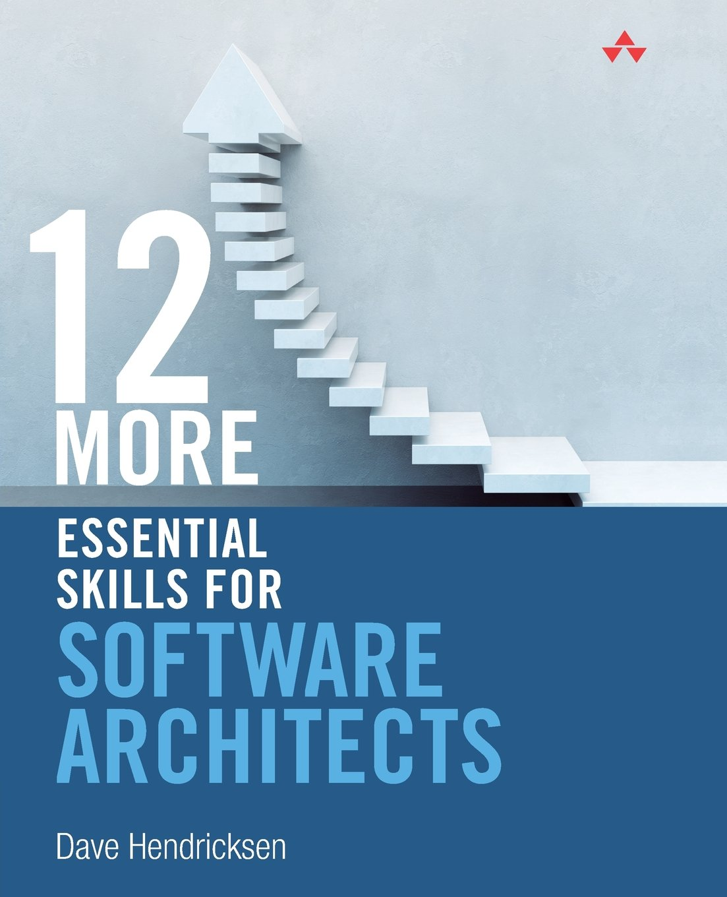
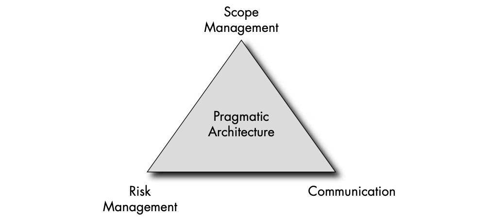
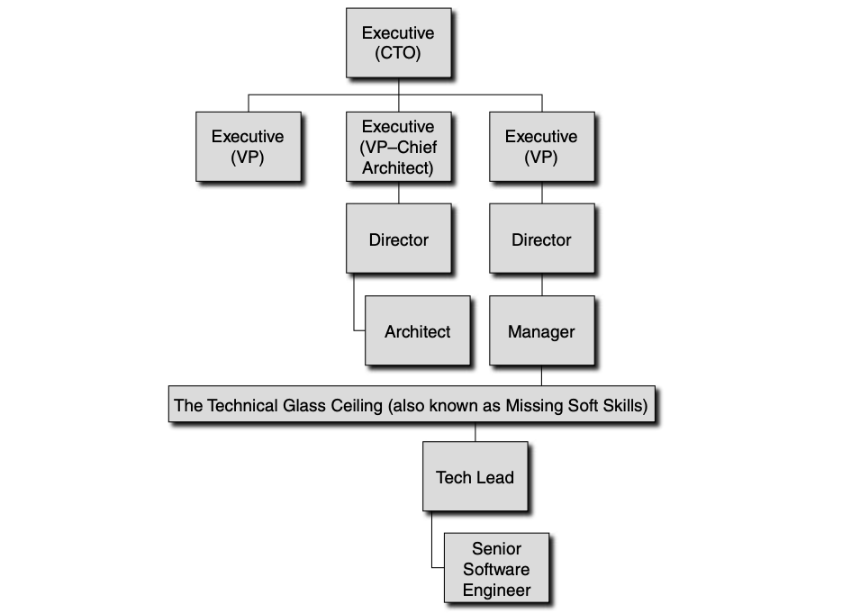

One day I stumbled upon a Reddit post where someone asked [whether Spring AI really outperforms Python-based webservices](https://www.reddit.com/r/SpringBoot/comments/1fb6sn7/spring_ai_use_cases/). An interesting answer caught my attention:

:::kokomi[[On Spring AI](https://www.reddit.com/r/SpringBoot/comments/1fb6sn7/comment/lm5c8i1/?utm_source=share&utm_medium=web3x&utm_name=web3xcss&utm_term=1&utm_content=share_button)]

"This is just a new library giving you functionality that has long been available in Python.

The answer to whether to choose it or a Python microservice will be the same as choosing a language for any other
application. Does the product development team know Python or Java better? Which language will have greater advantages
in a particular application?

If I have to create an application that will be developed and maintained for many years by many people, I will not
choose Python, in my opinion Java (with SpringBoot) is much better for this. Additionally, in our company we have a
better CI/CD, observability, libraries and various tools for Java applications. In our case, Spring-AI (and similar
libraries) will finally allow us to create decent production-ready GenAI applications.

However, if I had to make a simple tool that I could run locally to provide some assistance using AI, I would probably
choose Python. Creating a Spring Boot application would take much longer and be more tedious to run.

Of course, in other companies it may look different".

:::

I was trying to design a RAG pipeline on that day and I, like everyone else in a world of so many alternative choices
today, have couple of options that seem to have no dramatic differences for me:

- [LlamaIndex](https://llamaindex.qubitpi.org/)
- LangChain
- Haystack
- TxtAI
- etc.

What is my pick? The Reddit post answer above pointed me to a sounding direction: _this is not a question of personal
preferences, but an objective consideration on __practicality___:

- Do I know the language for using that framework?
- If I need to learn before I can use the framework, do I have enough time?
- What's the long term benefits of that choice, such as CI/CD and community support?

This also applies to a software engineering team:

- Does the team have a member portfolio that demonstrates high proficiency over the language of that framework?
- Does the team have enough time to deliver the business goal with that framework on board?
- Will ths software achieve good maintainability and extensibility in the long run?

This leads me to think about software architect role beyond the scope of technology. Or in general, __if I am leading a
tech team, what must be considered beyond technologies?__ I searched and found this book to be a good starting point:
_[12 Essential Skills for Software Architects](https://www.amazon.com/More-Essential-Skills-Software-Architects/dp/032190947X)_
([PDF](https://github.com/rambhawan/Computer-Compiler-Lang/blob/master/12%20Essential%20Skills%20for%20Software%20Architects.pdf))
by Dave Hendricksen whose chapter 11 directly addresses this concern. The chapter 11 was about how to bring
[pragmatism](#pragmatism) to the everyday world of software architecture.

Pragmatism
----------

Pragmatism is the dose of reality that needs to be mixed into the daily decisions related to architecture. It is easy to
dream of architectural ivory towers, elegant designs, and a universe devoid of financial constraints. However, the job
of an architect is to hold vision in one hand and reality in the other hand, and to bring them together. The two
concepts have a natural resistance to each other—the same way two like-poled magnets repel each other. They can be
brought together, but only through force.

:::tip[Pragmatic Architecture, Definition]

__Pragmatic architecture__ is the notion of driving toward an architectural vision (the strategic) while constraining
projects to reality (the tactical). That is, project dates, feasibility, financial costs, related project decisions,
and leverage capabilities or possibilities all need to be part of the mix in determining the "best" steps for the
architectural approach. 

:::

The key to pragmatic architecture is to manage through [scope management](#scope-management),
[risk management](#risk-management), and [communication](#communication):

For example, suppose you have a new project proposal that absolutely, positively must ship on a specific date in four
months because of a trade show, and there is a limited budget to get it done. The project will deliver a key strategic
advantage for your company over your competitors.

The challenge is that three competing architectural approaches are available:

1. The first approach would require the use of some new open-source technologies that your company has no experience
   with
2. The second approach would require you to build the solution primarily from the ground up - a mostly
   [greenfield development project](https://en.wikipedia.org/wiki/Greenfield_project#Software_development), except that
   it will need to be integrated with several of your legacy systems
3. The third approach would require you to hack a solution into the current legacy system, and would likely be fragile
   under heavy use.

You have three days to come up with a final decision; complete cost estimates, resource needs estimates, risks estimates
(and their mitigation plans), and key assumptions; and review the proposal with all affected parties. On the fourth day,
you will present your plan to the executives, who will be looking to dive deep into any area they like and ensure that
the plan of attack is solid.

### Scope Management

Although you may have your pet priorities for a project (those really cool new technologies or features that are just
looking for a project to fund their implementation), you need to consider the business needs to help determine what will
really help drive the ROI for this project and allow it to meet or exceed the financial expectations attached to the
project. If your pet technologies will truly help the business better meet its needs, then by all means consider them.
Here are some starting points to evaluate your pet technologies:

- __Work with business team to determine feature priority__: figuring out how to properly sequence the feature
  development of a particular project can be tricky business. Some infrastructure tasks will likely be needed to
  implement the flashy new feature that provides the new sales capabilities that will nearly market itself. Taking time
  to partner with the business can help prioritize the "must have" features and allow you to work through the real
  dependencies so that the value can be delivered as quickly as possible to the business.
- __Learn to live with ambiguity__: As an architect, you will always have a need for more information to make a more
  precise decision about the architecture for a particular project. No matter how many details you seek, there will
  always be a level of ambiguity in the decision-making process. Develop a sense of when you have _sufficient_
  information to make a reasonably calculated approach to allow a project to move forward with known assumptions and
  risks. Over time, you will develop a sixth sense for areas you need to investigate more fully or to document as a
  project assumption or risk.

  - On approach to deal with ambiguity is using Agile process, which will help you focus on the areas that need to be
    addressed now, while allowing some ambiguous parts of the project to live in the backlog until they need to be
    addressed as part of an iteration or as part of a spike (time-bounded proof of concept). 

    :::tip[[Architectural Spike](https://cloud-architecture.io/architecture/architectural-spiking/)]

    Architectural Spiking is running a small technical experiment, building working software to prove or disprove
    feasibility or a specific hypothesis. Spikes are throw away code they are not integrated into released products,
    they are used to prove or disprove a theory.

    A _time-bounded_ Architectural spikes can be applied when key decisions need to be made with respect to the
    [feasibility](#risk-management) of a particular architectural approach in order to gain insight into the potential
    route to take. To ensure a successful spike, follow these guidelines:

    - Understand the key elements that require investigation
    - Avoid implementing a complete solution
    - Don't ship it to production
    - Document your results and recommendations because other groups will find this information helpful
    - For implementation, pick those people who are willing to dive into murky, uncharted waters and get tasks done with
      minimal help 

    :::

### Risk Management

Bringing in new things is fun, but trying to get them operationalized is nearly always a challenge. One way to increase
the feasibility of a project is to minimize the number of new things you are injecting into the organization or to
sequence the changes such that you allow your project to incorporate the changes in a stable manner. When choosing among
broad set of possible technologies for an architectural approach, you need to take the following considerations into
account:

- Which resources will implement the system? Do they need any training? Are they familiar with the architectural
  approach being suggested?
- Has this architectural pattern been implemented previously in your company? In the industry?
- Which architectural spikes may be needed to remove any high-level risks?
- What kind of licensig needs to be procured? Do you know what the costs for this licensing will be? Has anyone worked
  with the company that is issuing the license? If not, it will be more difficult to bring the tool in. Are you willing
  to go to bat for this tool if you are challenged by executives? (Choose your battles wisely.)
- Are there special hardware needs? Has your company used this hardware vendor before? Can you execute this project on
  the cloud?
- Do you understand the nature of scaling the solution from

  - an application server perspective
  - a database perspective
  - a network perspective
  - a storage device perspective
  - a queuing perspective
  - a caching perspective
  - etc.
  
  Will you need to scale up or scale out?

- Do you have or can you build the appropriate tools that will enable your to monitor the system?
- Have you accounted for any reporting needs?
- Do you understand how to build, deploy, and test the solution?
- Are there any legal or regularoty issues you need to address?
- Do patents or other intellectual property need to be secured or developed for the development work that will occur?
- Does this development effort need any special research and development?
- Do you understand when this project needs to be delivered?
- Are you able to structure the project across multiple organizations in a manner that minimizes coupling between the
  groups and maximizes cohesion within the groups? 
- Do you understand the projected ROI for this project and the elements that will enable this ROI to be delivered?
  (What promises are being made to the field when this product gets delivered? Can you deliver on those promises?)
- Which alternatives have you considered? Why were some rejected?
- Which future projects are in the pipeline that will build upon this project as stratigic infrastructure?
- How does this project align with the company's strategic long-term goals?
- Does the project need to interact with any key software packages? Do any key software interfaces need to be
  implemented?
- Do any key data exchange formats need to be handled?
- Can you contemplate at least one reasonable design and implementation approach?
- Do you understand key alternatives? (If some aspect of the project fundamentally fails, what are the alternatives - do
  you have a good Plan B?) When during the project does a particular path need to be determined?

Another aspect of addressing feasibility is to properly set expectations of all key stakeholders in terms of
assumptions, risks, financial costs, and alternatives. Help executives make the right decision by considering the
following questions:

- What are the operational implications of this decision?
- What are the hardware implications of this decision?
- What are the training implications of this decision?
- What are the maintenance cost implications of this decision?
- Have any key architectural tenets been broken by this decision?
- What is the developmental cost of this decision?
- Will the decision enable the project to meet its delivery dates faster?
- Will the quality of the project be affected materially?
- Are all key stakeholders commiteed to this change> If not, why?

#### Type of Risks

- New technology failing to deliver as planned
- A dependent project failing to deliver
- Financial challenge that requires you to do with less

These likely risks and your ability to plan how to address them and which alternatives must be considered if and when
they happen will dramatically affect your ability to succeed on a regular basis. If you are able to deliver on your
promises even under dire circumstances, you will gain the reputation you need to be able to advance further up in the
organization

#### Software Operation Personnel

Involving those personnel who deal with the operational side of software development early on in the project development
life cycle can help minimize the operational costs once the project has gone into production, because operational costs
of a particular project can derail the project after being launched. Being the downstream group of the software, they
have insights into which types of information they need to access to deal with customers, such as customer complaints,
customer change requests, customer billing, and customer delivery alternatives. They may have insights into internal
processes as well. Learn how they are accustomed to processing information and identify the types of special access,
overrides, reprocessing, or other high-priority needs they have.

#### What is Acceptable to Sacrifice

This is the point when the project gets real: when all of the lofty goals and aspirations turn toward getting the end
result out the door. When things go wrong for a project (and they will), 

- work with the business to determine which features are "must-have" and which strategic aspects of the project will
  have to wait for another day
- Identify whether automated parts of the process can be manually done (at least for a while)

### Communication

#### Being Flexible as Architect

A certain amount of flexibility is needed during the implementation of a project. You need to clearly communicate in
which areas of the project there is some flexibility in terms of approach or features. Or sometimes the business may be
a bit tentative or unsure of what the right answer is or may not have done the necessary field studies to understand
certain customer nuances. If possible, try to understand the nature of where changes may be required, and build
flexibility into the designs to accommodate these changes if it is not overly expensive. Otherwise, seek to hold off on
implementing new features until customer feedback is available.

:::warning

Unfortunately, when software is being built, only a limited amount of variability and flexibility can be realized.
Indecisiveness that leads to significant rework will burn precious development dollars and needs to be kept to a
minimum.

:::

Therefore take the time to document decisions along the way. Ensure that the decision log is properly distributed so
that there are no surprises. The key to success is proper expectations setting and transparency.

The way we deal with multiple alternatives among group of people also demonstrate how an architect can be flexible.
Whenever you need to present alternatives as part of making a decision, whether to executives, business partners, or
even your kids, your ability to clearly articulate which options are available and which option you would recommend will
produce a great starting point for a conversation. Don't be afraid to recommend the solution you want; you will often
get what you wish for. Be willing to defend your choice and show that you have really thought through the decision, but
be supportive of others who choose options that don't match your recommendation. If someone does choose an option that
you did not recommend, move forward and own the decision as if you made it. At the same time, _make sure the decision
maker understands the consequences of that decision (e.g., delays, cost)_.

The Duality Nature of Architect - Technical and Managerial
----------------------------------------------------------

As I described in the blog cover, architect is not about reaching the top of technical skills, but a mental shift toward
a new skill sets while keep growing as what a technical person.

### The Technical Ceiling

One of the challenges that the very best technology folks (the gurus - the ones you go to when you have a difficult
problem that must be solved and solved right) often have is that they are often a complete pain to deal with. Their
approach and means of interacting are completely focused on correctness to the minutest detail.

The "technical glass ceiling" of those technology folks is simply missing soft skills. These skills can be learned,
although in most cases, the missing knowledge is usually filled in through a focused effort to change.

For people filling more senior positions, detailed technical skills are useful, but the balance begins to shift toward
their ability to successfully interact with others, to get things done, and to sell their viewpoint. From technologists'
point of view, the simple fact that the solution they are bringing forward is technically pure should be sufficient to
win its acceptance. They often believe that the solution should stand on its own without any sales required, and that
everyone should simply admire the beauty of the solution. Sometimes a technical person will fail to perceive that for
any project, a wide range of factors need to be taken into account. The product needs to deliver the best possible
return on investment (ROI) to those who are footing the bill. This often means squeezing in more functionality that may
not be "perfect", but is, in fact, good enough at a cost that enables enough money to be made and in a time frame to
meet market needs. Often competing products are being developed, and the organization needs to be first to market to
gain the market leadership position that will enable it to charge a premium price for its product. Those factors on
humans interactions include:

- _Balancing relationships and correctness_

  From a software development and engineering perspective, we are trained to look for defects (imperfections) and to
  remove these flaws quickly (we have all kinds of ways to deal with this task: pair programming, unit tests, functional
  tests, stress tests, code reviews, and so on). The challenge lies in the indisputable fact that people are not
  software: We don't need to drive out their imperfections. Instead, we seek to maintain integrity and authenticity with
  the other side, to provide valuable insights when appropriate, and to offer for other sot learn in a relatively quiet
  manner. The best guide is to have other people's best interests at heart and to user our best judgment to figure out
  how to proceed

  The dynamics is that everyone loves to talk and have their ideas be added into the ecosystem. Once our resources, i.e.
  programmers, are willing to contribute, they will begin taking ownership and will be willing to contribute even more
  ideas. The first few ideas that people throw out are ONLY "safe" ideas. They are testing the waters to see if sharks
  are present. If it proves to be safe, they are willing to begin bringing out their best and brightest ideas.

- _Learning to delegate_

  A key concept that enables this evolution to occur is allowing others to help determine the solution in order to
  trigger their sense of ownership.

  Architects usually can only suggest ideas; they do not have direct management authority, unlike directors and
  managers. This forces them to have to _sell_ their architectural approaches. If the other side is a bad ass, the
  advice below doesn't help, but in other case:

  - Listen
  - Don't defend
  - Be gracious

  because if we respond with anything other than gracious acceptance, we are asking for non-gracious behavior in
  response.. 

- _Realizing that life is reflexive_

  When we are receiving negative feedback about something we have done and care about passionately, we may act as if the
  criticism is a personal attack rather than an evaluation of the work. 

- _Word matters_

  - Don't speak negatively about someone
  - Look for opportunities to build relationships
  - Learn to speak and hear words that emphasize the positive

- _Integrity & Honesty_
