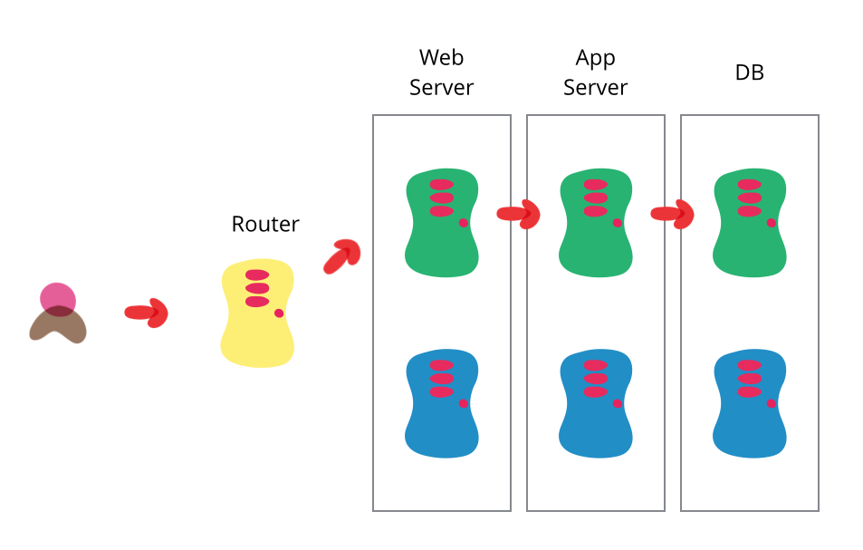

For those who are getting into DevOps, build a home lab or spin up some servers on a cloud provider like DigitalOcean
for example. Dive into

- Domain/DNS zones, records

  - [domain-check](https://github.com/saidutt46/domain-check) is a good tool

- Load balancers
- Learn some kind of Cloud platform - AWS is most common but GCP and Azure are also sought after. Openstack ("private
  cloud" installed on one's own hardware) is also pretty cool but here be dragons, also it's rare to see roles looking
  for this. The plus side is that if one has hardware to spare then is lots of the same concepts, if not terminology,
  apply to public clouds.
- Understand VPC, networking, security at a conceptual level (think medieval fortress, office building security). Brush
  up on networking fundamentals. We aren't looking to be a network engineer but should have some grasp of subnetting so
  we can read and write a route table and security groups. This comes up often in Cloud infra. Learn how to troubleshoot
  with dig, curl, telnet, netstat, tcpdump, and netcat.
- Ideally some Linux knowledge and bash scripting - but Windows/Powershell is also good to know, especially if looking
  into Azure. We want to be able to read and write basic scripts.
- Learn how to use git, or some other version control system. Code has to live somewhere and we want to know how to
  clone repositories, branch a repo, and push commits.
- Containerization. Start with Docker, basic bash or Python scripting skills and comfort in shell will help immensely
  here. Kubernetes is in high demand but we first want to get a grip on containers.
- Automation. Terraform and Ansible are both super cool but almost distinct languages unto themselves.
- CI/CD pipelines, Jenkins, gitlab-ci, GitHub actions, etc. The principles of continuous integration and continuous
  delivery and how that ties into software development. This is the real meat and potatoes of what DevOps traditionally
  entails but it depends a lot on all these other pieces.
- Web API and architecture. Not all but lots of DevOps generally revolves around supporting some kind of web
  application. Arguably DevOps exists to support microservices running in some platform (AWS, K8s, etc.) which
  traditionally would have been part of a monolithic server architecture.
- etc.

Also, check out https://roadmap.sh/devops and https://devops-daily.com/roadmap to see where your gaps are. In addition,
[Hello, World!](https://hw.glich.co/) is a great resource to go with.

What is Continuous Delivery
---------------------------

Continuous Delivery is the ability to get changes of all types - including new features, configuration changes, bug
fixes and experiments - into production, or into the hands of users, _safely_ and _quickly_ in a _sustainable_ way.

The goal of continuous delivery is to make deployments - whether of a large-scale distributed system, a complex
production environment, an embedded system, or an app - predictable, routine affairs that can be performed on demand.

We achieve all this by ensuring our code is always in a deployable state, even in the face of teams of thousands of
developers making changes on a daily basis. We thus completely eliminate the integration, testing and hardening phases
that traditionally followed "dev complete", as well as code freezes.

### Why Continuous Delivery

It is often assumed that if we want to deploy software more frequently, we must accept lower levels of stability and
reliability in our systems. In fact, peer-reviewed research shows that this is not the case. High performance teams
consistently deliver services faster and more reliably than their low performing competition. This is true even in
highly regulated domains such as [financial services](https://www.youtube.com/watch?v=eMS97X5ZTGc) and
[government](https://www.youtube.com/watch?v=QwHVlJtqhaI). This capability provides an incredible competitive advantage
for organizations that are willing to invest the effort to pursue it.

:::note

- Firms with high-performing IT organizations were twice as likely to exceed their profitability, market share and
  productivity goals.
- High performers achieved higher levels of both throughput and stability.
- The use of continuous delivery practices including version control, continuous integration, and test automation
  predicts higher IT performance.
- Culture is measurable and predicts job satisfaction and organizational performance.
- Continuous Delivery measurably reduces both deployment pain and team burnout.

:::

The practices at the heart of continuous delivery help us achieve several important benefits:

- __Low risk releases__. The primary goal of continuous delivery is to make software deployments painless, low-risk
  events that can be performed at any time, on demand. By applying [patterns](#patterns) such as __blue-green
  deployments__ it is relatively straightforward to achieve zero-downtime deployments that are undetectable to users.

  :::note[Blue-green Deployment]

  

  One of the challenges with automating deployment is the cut-over itself, taking software from the final stage of
  testing to live production. We usually need to do this quickly in order to minimize downtime. The blue-green
  deployment approach does this by ensuring we have __two production environments__, as identical as possible. At any
  time one of them, let's say blue for the example, is live. As we prepare a new release of our software we do our
  final stage of testing in the green environment. Once the software is working in the green environment, we switch the
  router so that all incoming requests go to the green environment - the blue one is now idle.

  Blue-green deployment also gives us a rapid way to rollback - if anything goes wrong we switch the router back to
  our blue environment. There's still the issue of dealing with missed transactions while the green environment was
  live, but depending on our design we may be able to feed transactions to both environments in such a way as to keep
  the blue environment as a backup when the green is live. Or we may be able to put the application in read-only mode
  before cut-over, run it for a while in read-only mode, and then switch it to read-write mode. That may be enough to
  flush out many outstanding issues.

  The two environments need to be different but as identical as possible. In some situations they can be different
  pieces of hardware, or they can be different virtual machines running on the same (or different) hardware. They can
  also be a single operating environment partitioned into separate zones with separate IP addresses for the two slices.

  Once we've put our green environment live and we're happy with its stability, we then use the blue environment as
  our __staging environment__ for the final testing step for our next deployment. When we are ready for our next
  release, we switch from green to blue in the same way that we did from blue to green earlier. That way both green and
  blue environments are regularly cycling between live, previous version (for rollback) and staging the next version.

  An advantage of this approach is that it's the same basic mechanism as we need to get a hot-standby working. Hence
  this allows us to test our disaster-recovery procedure on every release.

  The fundamental idea is to have two easily switchable environments to switch between, there are plenty of ways to vary
  the details. One project did the switch by bouncing the web server rather than working on the router. Another
  variation would be to use the same database, making the blue-green switches for web and domain layers.

  Databases can often be a challenge with this technique, particularly when we need to change the schema to support a
  new version of the software. The trick is to __separate the deployment of schema changes from application upgrades__.
  So first apply a database refactoring to change the schema to support both the new and old version of the application,
  deploy that, check everything is working fine so we have a rollback point, then deploy the new version of the
  application. (And when the upgrade has bedded down remove the database support for the old version.)
  :::

- __Faster time to market__. It's common for the integration and test/fix phase of the traditional phased software
  delivery lifecycle to consume weeks to even months. When teams work together to automate the build and deployment,
  environment provisioning, and regression testing process, developers can incorporate integration and regression
  testing into their daily work and completely remove these phases. We also avoid the large amount of re-work that
  plague the phased approach.
- __Higher quality and Better products__. When developers have automated tools that discover regressions within minutes,
  teams are freed to __focus their effort on user research and higher level testing activities__ such as exploratory
  testing, usability testing, and performance and security testing. By building a deployment pipeline, these activities
  can be performed continuously throughout the delivery process, ensuring quality is built into products and services
  from the beginning. Continuous delivery makes it economic to work in small batches. This means we can get feedback
  from users throughout the delivery lifecycle based on working software.
- __Lower costs__. Any successful software product or service will evolve significantly over the course of its lifetime.
  By investing in build, test, deployment and environment automation, we substantially reduce the cost of making and
  delivering incremental changes to software by __eliminating many of the fixed costs__ associated with the release
  process.
- __Happier teams__. Continuous Delivery makes releases less painful and reduces team burnout. Furthermore, when we
  release more frequently, software delivery teams can engage more actively with users, learn which ideas work and which
  don't, and see first-hand then outcomes of the work they have done. By removing low-value painful activities
  accociated with software delivery, we can fodus on what we care about most - continuous delighting our users.

__Continuous delivery is about continuous, daily improvement - the constant discipline of pursuing higher performance by
following the heuristic "if it hurts, do it more often, and bring the pain forward."__

Principles
----------

There are five principles at the heart of continuous delivery:

1. Build quality in
2. Work in small batches
3. Computers perform repetitive tasks, people solve problems
4. Relentlessly pursue continuous improvement
5. Everyone is responsible

It's easy to get bogged down in the details of implementing continuous delivery - tools, architecture, practices,
politics - if you find yourself lost, try revisiting these principles and you may find it helps you refocus on what's
important.

### Build Quality In

W. Edwards Deming, a key figure in the history of the Lean movement, offered
[14 key principles](https://deming.org/explore/fourteen-points) for management. Principle three states, "Cease
dependence on inspection to achieve quality. Eliminate the need for inspection on a mass basis by building quality into
the product in the first place".

It's much cheaper to fix problems and defects if we find them immediately - ideally before they are ever checked into
version control, by running automated tests locally. Finding defects downstream through inspection (such as manual
testing) is time-consuming, requiring significant triage. Then we must fix the defect, trying to recall what we were
thinking when we introduced the problem days or perhaps even weeks ago.

Creating and evolving feedback loops to detect problems as early as possible is essential and never-ending work in
continuous delivery. If we find a problem in our exploratory testing, we must not only fix it, but then ask: How could
we have caught the problem with an automated acceptance test? When an acceptance test fails, we should ask: Could we
have written a unit test to catch this problem?

### Work in Small Batches

In traditional phased approaches to software development, handoffs from dev to test or test to IT operations consist of
whole releases: months worth of work by teams consisting of tens or hundreds of people.

In continuous delivery, we take the opposite approach, and try and get every change in version control as far towards
release as we can, getting comprehensive feedback as rapidly as possible.

Working in small batches has many benefits. It reduces the time it takes to get feedback on our work, makes it easier to
triage and remediate problems, increases efficiency and motivation, and prevents us from succumbing to the sunk cost
fallacy.

The reason we work in large batches is because of the large fixed cost of handing off changes. __A key goal of
continuous delivery is to change the economics of the software delivery process to make it economically viable to work
in small batches so we can obtain the many benefits of this approach__.

:::note

A key goal of continuous delivery is to change the economics of the software delivery process to make it economically
viable to work in small batches so we can obtain the many benefits of this approach

:::

### Relentlessly Pursue Continuous Improvement

Continuous improvement, or _kaizen_ in Japanese, is another key idea from the Lean movement.
[Taiichi Ohno](http://www.amazon.com/dp/0071808019?tag=contindelive-20), a key figure in the history of the Toyota
company, once said,

> "Kaizen opportunitites are infinite. Don't think you have made things better than before and be at ease… This would be
> like the student who becomes proud because they bested their master two times out of three in fencing. Once you pick
> up the sprouts of kaizen ideas, it is important to have the attitude in our daily work that just underneath one kaizen
> idea is yet another one".

Don't treat transformation as a project to be embarked on and then completed so we can return to business as usual. The
best organizations are those where everybody treats improvement work as an essential part of their daily work, and where
nobody is satisfied with the status quo.

### Everyone is Responsible

In high performing organizations, nothing is "somebody else's problem." Developers are responsible for the quality and
stability of the software they build. Operations teams are responsible for helping developers build quality in. Everyone
works together to achieve the organizational level goals, rather than optimizing for what’s best for their team or
department.

When people make local optimizations that reduce the overall performance of the organization, it's often due to systemic
problems such as poor management systems such as annual budgeting cycles, or incentives that reward the wrong behaviors.
A classic example is rewarding developers for increasing their velocity or writing more code, and rewarding testers
based on the number of bugs they find.

Most people want to do the right thing, but they will adapt their behaviour based on how they are rewarded. Therefore,
it is very important to create fast feedback loops from the things that really matter: how customers react to what we
build for them, and the impact on our organization.

Foundations - Prerequisites for Continuous Delivery
---------------------------------------------------

### Configuration Management

Automation plays a vital role in ensuring we can release software repeatably and reliably. One key goal is to take
repetitive manual processes like build, deployment, regression testing and infrastructure provisioning, and automate
them. In order to achieve this, we need to version control everything required to perform these processes, including
source code, test and deployment scripts, infrastructure and application configuration information, and the many
libraries and packages we depend upon. We also want to make it straightforward to query the current -and historical -
state of our environments.

We have two overriding goals:

1. __Reproducibility__: We should be able to provision any environment in a fully automated fashion, and know that any
   new environment reproduced from the same configuration is identical.
2. __Traceability__: We should be able to pick any environment and be able to determine quickly and precisely the
   versions of every dependency used to create that environment. We also want to be able to compare previous versions of
   an environment and see what has changed between them.

These capabilities give us several very important benefits:

1. __Disaster recovery__: When something goes wrong with one of our environments, for example a hardware failure or a
   security breach, we need to be able to reproduce that environment in a deterministic amount of time in order to be
   able to restore service.
2. __Auditability__: In order to demonstrate the integrity of the delivery process, we need to be able to show the path
   backwards from every deployment to the elements it came from, including their version. Comprehensive configuration
   management, combined with deployment pipelines, enable this.
3. __Higher quality__: The software delivery process is often subject to long delays waiting for development, testing
   and production environments to be prepared. When this can be done automatically from version control, we can get
   feedback on the impact of our changes much more rapidly, enabling us to build quality in to our software.
4. __Capacity management__: When we want to add more capacity to our environments, the ability to create new
   reproductions of existing servers is essential. This capability, using [OpenStack](https://www.openstack.org/) for
   example, enables the horizontal scaling of modern cloud-based distributed systems.
5. __Response to defects__: When we discover a critical defect, or a vulnerability in some component of our system, we
   want to get a new version of our software released as quickly as possible. Many organizations have an emergency
   process for this type of change which goes faster by bypassing some of the testing and auditing. This presents an
   especially serious dilemma in safety-critical systems. Our goal should be to be able to use our normal release
   process for emergency fixes - which is precisely what continuous delivery enables, on the basis of comprehensive
   configuration management.

As environments become more complex and heterogeneous, it becomes progressively harder to achieve these goals. Achieving
perfect reproducibility and traceability to the last byte for a complex enterprise system is impossible (apart from
anything else, every real system has state). Thus a key part of configuration management is working to __simplify our
architecture, environments and processes__ to reduce the investment required to achieve the desired benefits.

#### Configuration Management Learning Resources

- [Infrastructure as Code](https://www.oreilly.com/library/view/infrastructure-as-code/9781491924334/)
- [Pedro Canahuati on scaling operations at Facebook](http://www.infoq.com/presentations/scaling-operations-facebook)

### Continuous Integration

Combining the work of multiple developers is hard. Software systems are complex, and an apparently simple,
self-contained change to a single file can easily have unintended consequences which compromise the correctness of the
system. As a result, some teams have developers work isolated from each other on their own branches, both to keep
trunk/master stable, and to prevent them treading on each other’s toes.

However, over time these branches diverge from each other. While merging a single one of these branches into mainline is
not usually troublesome, the work required to integrate multiple long-lived branches into mainline is usually painful,
requiring significant amounts of re-work as conflicting assumptions of developers are revealed and must be resolved.

Teams using long-lived branches often require code freezes, or even integration and stabilization phases, as they work
to integrate these branches prior to a release. Despite modern tooling, this process is still expensive and
unpredictable. On teams larger than a few developers, the integration of multiple branches requires multiple rounds of
regression testing and bug fixing to validate that the system will work as expected following these merges. This problem
becomes exponentially more severe as team sizes grow, and as branches become more long-lived.

The practice of continuous integration was invented to address these problems. CI (continuous integration) follows the
XP (extreme programming) principle that if something is painful, we should do it more often, and bring the pain forward.
Thus in CI developers integrate all their work into trunk (also known as mainline or master) on a regular basis (at
least daily). A set of automated tests is run both __before and after__ the merge to validate that no regressions are
introduced. If these automated tests fail, the team stops what they are doing and someone fixes the problem immediately.

Thus we ensure that the software is always in a working state, and that developer branches do not diverge significantly
from trunk. The benefits of continuous integration are very significant - higher levels of throughput, more stable
systems, and higher quality software. However the practice is still controversial, for two main reasons.

First, it requires developers to break up large features and other changes into smaller, more incremental steps that can
be integrated into trunk/master. This is a paradigm shift for developers who are not used to working in this way. It also
takes longer to get large features completed. However in general we don't want to optimize for the speed at which
developers can declare their work "dev complete" on a branch. Rather, we want to be able to get changes reviewed,
integrated, tested and deployed as fast as possible - and this process is an order of magnitude faster and cheaper when
the changes are small and self-contained, and the branches they live on are short-lived. Working in small batches also
ensures developers get regular feedback on the impact of their work on the system as a whole - from other developers,
testers, customers, and automated performance and security tests—which in turn makes any problems easier to detect,
triage, and fix.

Second, continuous integration requires a fast-running set of comprehensive automated unit tests. These tests should be
comprehensive enough to give a good level of confidence that the software will work as expected, while also running in a
few minutes or less. If the automated unit tests take longer to run, developers will not want to run them frequently,
and they will become harder to maintain. Creating maintainable suites of automated unit tests is complex and is best done
through test-driven development (TDD), in which developers write failing automated tests before they implement the code
that makes the tests pass. TDD has several benefits, the most important of which is that it ensures developers write code
that is modular and easy to test, reducing the maintenance cost of the resulting automated test suites. But TDD is still
not sufficiently widely practiced.

Despite these barriers, __helping software development teams implement continuous integration should be the number one
priority for any organization__ wanting to start the journey to continuous delivery. By creating rapid feedback loops
and ensuring developers work in small batches, CI enables teams to build quality into their software, thus reducing the
cost of ongoing software development, and increasing both the productivity of teams and the quality of the work they
produce.

#### Continuous Integration Learning Resources

- [Paul Duvall's book on Continuous Integration](http://www.amazon.com/dp/0321336380?tag=contindelive-20)

### Continuous Testing

The key to building quality into our software is making sure we can get fast feedback on the impact of changes.
Traditionally, extensive use was made of manual inspection of code changes and manual testing (testers following
documentation describing the steps required to test the various functions of the system) in order to demonstrate the
correctness of the system. This type of testing was normally done in a phase following “dev complete”. However this
strategy have several drawbacks:

- Manual regression testing takes a long time and is relatively expensive to perform, creating a bottleneck that
  prevents us releasing software more frequently, and getting feedback to developers weeks (and sometimes months) after
  they wrote the code being tested.
- Manual tests and inspections are not very reliable, since people are notoriously poor at performing repetitive tasks
  such as regression testing manually, and it is extremely hard to predict the impact of a set of changes on a complex
  software system through inspection.
- When systems are evolving over time, as is the case in modern software products and services, we have to spend
  considerable effort updating test documentation to keep it up-to-date.

In order to build quality in to software, we need to adopt a
[different approach](#different-types-of-software-testing).

The more features and improvements go into our code, the more we'll need to test to make sure that all our system works
properly. And then for each bug we fix, it would be wise to check that they don't get back in newer releases.
Automation is key to make this possible and writing tests sooner rather than later will become part of our development
workflow.

Once we have continuous integration and test automation in place, we create a
[deployment pipeline](#the-deployment-pipeline). In the deployment pipeline pattern, every change runs a build that

- creates packages that can be deployed to any environment and
- runs unit tests (and possibly other tasks such as static analysis), giving feedback to developers in the space of a
  few minutes.

Packages that pass this set of tests have more comprehensive automated acceptance tests run against them. Once we have
packages that pass all the automated tests, they are available for deplyment to other environments.

In the deployment pipeline, every change is effectively a release candidate. The job of the deployment pipeline is to
catch known issues. If we can't detect any known problems, we should feel totally comfortable releasing any packages
that have gone through it. If we aren't, or if we discover defects later, it means we need to improve our pipeline,
perhaps adding or updating some tests.

Our goal should be to find problems as soon as possible, and make the lead time from check-in to release as short as
possible. Thus we want to parallelize the activities in the deployment pipeline, not have many stages executing in
series. If we discover a defect in the acceptance tests, we should be looking to improve our unit tests (most of our
defects should be discovered through unit testing).

#### Different Types of Software Testing

##### Unit Tests

Unit tests are very low level and close to the source of an application. They consist in testing individual methods and
functions of the classes, components, or modules used by our software. Unit tests are generally quite cheap to automate
and can run very quickly by a continuous integration server.

##### Integration Tests

Integration tests verify that different modules or services used by our application work well together. For example, it
can be testing the interaction with the database or making sure that microservices work together as expected. These
types of tests are more expensive to run as they require multiple parts of the application to be up and running.

##### Functional Tests

Functional tests focus on the business requirements of an application. They only verify the output of an action and do
not check the intermediate states of the system when performing that action.

There is sometimes a confusion between integration tests and functional tests as they both require multiple components
to interact with each other. The difference is that an integration test may simply verify that we can query the
database while a functional test would expect to get a specific value from the database as defined by the product
requirements.

##### End-to-End Tests

End-to-end testing replicates a user behavior with the software in a complete application environment. It verifies that
various user flows work as expected and can be as simple as loading a web page or logging in or much more complex
scenarios verifying email notifications, online payments, etc...

End-to-end tests are very useful, but they're expensive to perform and can be hard to maintain when they're automated.
It is recommended to have a few key end-to-end tests and rely more on lower level types of testing (unit and
integration tests) to be able to quickly identify breaking changes.

##### Acceptance Tests

Acceptance tests are formal tests that verify if a system satisfies business requirements. They require the entire
application to be running while testing and focus on replicating user behaviors. But they can also go further and
measure the performance of the system and reject changes if certain goals are not met.

##### Performance Tests

Performance tests evaluate how a system performs under a particular workload. These tests help to measure the
reliability, speed, scalability, and responsiveness of an application. For instance, a performance test can observe
response times when executing a high number of requests, or determine how a system behaves with a significant amount of
data. It can determine if an application meets performance requirements, locate bottlenecks, measure stability during
peak traffic, and more.

##### Smoke Tests

Smoke tests are basic tests that check the basic functionality of an application. They are meant to be quick to
execute, and their goal is to give us the assurance that the major features of our system are working as expected.

Smoke tests can be useful right after a new build is made to decide whether or not we can run more expensive tests, or
right after a deployment to make sure that they application is running properly in the newly deployed environment.

Implementing Continuous Delivery
--------------------------------

Organizations attempting to deploy continuous delivery tend to make two common mistakes. The first is to treat
continuous delivery as an end-state, a goal in itself. The second is to spend a lot of time and energy worrying about
what products to use.

### Evolutionary Architecture

In the context of enterprise architecture there are typically multiple attributes we are concerned about, for example
availability, security, performance, usability and so forth. In continuous delivery, we introduce two new architectural
attributes:

1. __testability__
2. __deployability__

In a _testable_ architecture, we design our software such that most defects can (in principle, at least) be discovered
by developers by running automated tests on their workstations. We shouldn’t need to depend on complex, integrated
environments in order to do the majority of our acceptance and regression testing.

In a _deployable_ architecture, deployments of a particular product or service can be performed independently and in a
fully automated fashion, without the need for significant levels of orchestration. Deployable systems can typically be
upgraded or reconfigured with zero or minimal downtime.

Where testability and deployability are not prioritized, we find that much testing requires the use of complex,
integrated environments, and deployments are "big bang" events that require that many services are released at the same
time due to complex interdependencies. These "big bang" deployments require many teams to work together in a carefully
orchestrated fashion with many hand-offs, and dependencies between hundreds or thousands of tasks. Such deployments
typically take many hours or even days, and require scheduling significant downtime.

Designing for testability and deployability starts with ensuring our products and services are composed of
loosely-coupled, well-encapsulated components or modules

We can define a well-designed modular architecture as one in which it is possible to test or deploy a single component
or service on its own, with any dependencies replaced by a suitable test double, which could be in the form of a virtual
machine, a stub, or a mock. Each component or service should be deployable in a fully automated fashion on developer
workstations, test environments, or in production. In a well-designed architecture, it is possible to get a high level of
confidence the component is operating properly when deployed in this fashion.

:::note Test Double

Test Double is a generic term for any case where you replace a production object for testing purposes. There are various
kinds of double:

- __Dummy__ objects are passed around but never actually used. Usually they are just used to fill parameter lists.
- __Fake__ objects actually have working implementations, but usually take some shortcut which makes them not suitable
  for production (an InMemoryTestDatabase is a good example).
- __Stubs__ provide canned answers to calls made during the test, usually not responding at all to anything outside
  what's programmed in for the test.
- __Spies__ are stubs that also record some information based on how they were called. One form of this might be an email
  service that records how many messages it was sent.
- __Mocks__ are pre-programmed with expectations which form a specification of the calls they are expected to receive.
  They can throw an exception if they receive a call they don't expect and are checked during verification to ensure
  they got all the calls they were expecting.

:::

Any true service-oriented architecture should have these properties—but unfortunately many do not. However, the
microservices movement has explicitly prioritized these architectural properties.

Of course, many organizations are living in a world where services are distinctly hard to test and deploy. Rather than
re-architecting everything, we recommend an iterative approach to improving the design of enterprise system, sometimes
known as evolutionary architecture. In the evolutionary architecture paradigm, we accept that successful products and
services will require re-architecting during their lifecycle due to the changing requirements placed on them.

One pattern that is particularly valuable in this context is the strangler application. In this pattern, we iteratively
replace a monolithic architecture with a more componentized one by ensuring that new work is done following the
principles of a service-oriented architecture, while accepting that the new architecture may well delegate to the system
it is replacing. Over time, more and more functionality will be performed in the new architecture, and the old system
being replaced is "strangled".


### Patterns

#### The Deployment Pipeline

The key pattern introduced in continuous delivery is the __deployment pipeline__. Our goal was to make deployment to any
environment a fully automated, scripted process that could be performed on demand in minutes. We wanted to be able to
configure testing and production environments purely from configuration files stored in version control. The apparatus
we used to perform these tasks became known as _deployment pipelines_

In the deployment pipeline pattern, every change in version control triggers a process (usually in a CI server) which
creates deployable packages and runs automated unit tests and other validations such as static code analysis. This first
step is optimized so that it takes only a few minutes to run. If this initial commit stage fails, the problem must be
fixed immediately; nobody should check in more work on a broken commit stage. Every passing commit stage triggers the
next step in the pipeline, which might consist of a more comprehensive set of automated tests. Versions of the software
that pass all the automated tests can then be deployed to production.

Deployment pipelines tie together [configuration management](#configuration-management),
[continuous integration](#continuous-integration) and [test](#continuous-testing) and deployment automation in a
holistic, powerful way that works to improve software quality, increase stability, and reduce the time and cost required
to make incremental changes to software, whatever domain we're operating in. When building a deployment pipeline, the
following practices become valuable:

- __Only build packages once__. We want to be sure the thing we're deploying is the same thing we've tested throughout
  the deployment pipeline, so if a deployment fails we can eliminate the packages as the source of the failure.
- __Deploy the same way to every environment, including development__. This way, we test the deployment process many,
  many times before it gets to production, and again, we can eliminate it as the source of any problems.
- __Smoke test your deployments__. Have a script that validates all your application's dependencies are available, at
  the location you have configured your application. Make sure your application is running and available as part of the
  deployment process.
- __Keep your environments similar__. Although they may differ in hardware configuration, they should have the same
  version of the operating system and middleware packages, and they should be configured in the same way. This has
  become much easier to achieve with modern virtualization and container technology.

With the advent of infrastructure as code, it has became possible to use deployment pipelines to create a fully
automated process for taking all kinds of changes—including database and infrastructure changes

### Patterns for Low-Risk Releases

In the context of web-based systems there are a number of patterns that can be applied to further reduce the risk of
deployments. Michael Nygard also describes a number of important software design patterns which are instrumental in
creating resilient large-scale systems in his book
[Release It!](http://www.amazon.com/dp/0978739213?tag=contindelive-20)

The 3 key principles that enable low-risk releases are

1. __Optimize for Resilience__. Once we accept that failures are inevitable, we should start to move away from the idea
   of investing all our effort in preventing problems, and think instead about how to restore service as rapidly as
   possible when something goes wrong. Furthermore, when an accident occurs, we should treat it as a learning
   opportunity. Resilience isn't just a feature of our systems, it's a characteristic of a team's culture. High
   performance organizations are constantly working to improve the resilience of their systems by trying to break them
   and implementing the lessons learned in the course of doing so.
2. __Low-risk Releases are Incremental__. Our goal is to architect our systems such that we can release individual
   changes (including database changes) independently, rather than having to orchestrate big-bang releases due to tight
   coupling between multiple different systems.
3. __Focus on Reducing Batch Size__. Counterintuitively, deploying to production more frequently actually reduces the
   risk of release when done properly, simply because the amount of change in each deployment is smaller. When each
   deployment consists of tens of lines of code or a few configuration settings, it becomes much easier to perform root
   cause analysis and restore service in the case of an incident. Furthermore, because we practice the deployment
   process so frequently, we’re forced to simplify and automate it which further reduces risk.

Deploying v.s. Releasing
------------------------

### What is Software Release

A release is __a collection of one or more new or changed services or service components deployed into the live
environment as a result of one or more changes__

In other words, a release makes services and features available to users. More often than not,
[release management](https://www.bmc.com/blogs/devops-release-management/) is more of a business responsibility than a
technical responsibility. This is because the decisions on scheduling releases can be tied to business strategy from a
revenue or portfolio management perspective.

### What is Deployment

Deployment involves moving software from one controlled environment to another. __An environment is a subset of IT
infrastructure used for a particular purpose__. The most common environments are:

- __Development__. Commonly referred to as _dev_, this is where developers build the code.
- __Integration__. Here, the new code is combined and validated that it works with existing code.
- __Test__. This is where both functional and non-functional tests are conducted on the merged code to confirm it meets
  organization and customer requirements.
- __Staging__. This environment is used to test the software using real data to validate it is ready for use.
- __Production__. Commonly referred to as prod, this is where the software is made available to users.

#### Trunk-Based Development

Trunk-based development is a version control management practice where developers merge small, frequent updates to a
core "trunk" or main branch. Since it streamlines merging and integration phases, it helps achieve CI/CD and increases
software delivery and organizational performance.

In the early days of software development, programmers didn't have the luxury of modern version control systems. Rather,
they developed two versions of their software concurrently as a means of tracking changes and reversing them if
necessary. Over time, this process proved to be labor-intensive, costly, and inefficient.

As version control systems matured, various development styles emerged, enabling programmers to find bugs more easily,
code in parallel with their colleagues, and accelerate release cadence. Today, most programmers leverage one of two
development models to deliver quality software

1. Gitflow
2. trunk-based development

Gitflow, which was popularized first, is a stricter development model where only certain individuals can approve changes
to the main code. This maintains code quality and minimizes the number of bugs. Trunk-based development is a more open
model since all developers have access to the main code. This enables teams to iterate quickly and implement
[CI/CD](https://www.atlassian.com/continuous-delivery).

##### What is Trunk-Based Development

Trunk-based development is a
[version control management](https://www.atlassian.com/git/tutorials/what-is-version-control) practice where developers
merge small, frequent updates to a  core "trunk" or main branch. It's a common practice among
[DevOps](https://www.atlassian.com/devops/what-is-devops) teams and part of the
[DevOps lifecycle](https://www.atlassian.com/devops/what-is-devops/devops-best-practices) since it streamlines merging
and integration phases. In fact, trunk-based development is a required practice of CI/CD. Developers can create
short-lived branches with a few small commits compared to other long-lived feature branching strategies. As codebase
complexity and team size grow, trunk-based development helps keep production releases flowing.

##### Gitflow vs. Trunk-Based Development

[Gitflow](https://www.atlassian.com/git/tutorials/comparing-workflows/gitflow-workflow) is an alternative Git branching
model that uses long-lived feature branches and multiple primary branches. Gitflow has more, longer-lived branches and
larger commits than trunk-based development. Under this model, developers create a feature branch and delay merging it
to the main trunk branch until the feature is complete. These long-lived feature branches require more collaboration to
merge as they have a higher risk of deviating from the trunk branch and introducing conflicting updates.

Gitflow also has separate primary branch lines for development, hotfixes, features, and releases. There are different
strategies for merging commits between these branches. Since there are more branches to juggle and manage, there is
often more complexity that requires additional planning sessions and review from the team.

Trunk-based development is far more simplified since it focuses on the main branch as the source of fixes and releases.
In trunk-based development the main branch is assumed to always be stable, without issues, and ready to deploy.

##### Benefits of Trunk-Based Development

Trunk-based development is a required practice for
[continuous integration](https://www.atlassian.com/continuous-delivery/continuous-integration). If build and test
processes are automated but developers work on isolated, lengthy feature branches that are infrequently integrated into
a shared branch, continuous integration is not living up to its potential.

Trunk-based development eases the friction of code integration. When developers finish new work, they must merge the new
code into the main branch. Yet they should not merge changes to the truck until they have verified that they can build
successfully. During this phase, conflicts may arise if modifications have been made since the new work began. In
particular, these conflicts are increasingly complex as development teams grow and the code base scales. This happens
when developers create separate branches that deviate from the source branch and other developers are simultaneously
merging overlapping code. Luckily, the trunk-based development model reduces these conflicts.

###### Allows Continuous Code Integration

In the trunk-based development model, there is a repository with a steady stream of commits flowing into the main
branch. Adding an automated test suite and code coverage monitoring for this stream of commits enables continuous
integration. When new code is merged into the trunk, automated integration and code coverage tests run to validate the
code quality.

###### Ensures Continuous Code Review

The rapid, small commits of trunk-based development make code review a more efficient process. With small branches,
developers can quickly see and review small changes. This is far easier compared to a long-lived feature branch where a
reviewer reads pages of code or manually inspects a large surface area of code changes.

###### Enables Consecutive Production Code Releases

Teams should make frequent, daily merges to the main branch. Trunk-based development strives to keep the trunk branch
"green", meaning it's ready to deploy at any commit. Automated tests, code converge, and code reviews provides a
trunk-based development project with the assurances it's ready to deploy to production at any time. This gives team
agility to frequently deploy to production and set further goals of daily production releases.

:::note

As CI/CD grew in popularity, branching models were refined and optimized, leading to the rise of trunk-based
development. Now, trunk-based development is a requirement of continuous integration. With continuous integration,
developers perform trunk-based development in conjunction with automated tests that run after each committee to a
trunk. This ensures the project works at all times.

:::

##### Trunk-Based Development Best Practices

Trunk-based development ensures teams release code quickly and consistently. The following is a list of exercises and
practices that will help refine your team's cadence and develop an optimized release schedule.

###### Develop in Small Batches

Trunk-based development follows a quick rhythm to deliver code to production. If trunk-based development was like music
it would be a rapid staccato -- short, succinct notes in rapid succession, with the repository commits being the notes.
__Keeping commits and branches small__ allows for a more rapid tempo of merges and deployments.

Small changes of a couple of commits or modification of a few lines of code minimize cognitive overhead. It's much
easier for teams to have meaningful conversations and make quick decisions when reviewing a limited area of code versus
a sprawling set of changes.

###### Feature Flags

Feature flags nicely compliment trunk-based development by enabling developers to wrap new changes in an inactive code
path and activate it at a later time. This allows developers to forgo creating a separate repository feature branch and
instead commit new feature code directly to the main branch within a feature flag path.

###### Implement Comprehensive Automated Testing

__Automated testing is necessary for any modern software project intending to achieve CI/CD__. There are multiple types
of automated tests that run at different stages of the release pipeline. Short running unit and integration tests are
executed during development and upon code merge. Longer running, full stack, end-to-end tests are run in later pipeline
phases against a full staging or production environment.

Automated tests help trunk-based development by maintaining a small batch rhythm as developers merge new commits. The
automated test suite reviews the code for any issues and automatically approves or denies it. This helps developers
rapidly create commits and run them through automated tests to see if they introduce any new issues.

###### Perform Asynchronous Code Reviews

In trunk-based development, code review should be performed immediately and not put into an asynchronous system for
later review. Automated tests provide a layer of preemptive code review. When developers are ready to review a team
member's pull request, they can first check that the automated tests passed and the code coverage has increased. This
gives the reviewer immediate reassurance that the new code meets certain specifications. The reviewer can then focus on
optimizations.

###### Have Three or Fewer Active Branches in the Application's Code Repository

Once a branch merges, it is best practice to delete it. __A repository with a large amount of active branches has some
unfortunate side effects__. While it can be beneficial for teams to see what work is in progress by examining active
branches, this benefit is lost if there are stale and inactive branches still around. Some developers use Git user
interfaces that may become unwieldy to work with when loading a large number of remote branches.

###### Merge Branches to the Trunk at Least Once a Day

High-performing, trunk-based development teams should close out and merge any open and merge-ready branches at least on
a daily basis. This exercise helps keep rhythm and sets a cadence for release tracking. The team can then tag the main
trunk at the end of day as a release commit, which has the helpful side effect of generating a daily agile release
increment.

###### Reduced Number of Code Freezes and Integration Phases

__Agile CI/CD teams shouldn't need planned code freezes or pauses for integration phases__ -- although an organization
may need them for other reasons. The "continuous" in CI/CD implies that updates are constantly flowing. Trunk-based
development teams should try to avoid blocking code freezes and plan accordingly to ensure the release pipeline is not
stalled.

###### Build Fast and Execute Immediately

In order to maintain a quick release cadence, build and test execution times should be optimized. CI/CD build tools
should use caching layers where appropriate to avoid expensive computations for static. __Tests should be optimized to
use appropriate stubs for third-party services__.

GitHub Action
-------------

### Why Should We Pin Our GitHub Actions by commit-hash

Supply chain attacks are not something new; we have heard about them extensively, and the maximum we can do is mitigate
them as best as we can. However, it is crucial to acknowledge that these types of attacks will always exist. With that
in mind, it is important to understand all the attack vectors and take the necessary steps to secure our environment.

One of the initiatives planned by the Node.js Security WG (Working Group) for 2023 is to enhance the OSSF Scorecard.
This task requires changing all Node.js actions to be pinned by commit-hash. The reason for this approach is quite
simple: commit-hash provides immutability, unlike tags which do not.

For instance, it is quite common to include the following action as part of our application's CI pipeline:

```yaml
jobs:
  build:
    name: Build, push
    runs-on: ubuntu-latest
    steps:
    - name: Checkout master
      uses: actions/checkout@v3.5.2
```

Many developers rely on tools like Dependabot or Renovatebot to ensure that these actions stay up-to-date. However,
using the release tag can pose a risk to our environment.

#### Looking at a Scenario Where a Malicious Actor Gets Control

Let's consider a scenario where a malicious actor gains control over the `actions/checkout` package. This compromised
package can now potentially manipulate the entire CI process. It can access environment variables used by other jobs,
write to a shared directory that subsequent jobs process, make remote calls, inject malicious code into the production
binary, and perform other malicious activities

What many developers assume is that once they pin an action using a release tag, such as v3.5.2, they are safe because
any new changes would require a new release. However, this assumption is fundamentally incorrect. Release tags are
__mutable__, and a malicious actor can override them. To illustrate this point, I have created two repositories for
educational purposes:

1. [bad-action](https://github.com/RafaelGSS/bad-action) - This repository contains a GitHub action that simulates
   someone taking over the package.
2. [using-bad-action](https://github.com/RafaelGSS/using-bad-action) - This repository demonstrates a project that
   utilizes the aforementioned action, as the name suggests.

In the `.github/workflows/main.yml` file of the latter repository, the `bad-action` is being used in version v1.0.1:

```yaml
on:
  workflow_dispatch:

jobs:
  example_job:
    runs-on: ubuntu-latest
    steps:
      - uses: RafaelGSS/bad-action@v1.0.1
```

For this practical example, `workflow_dispatch` will be used, but the same applies to `on: [push, pull_request]`
processes and so on.

As a result, when the action is executed, it prints “Hello world” in the console.


Now, let's consider the scenario where a bad actor takes over the repository and modifies the "Hello world" message to
"Hello darkness my old friend" without creating a new release. Instead, the actor overrides the existing v1.0.1 release
using the following commands:

```shell
echo "echo \"Hello darkness my old friend\"" > run.sh
git add run.sh
git commit -m "dangerous commit"
git push origin :refs/tags/v1.0.1
git tag -fa v1.0.1
git push origin main --tags
```

Consequently, if the action is executed again without any changes made to the source code, it will print "Hello darkness
my old friend". This demonstrates how our environment can be exploited by manipulating release tags.


#### Solution

Pinning an action to a full-length commit SHA is currently the only method to ensure the use of an action as an
immutable release.

:::note[Quoting the OSSF Scorecard]

Pinned dependencies help reduce various security risks:

- They guarantee that checking and deployment are performed with the same software, minimizing deployment risks,
  simplifying debugging, and enabling reproducibility.
- They can help mitigate compromised dependencies from compromising the project's security. By evaluating the pinned
  dependency and being confident that it is not compromised, we can prevent the use of a later version that may be
  compromised.
- Pinned dependencies are a way to counter dependency confusion (or substitution) attacks. In these attacks, an
  application uses multiple feeds to acquire software packages (a “hybrid configuration”), and attackers trick the user
  into using a malicious package from an unexpected feed.

:::

With that in mind, fixing or securing the action is a straightforward process:

```yaml
on:
  workflow_dispatch:

jobs:
  example_job:
    runs-on: ubuntu-latest
    steps:
      - uses: RafaelGSS/bad-action@e20fd1d81b3f403df56f5f06e2aa9653a6a60763  # v1.0.1
```

Adding a comment referring to the tag enables automated dependency updates, such as Dependabot or Renovatebot, to update it whenever a new release is detected. [We can see an example of this in action in the Node.js Security WG repository](https://github.com/nodejs/security-wg/pull/1009).


There are open-source tools like [StepSecurity](https://www.stepsecurity.io/) that can assist us in addressing these
concerns. It generates automated pull requests for our codebase based on the configuration specified on their website.

### Using a GitHub Action Matrix to Define Variations for Each Job

A matrix strategy lets you use variables in a single job definition to automatically create multiple job runs that are
based on the combinations of the variables. For example, you can use a matrix strategy to test your code in multiple
versions of a language or on multiple operating systems.

#### Using a Matrix Strategy

Use `jobs.<job_id>.strategy.matrix` to define a matrix of different job configurations. Within your matrix, define one
or more variables followed by an array of values. For example, the following matrix has a variable called `version` with
the value `[10, 12, 14]` and a variable called os with the value `[ubuntu-latest, windows-latest]`:

```yaml
jobs:
  example_matrix:
    strategy:
      matrix:
        version: [10, 12, 14]
        os: [ubuntu-latest, windows-latest]
```

A job will run for each possible combination of the variables. In this example, the workflow will run six jobs, one for
each combination of the `os` and `version` variables.

By default, GitHub will maximize the number of jobs run in parallel depending on runner availability. The __order of the
variables in the matrix determines the order in which the jobs are created__. The first variable you define will be the
first job that is created in your workflow run. For example, the above matrix will create the jobs in the following
order:

- `{version: 10, os: ubuntu-latest}`
- `{version: 10, os: windows-latest}`
- `{version: 12, os: ubuntu-latest}`
- `{version: 12, os: windows-latest}`
- `{version: 14, os: ubuntu-latest}`
- `{version: 14, os: windows-latest}`

A matrix will generate a maximum of __256__ jobs per workflow run. This limit applies to both GitHub-hosted and
self-hosted runners.

The variables that you define become properties in the matrix context, and you can reference the property in other areas
of your workflow file. In this example, you can use `matrix.version` and `matrix.os` to access the current value of
version and os that the job is using. For more information, see "[Contexts][Contexts]."

#### Example: Using a Single-Dimension Matrix

You can specify a single variable to create a single-dimension matrix.

For example, the following workflow defines the variable version with the values `[10, 12, 14]`. The workflow will run
three jobs, one for each value in the variable. Each job will access the version value through the `matrix.version`
context and pass the value as `node-version` to the actions/setup-node action.

#### Example: Using a Multi-dimension Matrix

You can specify multiple variables to create a multi-dimensional matrix. A job will run for each possible combination of
the variables.

For example, the following workflow specifies two variables:

- Two operating systems specified in the `os` variable
- Three Node.js versions specified in the `version` variable

The workflow will run six jobs, one for each combination of the `os` and `version` variables. Each job will set the
`runs-on` value to the current `os` value and will pass the current version value to the `actions/setup-node` action.

```yaml
jobs:
  example_matrix:
    strategy:
      matrix:
        os: [ubuntu-22.04, ubuntu-20.04]
        version: [10, 12, 14]
    runs-on: ${{ matrix.os }}
    steps:
      - uses: actions/setup-node@49933ea5288caeca8642d1e84afbd3f7d6820020  # v4.4.0
        with:
          node-version: ${{ matrix.version }}
```

#### Example: Using Contexts to Create Matrices

You can use contexts to create matrices. For more information about contexts, see "[Contexts][Contexts]."

For example, the following workflow triggers on the `repository_dispatch` event and uses information from the event
payload to build the matrix. When a repository dispatch event is created with a payload like the one below, the matrix
`version` variable will have a value of `[12, 14, 16]`. For more information about the `repository_dispatch` trigger,
see "[Events that trigger workflows][Events that trigger workflows]."

```json
{
    "event_type": "test",
    "client_payload": {
        "versions": [12, 14, 16]
    }
}
```

```yaml
on:
  repository_dispatch:
    types:
      - test

jobs:
  example_matrix:
    runs-on: ubuntu-latest
    strategy:
      matrix:
        version: ${{ github.event.client_payload.versions }}
    steps:
      - uses: actions/setup-node@49933ea5288caeca8642d1e84afbd3f7d6820020  # v4.4.0
        with:
          node-version: ${{ matrix.version }}
```

#### Expanding or adding matrix configurations

Use `jobs.<job_id>.strategy.matrix.include` to expand existing matrix configurations or to add new configurations. The
value of include is a list of objects.

For each object in the `include` list, the key:value pairs in the object will be added to each of the matrix
combinations if none of the key:value pairs overwrite any of the original matrix values. If the object cannot be added
to any of the matrix combinations, a new matrix combination will be created instead. Note that the original matrix
values will not be overwritten, but added matrix values can be overwritten.

For example, this matrix:

```yaml
strategy:
  matrix:
    fruit: [apple, pear]
    animal: [cat, dog]
    include:
      - color: green
      - color: pink
        animal: cat
      - fruit: apple
        shape: circle
      - fruit: banana
      - fruit: banana
        animal: cat
```

will result in six jobs with the following matrix combinations:

- `{fruit: apple, animal: cat, color: pink, shape: circle}`
- `{fruit: apple, animal: dog, color: green, shape: circle}`
- `{fruit: pear, animal: cat, color: pink}`
- `{fruit: pear, animal: dog, color: green}`
- `{fruit: banana}`
- `{fruit: banana, animal: cat}`

following this logic:

- `{color: green}` is added to all of the original matrix combinations because it can be added without overwriting any
  part of the original combinations.
- `{color: pink, animal: cat}` adds `color:pink` only to the original matrix combinations that include `animal: cat`.
  This overwrites the color: green that was added by the previous include entry.
- `{fruit: apple, shape: circle}` adds shape: circle only to the original matrix combinations that include
  `fruit: apple`.
- `{fruit: banana}` cannot be added to any original matrix combination without overwriting a value, so it is added as an
  additional matrix combination.
- `{fruit: banana, animal: cat}` cannot be added to any original matrix combination without overwriting a value, so it
  is added as an additional matrix combination. It does not add to the `{fruit: banana}` matrix combination because that
  combination was not one of the original matrix combinations.

This looks like kinda "what're we doing here???". But let us just look at the following examples which make it more
clear.

The following workflow will run six jobs, one for each combination of `os` and node. When the job for the os value of
`windows-latest` and node value of `16` runs, an additional variable called `npm` with the value of `6` will be included
in the job.

```yaml
jobs:
  example_matrix:
    strategy:
      matrix:
        os: [windows-latest, ubuntu-latest]
        node: [12, 14, 16]
        include:
          - os: windows-latest
            node: 16
            npm: 6
    runs-on: ${{ matrix.os }}
    steps:
      - uses: actions/setup-node@49933ea5288caeca8642d1e84afbd3f7d6820020  # v4.4.0
        with:
          node-version: ${{ matrix.node }}
      - if: ${{ matrix.npm }}
        run: npm install -g npm@${{ matrix.npm }}
      - run: npm --version
```

This matrix will run 10 jobs, one for each combination of `os` and `version` in the matrix, plus a job for the `os`
value of `windows-latest` and version value of `17`.

```yaml
jobs:
  example_matrix:
    strategy:
      matrix:
        os: [macos-latest, windows-latest, ubuntu-latest]
        version: [12, 14, 16]
        include:
          - os: windows-latest
            version: 17
```

If you don't specify any matrix variables, all configurations under `include` will run. For example, the following
workflow would run two jobs, one for each `include` entry. This lets you take advantage of the matrix strategy without
having a fully populated matrix.

```yaml
jobs:
  includes_only:
    runs-on: ubuntu-latest
    strategy:
      matrix:
        include:
          - site: "production"
            datacenter: "site-a"
          - site: "staging"
            datacenter: "site-b"
```

#### Excluding Matrix Configurations

To remove specific configurations defined in the matrix, use `jobs.<job_id>.strategy.matrix.exclude`. An excluded
configuration only has to be a partial match for it to be excluded. For example, the following workflow will run nine
jobs: one job for each of the 12 configurations, minus the one excluded job that matches
`{os: macos-latest, version: 12, environment: production}`, and the two excluded jobs that match
`{os: windows-latest, version: 16}`.

```yaml
strategy:
  matrix:
    os: [macos-latest, windows-latest]
    version: [12, 14, 16]
    environment: [staging, production]
    exclude:
      - os: macos-latest
        version: 12
        environment: production
      - os: windows-latest
        version: 16
runs-on: ${{ matrix.os }}
```

> Note: All `include` combinations are processed after `exclude`. This allows you to use `include` to add back
> combinations that were previously excluded.

#### Handling Failures

You can control how job failures are handled with `jobs.<job_id>.strategy.fail-fast` and
`jobs.<job_id>.continue-on-error`.

`jobs.<job_id>.strategy.fail-fast` applies to the entire matrix. If `jobs.<job_id>.strategy.fail-fast` is set to `true`,
GitHub will cancel all in-progress and queued jobs in the matrix if any job in the matrix fails. This property defaults
to `true`.

`jobs.<job_id>.continue-on-error` applies to a single job. If `jobs.<job_id>.continue-on-error` is `true`, other jobs in
the matrix will continue running even if the job with `jobs.<job_id>.continue-on-error: true` fails.

You can use `jobs.<job_id>.strategy.fail-fast` and `jobs.<job_id>.continue-on-error` together. For example, the
following workflow will start four jobs. For each job, continue-on-error is determined by the value of
`matrix.experimental`. If any of the jobs with `continue-on-error: false` fail, all jobs that are in progress or queued
will be cancelled. If the job with `continue-on-error: true` fails, the other jobs will not be affected.

```yaml
jobs:
  test:
    runs-on: ubuntu-latest
    continue-on-error: ${{ matrix.experimental }}
    strategy:
      fail-fast: true
      matrix:
        version: [6, 7, 8]
        experimental: [false]
        include:
          - version: 9
            experimental: true
```

#### Configuring the Maximum Number of Concurrent Jobs

By default, GitHub will maximize the number of jobs run in parallel depending on runner availability. To set the maximum
number of jobs that can run simultaneously when using a `matrix` job strategy, use
`jobs.<job_id>.strategy.max-parallel`.

For example, the following workflow will run a maximum of two jobs at a time, even if there are runners available to run
all six jobs at once.

```yaml
jobs:
  example_matrix:
    strategy:
      max-parallel: 2
      matrix:
        version: [10, 12, 14]
        os: [ubuntu-latest, windows-latest]
```

### Build and Push Docker Images through GitHub Action

On every push to GitHub, [GitHub Action](https://github.com/marketplace/actions/build-and-push-docker-images) can
auto-trigger the docker image build and push to [Docker Hub](https://hub.docker.com). We will be able to see that each
push results in a usable image, which enhances the quality of a docker image a lot.

#### Generate Docker Hub Access Token

Before we start, ensure you can access [Docker Hub](https://hub.docker.com/) from any workflows you create. To do this:

1. Add your Docker ID as a secret to GitHub. Navigate to your GitHub repository and click __Settings__ > __Secrets__ >
   __New secret__.
2. Create a new secret with the name DOCKERHUB_USERNAME and your Docker ID as value.
3. Create a new Personal Access Token (PAT). To create a new token, go to Docker Hub Settings at
   `https://hub.docker.com/settings/security` and then click __New Access Token__.

#### Define CI Workflow on GitHub

`git checkout` the branch that contains the docker image definition, i.e. Dockerfile, and add a new YAML file to the
following path

```bash
<github-repo>/.github/workflows/<workflow-name>.yml
```

The YAML file should contain the following workflow definition:

:::note

Change the `<branch-name>` and `<docker-image-name>` below accordingly.

:::

```yaml
# Builds and pushes XXX image to Docker Hub

name: ci

on:
  push:
    branches:
      - '<branch-name>'

jobs:
  docker:
    runs-on: ubuntu-latest
    steps:
      -
        name: Checkout
        uses: actions/checkout@11bd71901bbe5b1630ceea73d27597364c9af683  # v4.2.2
      -
        name: Set up QEMU
        uses: docker/setup-qemu-action@v2
      -
        name: Set up Docker Buildx
        uses: docker/setup-buildx-action@v2
      -
        name: Login to DockerHub
        uses: docker/login-action@v2
        with:
          
          username: ${{ secrets.DOCKERHUB_USERNAME }}
          password: ${{ secrets.DOCKERHUB_TOKEN }}
          
      -
        name: Build and push
        uses: docker/build-push-action@v3
        with:
          context: .
          push: true
          
          tags: ${{ secrets.DOCKERHUB_USERNAME }}/<docker-image-name>:latest
          
```

Push the YAML file onto GitHub. Every push to that branch afterwards will trigger the image build and push.

#### Build Status Badge

To generate real-time badge on image build status, we could use an
[approach](https://docs.github.com/en/actions/monitoring-and-troubleshooting-workflows/adding-a-workflow-status-badge)
that GitHub supports out-of-the-box.

Software Artifactory with Nexus 3 Repository Manager OSS
--------------------------------------------------------

The proliferation of different repository formats and tools accessing them as well as the emergence of more publicly
available repositories has triggered the need to manage access and usage of these repositories and the components they
contain.

Hosting our private repositories for internal components has proven to be a very efficient methodology to exchange
components during all phases of the software development lifecycle. It is considered a best practice at this stage.

The task of managing all the repositories a development teams interact with can be supported by the use of a dedicated
server application - a __repository manager__. To put it simply, a repository manager provides two core features:

1. __the ability of proxying a remote repository and cache components saving both bandwidth and time required to
   retrieve a software component from a remote repository repeatedly__
2. __the ability of hosting a repository providing an organization with a deployment target for internal software
   components__

Just as Source Code Management (SCM) tools are designed to manage source code, repository managers have been designed to
manage and trace external dependencies and components generated by internal build.

Repository managers are an essential part of any enterprise or open-source software development effort and they enable
greater collaboration between developers and wider distribution of software by facilitating the exchange and usage of
binary components.

When we install a repository manager, we are bringing the power of a repository like the Central Repository into our
organization. We can use it to proxy the Central Repositories and other repositories, and host our own repositories for
internal and external use.

In addition to the two aforementioned core features, a repository manager can support the following use cases

- allows us to manage binary software components through the software development lifecycle
- search and catalogue software components
- control component releases with rules and add automated notifications
- integrate with external security systems, such as LDAP
- manage component metadata
- control access to components and repositories
- display component dependencies
- brose component archive contents

Using a repository manager provides a number of benefits, including

- improved software build performance due to faster component download off the local repository manager
- reduced bandwidth usage due to component caching
- higher predictability and scalability due to limited dependency on external repositories
- increased understanding of component usage due to centralized storage of all used components
- simplified developer configuration due to central access configuration to remote repositories and components on the
  repository manager
- unified method to provide components to consumer reducing complexity overheads
- improved collaboration due to the simplified exchange of binary components

<!--truncate-->

System Requirements
-------------------

### Memory Requirements

The requirements assume there are no other significant memory hungry processes running on the same host.

| ____                     | __JVM Heap__ | __JVM Direct__                           | __Host Physical/RAM__ |
|:------------------------:|:------------:|:----------------------------------------:|:---------------------:|
| __Minimum ( default ) __ | 2703MB       | 2703MB                                   | 8GB                   |
| __Maximum__              | 4GB          | (host physical/RAM * 2/3) - JVM max heap | no limit              |

### Disk Space

__Application Directory__ - The size of this directory varies slightly each release. It currently around 330 MB. It is
normal to have multiple application directories installed on the same host over time as repository manager is upgraded.

__Data Directory__ - On first start, repository manager creates the base files needed to operate. The bulk of disk
space will be held by our deployed and proxied artifacts, as well as any search indexes. This is highly installation
specific, and will be dependent on the repository formats used, the number of artifacts stored, the size of our teams
and projects, etc.  It's best to plan for a lot though, formats like Docker and Maven can use very large amounts of
storage (500Gb easily).  __When available disk space drops below 4GB the database will switch to read-only mode__.

Concepts
--------

The Nexus Repository Manager OSS is all about working with __components__ and __repositories__.

### Components

A component is a resource like a library or a framework that is used as part of a software application at run-time,
integration or unit test execution time or required as part of build process. It could be an entire application or a
static resource like an image.

Typically these components are archives of a large variety of files, such as Java bytecode in class files, text files,
or binary files such as images, PDFs, and music files. The archives have numerous formats such as JAR, WAR, ZIP, NPM
packages, or .sh

Components can be composed of multiple, nested components themselves. For example, consider a Java web application
packaged as a WAR component. It contains a number of JAR components and a number of JavaScript libraries. All of these
are standalone components in other contexts and happend to be included as part of the WAR component.

Components provide all the building blocks and features that allow a development team to create powerful applications
by assembling them and adding their own business related components to create a full-fledged, powerful application.

Components, in other tool-chains, are called artifacts, packages, bundles, archives, and other terms. The concept and
idea, however, remain the same and component is used as the independent, generic term.

### Repository

A wide variety of components exists and more are continuously created by the open source community as well as
proprietary vendors. These are libraries and frameworks written in various languages on different platforms that are
used for application development every day. It has become a default pattern to build applications by combining the
features of multiple components with our own custom components containing our application code to create an application
for a specific domain

In order to ease the consumption and usage of components, they are aggregated into collection of components. These are
called __repositories__ and are typically available on the internet as a service. On different platforms terms such as
registry and others are used for the same concept.

Examples for such repositories are

- the Central Repository, also known as Maven Central
- the NuGet Gallery
- RubyGems.org
- npmjs.org

Components in these repositories are accessed by numerous tools including

- package managers like npm, nuget or gem
- build tools such as Maven, Gradle, rake or grunt
- IDE's such as Eclipse and IntelliJ

### Repository Format

The different repositories use different technologies to store and expose the components in them to client tools. This
defines a repository format and as such is closely related to the tools interacting with the repository.

For example, the Maven repository format relies on a specific directory structure defined by the identifiers of the
components and a number of XML formatted files for metadata. Component interaction is performed via plain HTTP commands
and some additional custom interaction with the XML files.

Other repositories formats use database for storage and REST API interactions, or different directory structures wit
format specific files for the metadata

Repository Management
---------------------

We've seen that repositories are the containers for the components provided to our users. Creating and managing
repositories is an essential part of our Nexus Repository configuration, since it allows us to expose more components
to our users. It supports proxy repositories, hosted repositories and repository groups in a number of different
repository formats.

:::info

To manage repositories select the __Repositories__ item in the Repository sub menu of the __Administration__ menu.

:::

The binary parts of a repository are stored in __blob stores__, which can be configured by selecting Blob Stores from
the Repository sub menu of the Administration menu.

### Repository Types

#### Proxy Repository

__A repository with the type proxy, also known as a proxy repository, is a repository that is linked to a remote
repository__. Any request for a component is verified against the local content of the proxy repository. If no local
component is found, the request is forwarded to the remote repository. The component is then retrieved and stored
locally in the repository manager, which acts as a cache. Subsequent requests for the same component are then fulfilled
from the local storage, therefore eliminating the network bandwidth and time overhead of retrieving the component from
the remote repository again.

By default, the repository manager ships with the following configured proxy repositories:

- __maven-central__ This proxy repository accesses the Central Repository, formerly known as Maven Central. It is the
  default component repository built into Apache Maven
- __nuget.org-proxy__ This proxy repository accesses the [NuGet Gallery](https://www.nuget.org/). It is the default
  component repository used by the `nuget` package management tool used for .Net development.

#### Hosted Repository

A repository with the type hosted, also known as a __hosted repository__, is a repository that stores components in the
repository manager as the authoritative location for these components.

By default, the repository manager ships with the following configured hosted repositories:

- __maven-releases__ This hosted repository uses the maven2 repository format with a release version policy. It is
  intended to be the repository where an organization publishes internal releases. We can also use this repository for
  third-party components that are not available in external repositories and can therefore not be retrieved via a
  configured proxy repository. Examples of these components could be commercial, proprietary libraries such as an
  Oracle
  JDBC driver that may be referenced by the organization.
- __maven-snapshots__ This hosted repository uses the maven2 repository format with a snapshot version policy. It is
  intended to be the repository where the organization publishes internal development versions, also known as
  snapshots.
- __nuget-hosted__  This hosted repository is where the organization can publish internal releases in repository using
  the nuget repository format. We can also use this repository for third-party components that are not available in
  external repositories, that could potentially be proxied to gain access to the components.

#### Repository Group

A repository with the type group, also known as __repository group__, represents a powerful feature of Nexus Repository
Manager. They allow us to combine multiple repositories and other repository groups in a single repository. This in
turn means that our users can rely on a single URL for their configuration needs, while the administrators can add more
repositories and therefore components to the repository group.

:::caution

When a user is given a privilege to a group repository, then that user will also have that privilege to all transitive
members of that group repository __only when their request is directed to the group repository__. Direct requests to
individual member repositories will only work if the user is given explicit permission to the individual repository.

:::

The repository manager ships with the following groups:

- __maven-public__ The maven-public group is a repository group of maven2 formatted repositories and combines the
  important __external proxy repository for the Central Repository__ with the hosted repositories __maven-releases__
  and maven-snapshots. This allows us to _expose the components of the Central Repository as well as our internal
  components in one single, simple-to-use repository_ and therefore URL.
- __nuget-group__ This group combines the nuget formatted repositories nuget-hosted and nuget.org-proxy into a single
  repository for .Net development with NuGet.

### Managing Repositories and Repository Groups

TBA

#### Setting Up Maven Repositories

Historically Nexus Repository Manager started as a repository manager supporting the Maven repository format and it
continues to include excellent support for users of Apache Maven.

### Maven Repository Format Overview

> Looking at the Maven repository format and associated concepts and ideas allows us to grasp some of the details and
> intricacies involved with different tools and repository formats, that will help us appreciate the need for
> repository management.

Maven developers are familiar with the concept of a repository, since repositories are used by default. The primary
type of a binary component in a Maven format repository is a JAR file containing Java byte-code. This is due to the
Java background of Maven and the fact that the default component type is a JAR. Practically however, there is no limit
to what type of component can be stored in a Maven repository. For example, we can easily deploy WAR or EAR files,
source archives, Flash libraries and applications, Android archives or applications or Ruby libraries to a Maven
repository.

Every software component is described by an XML document called a Project Object Model (POM). This POM contains
information that describes a project and lists a project’s dependencies - the binary software components, which a given
component depends upon for successful compilation or execution.

When Maven downloads a component like a dependency or a plugin from a repository, it also downloads that component's
POM. _Given a component's POM, Maven can then download any other components that are required by that component_.

Maven, which interacts with a Maven repository to search for binary software components, model the projects they manage
and retrieve software components on-demand from a repository.

#### The Central Repository

When we download and install Maven without any customization, it retrieves components from the Central Repository. It
serves millions of Maven users every single day. It is the default, built-in repository using the Maven repository
format and is _managed by Sonatype_. We can also view statistics about the size of the Central Repository
[online](https://search.maven.org/stats).

The Central Repository is the largest repository for Java-based components. It can be easily used from other build
tools as well. One can look at the Central Repository as an example of how Maven repositories operate and how they are
assembled. Here are some of the properties of release repositories such as the Central Repository:

- __Component Metadata__ All software components added to the Central Repository require proper metadata, including a
  Project Object Model (POM) for each component that describes the component itself and any dependencies that software
  component might have.
- __Release Stability__ Once published to the Central Repository, a component and the metadata describing that
  component never change. This property of a release repository, like the Central Repository,  guarantees that
  projects that depend on releases will be repeatable and stable over time. While new software components are being
  published every day, once a component is assigned a release number on the Central Repository, there is a strict
  policy against modifying the contents of a software component after a release.
- __Component Security__ The Central Repository contains cryptographic hashes and PGP signatures that can be used to
  verify the authenticity and integrity of software components served and supports connections in a secure manner via
  __HTTPS__.
- __Performance__ The Central Repository is exposed to the users globally via a high performance content delivery
  network of servers.

In addition to the Central Repository, there are a number of major organizations, such as Red Hat, Oracle or the Apache
Software foundation, which maintain separate additional repositories. Best practice to facilitate these available
repositories with Nexus Repository Manager OSS is to proxy and cache the contents on our own network.

#### Component Coordinates and the Repository Format

Component coordinates create a unique identifier for a component. Maven coordinates use the following values: groupId,
artifactId, version, and packaging. This set of coordinates is often referred to as a __GAV coordinate__, which is
short for Group, Artifact, Version coordinate. The GAV coordinate standard is the foundation for Maven's ability to
manage dependencies. Four elements of this coordinate system are described below:

- __groupId__ A group identifier groups a set of components into a logical group. Groups are often designed to reflect
  the __organization__ under which a particular software component is being produced. For example, software components
  produced by the Maven project at the Apache Software Foundation are available under the groupId "org.apache.maven"
- __artifactId__ An artifactId is an identifier for a software component and should be a descriptive name. The
  combination of groupId and artifactId must be unique for a specific project.
- __version__ The version of a project ideally follows the established convention of
  [__semantic versioning__](http://semver.org/). For example, if our simple-library component has a major release
  version of 1, a minor release version of 2 and point release version of 3, the version would be 1.2.3. Versions can
  also have __alphanumeric qualifiers__ which are often used to denote release status. An example of such a qualifier
  would be a version like "1.2.3-BETA" where BETA signals a stage of testing meaningful to consumers of a software
  component.
- __packaging__ Maven was initially created to handle JAR files, but a Maven repository is completely agnostic about
  the type of component it is managing. Packaging can be anything that describes any binary software format including:
  zip, nar, war, ear, sar and aar.

Tools designed to interact Maven repositories translate component coordinates into a URL which corresponds to a
location in a Maven repository. If a tool such as Maven is looking for version "1.2.0" of the "commons-lang" JAR in
the group "org.apache.commons", this request is translated into:

```bash
<repoURL>/org/apache/commons/commons-lang/1.2.0/commons-lang-1.2.0.jar
```

Maven also downloads the corresponding POM for "commons-lang 1.2.0" from:

```bash
<repoURL>/org/apache/commons/commons-lang/1.2.0/commons-lang-1.2.0.pom
```

This POM may contain references to other components, which are then retrieved from the same repository using the same
URL patterns.

#### Release and Snapshot Repositories

A Maven repository stores two types of components:

1. __Release repositories__ are for stable, static release components. A release component is a component which was
   created by a specific, versioned release. For example, consider the "1.2.0" release of the "commons-lang" library
   stored in the Central Repository. This release component, "commons-lang-1.2.0.jar", and the associated POM,
   "commons-lang-1.2.0.pom", are static objects which will never change in the Central Repository. Released components
   are considered to be solid, stable and perpetual in order to guarantee that builds which depend upon them are
   repeatable over time. The released JAR component is associated with a PGP signature, an MD5, and a SHA check-sum
   which can be used to verify both the authenticity and integrity of the binary software component.
2. __Snapshot repositories__ are frequently updated repositories that store binary software components from projects
   under constant development. Snapshot components are components generated during the development of a software
   project. A Snapshot component has both a version number such as "1.3.0" or "1.3" and a timestamp in its name. For
   example, a snapshot component for "commons-lang 1.3.0" might have the name
   "commons-lang-1.3.0.-20090314.182342-1.jar". The associated POM, MD5 and SHA hashes would also have a similar name.
   To facilitate collaboration during the development of software components, Maven and other clients that know how to
   consume snapshot components from a repository also know how to interrogate the metadata associated with a Snapshot
   component to retrieve the latest version of a Snapshot dependency from a repository.

__While it is possible to create a repository which serves both release and snapshot components, repositories are
usually segmented into release or snapshot repositories serving different consumers and maintaining different standards
and procedures for deploying components__. Much like the difference between networks, a release repository is considered
like a production network and a snapshot repository is more like a development or a testing network. While there is a
higher level of procedure and ceremony associated with deploying to a release repository, snapshot components can be
deployed and changed frequently without regard for stability and repeatability concerns.

:::info

A project under active development produces snapshot components that change over time. A release is comprised of
components which will remain unchanged over time.

:::

### Version policy

Every repository has one of the 3 __version policies__ configured:

- __Release__ A Maven repository can be configured to be suitable for release components with the Release version
  policy. The Central Repository uses a release version policy.
- __Snapshot__ Continuous development is typically performed with snapshot versions supported by the Snapshot version
  policy. These version values have to __end with -SNAPSHOT in the POM file__. This allows repeated uploads where the
  actual number used is composed of a date/timestamp and an enumerator and the retrieval can still use the -SNAPSHOT
  version string. The repository manager and client tools manage the metadata files that manage this translation from
  the snapshot version to the timestamp value.
- __Mixed__ The Mixed version policy allows us to support both approaches within one repository.

### Hosting Maven Repositories

A hosted Maven repository can be used to deploy our own as well as third-party components. A default installation of
Nexus Repository Manager includes two hosted Maven repositories. The __maven-releases__ repository uses a release
version policy and the __maven-snapshots__ repository uses a snapshot version policy.

#### Deploying to Hosted Maven repository

Deployment to a repository is configured in 2 steps

1. [Have Maven project point to the repository](#configuring-repository-in-maven-project)
2. [Authenticate push access to the repository](#obtaining-push-access-to-repository)

##### Configuring Repository in Maven Project

Deployment to a repository is configured in the  `pom.xml` for the respective project in the "distributionManagement"
section:

```xml
<project>
   ...

    <distributionManagement>
        <repository>
            <id>nexus</id>
            <name>Releases</name>
            <url>https://nexus-host/repository/maven-releases</url>
        </repository>
        <snapshotRepository> <!-- This repository can be omitted -->
            <id>nexus</id>
            <name>Snapshot</name>
            <url>https://nexus-host/repository/maven-snapshots</url>
        </snapshotRepository>
    </distributionManagement>

   ...
```

:::tip

- Replace the `nexus-host` with the NDS address pointing to the actual Nexus instance and
  `maven-releases`/`maven-snapshots` to the actual repository name. For example,

  ```xml
  <distributionManagement>
      <repository>
          <id>nexus</id>
          <name>Releases</name>
          <url>https://nexus.paion-data.dev/repository/maven-oss</url>
      </repository>
  </distributionManagement>
  ```

- The "Snapshot" repository (tagged `snapshotRepository` above) can be omitted in the most CI/CD-enabled project team

:::

##### Obtaining Push Access to Repository

The credentials used for the deployment are configured in the "server" section of the `settings.xml` file. In the
example below server contains "nexus" as the id, along with a "headless user's" username and password. They are the
credentials needed to authenticate against the repository:

```xml
<settings>
...

    <servers>
        <server>
            <id>nexus</id>
            <username>some-headless-username</username>
            <password>some-headless-password</password>
        </server>
    </servers>

...
```

Next, we need to grant the user above (i.e. "some-headless-username") the push access on the repository side in the
following steps:

1. Create a [content selector](#content-selectors)
2. Create a [privilege](#privileges)
3. Create a [role](#roles)
4. Assign role to [the headless user](#users) defined above

A full build of project, including downloading the declared dependencies and uploading the build output to the
repository manager, can now be invoked with `mvn clean deploy`.

##### Deploying to Hosted Maven Repository via CI/CD (e.g. GitHub Actions)

Note that we deployed in the last minute our artifact to repository through a manual `mvn clean deploy` command. To
enable automatic deployment to the repository, we will simply go through
[the exact same procedure](#deploying-to-hosted-maven-repository-manually) except that instead of running
`mvn clean deploy` locally and manually, we let CI/CD execute that for us.

###### Up-version Automatically

It should be noted that a standard release repository does not allow an artifacts with a defined version to be pushed
into it twice. For example, if our artifacts is my-artifact-1.1.2.jar, this JAR, with version 1.1.2, will fail to be
published onto the repository the 2nd time unless we delete the version 1.1.2 up there.

Therefore, we need to bump the artifact version each time we release. We achieve this using GitHub's tagging system. The
two scripts below, taken from [Yahoo/fili's CI/CD](https://github.com/yahoo/fili/tree/master/screwdriver), creates a new
tag based on previous release tag:

1. __tag-for-release.bash__

   ```bash
   #!/bin/bash

   # Pick up the tags from the adjusted remote
   git fetch --unshallow
   git fetch --tags

   echo $(git branch -v)

   # Get the last tag on this branch
   LAST_TAG=$(git describe)
   echo "INFO Last tag: $LAST_TAG"

   # Build the new tag to push
   NEW_TAG=$(LAST_TAG=${LAST_TAG} python .github/upversion.py)
   echo "INFO Creating tag: $NEW_TAG"
   git tag $NEW_TAG -a -m "Autogenerated version bump tag"

   # Push the new tag
   echo "INFO Pushing tag: $NEW_TAG"
   git push origin $NEW_TAG
   ```

2. __upversion.py__

   ```python
   #!/usr/bin/python

   import os

   split_tag = (os.environ['LAST_TAG'].split('-')[0]).split(".")
   split_tag[-1] = str(int(split_tag[-1]) + 1)
   print(".".join(split_tag))
   ```

_We put these two files under __.github__ directory_.

###### Deploying to [GitHub Packages](https://github.com/features/packages)

Create a __release.yml__ file under _.github/workflows_ directory with the following content:

```yaml
---
name: Release

on:
  push:
    branches:
      - master

jobs:
  test:
    uses: ./.github/workflows/test.yml
    secrets: inherit

  publish:
    needs: [test]
    runs-on: ubuntu-latest
    permissions:
      contents: write # allow for pushing tag
      packages: write
    steps:
      - uses: actions/checkout@11bd71901bbe5b1630ceea73d27597364c9af683  # v4.2.2
      - uses: actions/setup-java@v3
        with:
          java-version: '11'
          distribution: 'adopt'
      - name: Tag for release
        run: |
          git config --global user.name 'QubitPi'
          git config --global user.email 'jack20191124@proton.me'
          .github/tag-for-release.bash
      - name: Set release version
        run: |
          VERSION=$(git describe)
          mvn versions:set -DnewVersion=$VERSION -DgenerateBackupPoms=false
          mvn versions:update-property -Dproperty=version.owner -DnewVersion=$VERSION -DgenerateBackupPoms=false
      - name: Publish Package to Paion Nexus Repository
        run: mvn --batch-mode deploy
        env:
          GITHUB_TOKEN: ${{ secrets.GITHUB_TOKEN }}
      - name: Deploy documentation to GitHub Pages
        uses: peaceiris/actions-gh-pages@4f9cc6602d3f66b9c108549d475ec49e8ef4d45e  # v4.0.0
        with:
          github_token: ${{ secrets.GITHUB_TOKEN }}
          publish_dir: ./docs
          enable_jekyll: true
          user_name: QubitPi
          user_email: jack20191124@proton.me
```

:::info

The `test` job defined above is a [workflow call][reusing GitHub workflow] that delegates all testing to a separate
GitHub Action. An example of such workflow could be:

```yaml
---
name: Test

on:
  workflow_call:
  pull_request:
    types: [opened, synchronize, reopened]

jobs:
  test:
    name: Test
    runs-on: ubuntu-latest
    steps:
      - uses: actions/checkout@v2
      - name: Set up JDK 11 for Build
        uses: actions/setup-java@v1
        with:
          java-version: 11
      - name: Build
        run: mvn -B clean verify
```

:::

:::info

The "Set release version" step above was inspired by
[yahoo/fili's approach](https://github.com/yahoo/fili/blob/master/screwdriver/scripts/publish.sh)

:::

###### Deploying to Nexus 3

Or we can deploy to any hosted repository such as Nexus 3 with a slightly modified release definition:

:::tip

Note that this file differs from the [GitHub version](#deploying-to-github-packageshttpsgithubcomfeaturespackages) by
replacing the `GITHUB_TOKEN` with the dedicated credentials put in a dynamically generated settints.xml file using
the [whelk-io/maven-settings-xml-action](https://github.com/whelk-io/maven-settings-xml-action) action. These
credentials are sealed securely in [GitHub Secrets][GitHub Secrets]. We need to define the following 3 secrets:

1. __MAVEN_DEPLOY_SERVER_ID__
2. __MAVEN_DEPLOY_SERVER_USERNAME__
3. __MAVEN_DEPLOY_SERVER_PASSWD__

:::

```yaml
---
name: Release

on:
  push:
    branches:
      - master

jobs:
  test:
    uses: ./.github/workflows/test.yml
    secrets: inherit

  publish:
    needs: [test]
    runs-on: ubuntu-latest
    permissions:
      contents: write # allow for pushing tag
      packages: write
    steps:
      - uses: actions/checkout@11bd71901bbe5b1630ceea73d27597364c9af683  # v4.2.2
      - uses: actions/setup-java@v3
        with:
          java-version: '11'
          distribution: 'adopt'
      - name: Tag for release
        run: |
          git config --global user.name 'QubitPi'
          git config --global user.email 'jack20191124@proton.me'
          .github/tag-for-release.bash
      - name: Set release version
        run: |
          VERSION=$(git describe)
          mvn versions:set -DnewVersion=$VERSION -DgenerateBackupPoms=false
          mvn versions:update-property -Dproperty=version.owner -DnewVersion=$VERSION -DgenerateBackupPoms=false
      - name: Generate settings.xml in order to grant push access to Paion Nexus Repository
        uses: whelk-io/maven-settings-xml-action@v20
        with:
          servers: >
            [
              {
                "id": "${{ secrets.MAVEN_DEPLOY_SERVER_ID }}",
                "username": "${{ secrets.MAVEN_DEPLOY_SERVER_USERNAME }}",
                "password": "${{ secrets.MAVEN_DEPLOY_SERVER_PASSWD }}"
              }
            ]
      - name: Publish Package to Paion Nexus Repository
        run: mvn --batch-mode deploy
      - name: Deploy documentation to GitHub Pages
        uses: peaceiris/actions-gh-pages@4f9cc6602d3f66b9c108549d475ec49e8ef4d45e  # v4.0.0
        with:
          github_token: ${{ secrets.GITHUB_TOKEN }}
          publish_dir: ./docs
          enable_jekyll: true
          user_name: QubitPi
          user_email: jack20191124@proton.me
```

:::tip

We can later pull our released artifact from the hosted repository by placing the __repository__ section. For example:

```xml
<project>

    ...

    <repositories>
        <repository>
            <id>paion</id>
            <name>Paion Data Official Release Repository</name>
            <url>https://nexus.paion-data.dev/repository/maven-oss</url>
        </repository>
    </repositories>
</project>
```

:::

#### Using Repository Manager with Apache Maven

To use repository manager with [Apache Maven](http://maven.apache.org/), configure Maven to check the repository manager
instead of the default, built-in connection to the Central Repository.

To do this, we add a mirror configuration and override the default configuration for the central repository in our
"~/.m2/settings.xml", shown below:

:::tip

Replace the "nexus-host" with the NDS address pointing to the actual Nexus instance.

:::

```xml
<settings>
  <mirrors>
    <mirror>
      <!--This sends everything else to /public -->
      <id>nexus</id>
      <mirrorOf>*</mirrorOf>
      <url>https://nexus-host/repository/maven-public/</url>
    </mirror>
  </mirrors>

  <profiles>
    <profile>
      <id>nexus</id>
      <!--Enable snapshots for the built in central repo to direct -->
      <!--all requests to nexus via the mirror -->
      <repositories>
        <repository>
          <id>central</id>
          <url>http://central</url>
          <releases><enabled>true</enabled></releases>
          <snapshots><enabled>true</enabled></snapshots>
        </repository>
      </repositories>
     <pluginRepositories>
        <pluginRepository>
          <id>central</id>
          <url>http://central</url>
          <releases><enabled>true</enabled></releases>
          <snapshots><enabled>true</enabled></snapshots>
        </pluginRepository>
      </pluginRepositories>
    </profile>
  </profiles>

  <activeProfiles>
    <!--make the profile active all the time -->
    <activeProfile>nexus</activeProfile>
  </activeProfiles>
</settings>
```

In the configuration above, a single profile called __nexus__ is defined. It configures a repository and a
pluginRepository with the id __central__ that overrides the same repositories in the Super POM. The _Super POM_ is
internal to every Apache Maven install and establishes default values. These overrides are important since they change
the repositories by enabling snapshots and replacing the URL with a bogus URL. This URL is overridden by the __mirror__
setting in the same settings.xml file to point to the URL of our single repository group. This repository group can,
therefore, contain release as well as snapshot components and Maven will pick them up.

In addition, The __mirrorOf__ pattern of `*` causes any repository request to be redirected to this mirror and to our
single repository group, which in the example is the public group.

:::tip

It is possible to use other patterns in the "mirrorOf" field. A possible valuable setting is to use __external:__*.
This matches all repositories except those using "localhost" or file based repositories. This is used in conjunction
with a repository manager when you want to exclude redirecting repositories that are defined for integration testing.
The integration test runs for Apache Maven itself require this setting.

More documentation about mirror settings can be found in the
[mini guide on the Maven web site](http://maven.apache.org/guides/mini/guide-mirror-settings.html).

:::

:::note

For startup who doesn't really need to proxy the entire Maven Central at the moment, another approach is to set up
multiple repositories. In each project they are working on, they will still fetch everything from Maven Central except
for their hosted component from Nexus

There are two different ways that we can specify the use of multiple repositories. The first way is to specify in a POM
which repositories we want to use. That is supported both inside and outside of build profiles:

```xml
<project>
    ...

    <repositories>
        <repository>
            <id>my-repo1</id>
            <name>your custom repo</name>
            <url>http://jarsm2.dyndns.dk</url>
        </repository>
        <repository>
            <id>my-repo2</id>
            <name>your custom repo</name>
            <url>http://jarsm2.dyndns.dk</url>
        </repository>
    </repositories>

    ...
</project>
```

The other way we can specify multiple repositories is by creating a profile in the `${user.home}/.m2/settings.xml` or
`${maven.home}/conf/settings.xml` file like the following:

```xml
<settings>
    ...
    <profiles>
        ...
        <profile>
            <id>myprofile</id>
            <repositories>
                <repository>
                    <id>my-repo2</id>
                    <name>your custom repo</name>
                    <url>http://jarsm2.dyndns.dk</url>
                </repository>
            </repositories>
        </profile>
        ...
    </profiles>

     <activeProfiles>
         <activeProfile>myprofile</activeProfile>
     </activeProfiles>
     ...
</settings>
```

If we specify repositories in profiles we must remember to activate that particular profile. As we can see above we do
this by registering a profile to be active in the `activeProfiles` element.

We could also activate this profile on the command like by executing the following command:

```bash
mvn -Pmyprofile ...
```

In fact the `-P` option will take a CSV list of profiles to activate if we wish to activate multiple profiles
simultaneously.

The settings descriptor documentation can be found on the
[Maven Local Settings Model Website](https://maven.apache.org/maven-settings/settings.html).

:::

Remote repository URLs are queried in the following order for artifacts until one returns a valid result:

1. Global settings.xml
2. User settings.xml
3. Local pom.xml
4. Parent POMs, recursively
5. Super POM
6. effective POMs from dependency path to the artifact.

For each of these locations, the repositories within the profiles are queried first in the order outlined at
[Introduction to build profiles](https://maven.apache.org/guides/introduction/introduction-to-profiles.html).

Before downloading from a repository,
[mirrors configuration](https://maven.apache.org/guides/mini/guide-mirror-settings.html) is applied.

Effective settings and local build POM, with profile taken into account, can easily be reviewed to see their
repositories order with `mvn help:effective-settings` and mvn `help:effective-pom -Dverbose`.

### Setting Up Docker Registry

Docker containers and their usage have revolutionized the way applications and the underlying operating system are
packaged and deployed to development, testing and production systems. The creation of the
[Open Container Initiative](https://opencontainers.org/), and the involvement of a large number of stakeholders,
guarantees that the ecosystem of tools around the lightweight containers and their usage will continue to flourish.
[Docker Hub](https://hub.docker.com/) is the original registry for Docker container images and it is being joined by
more and more other publicly available registries such as the
[Google Container Registry](https://cloud.google.com/container-registry/) and others.

Nexus Repository Manager OSS support Docker registries as the Docker repository format for __hosted__ and __proxy__
repositories. We can expose these repositories to the client-side tools directly or as a
[repository group](#repository-group), which is a repository that merges and exposes the contents of multiple
repositories in one convenient URL. This allows us to reduce time and bandwidth usage for accessing Docker images in a
registry as well as share our images within our organization in a hosted repository. Users can then launch containers
based on those images, resulting in a completely private Docker registry with all the features available in the
repository manager.

#### Docker Port Scalability

The Docker client has strict requirements about how it can retrieve content from a repository (i.e., a registry). These
requirements mainly center around the path at which it expects everything to be hosted.

While it is possible to tell the Docker client to use a chosen host from which to retrieve (or to which to upload)
images, it is not possible to tell it to use an arbitrary base path where images are stored in a registry.

To further explain, the Docker client is given a registry to contact by specifying only the hostname + port. It's also
given a specific path to an image in that registry. So, for example, it would be given
`example:443/some/custom/image` to specify an image. We are not able to specify a registry application path.

Nexus Repository exposes its Docker registries with a repository path of `/repository/<repo_name>/` and, by default,
and application context path of `/`.

So, a full Docker image in the repository "docker-hosted" might be accessible at full URL
"example:443/nexus3/repository/docker-hosted/some/custom/image", which can be broken down as follows:

- __example.com__ = host name
- __443__ = port
- /nexus3 = application context path
- /repository/docker-hosted = base registry path
- __/some/custom/image__ = specific image path in the registry

There is no way to give the Docker client the application context path or base registry path. Docker needs the registry
exposed at the root of the host + port that it is accessing.

This is important because Nexus Repository uses request paths to separate content between different repositories. There
are a few potential ways to overcome this Docker limitation:

### Access Control

Nexus Repository uses __role-based access control__ (__RBAC__) to give administrators fine-grained control over user
rights to the following:

- Access to the Nexus Repository web application
- Read access to a component path in a repository
- Administator access to configuration
- Publish or upload files to a repository

The default configuration ships with the administrator role and optional anonymous access to browse and read all
repositories. __We should not use the default anonymous role if we need to create protected repositories__.

### Realms

:::info What Is a Realm?

A realm is a security policy domain defined for a web or application server. The protected resources on a server can be
partitioned into a set of protection spaces, __each with its own authentication scheme__ and/or authorization database
containing a collection of users and groups.
:::

The realms can be accessed via the __Realms__ menu item located under __Security__, in the Administration main menu.


Effectively, the configuration shown above determines what authentication realm is used to grant a user access and the
order the realms are used.

- __Local Authenticating Realm and Local Authorizing Realm__ These are the built-in realms used by default. They allow
  the repository manager to manage security setup without additional external systems. Sonatype recommends keeping the
  Local realms at the top of the active list.  In the event of system recovery, if we have them lower in the order (or
  removed), restoration may be more difficult.

### Privileges

Privileges define actions which can be performed against specific functionality. Privileges can only be assigned to
roles.

To access Privileges go to __Security__ in the Administration menu, where it's listed as a sub-section. An extensive
list of privileges is already built in the repository manager and is partially shown in the figure below


This feature allows us to inspect existing privileges and create custom privileges as required. Users will need
_nx-privilege_ or _nx-all_ privileges to access this page.

#### Privilege Names

Names are unique identifiers. Privileges included by default are prefixed with __nx-__ . Privileges that are migrated
from Nexus Repository 2 will be named as they were in Repository 2. Privileges that we create ourselves can only
consist of letters, digits, underscores(`_`), hyphens(`-`), and dots(`.`). A privilege name cannot start with an
underscore or dot.

For custom privileges, it is encouraged that we use a __simple convention__ to namespace our privileges. For example
using a simple acronym representing our organization name. "Example Organization Inc." could prefix its privilege names
with __eoi-__ for example.

#### Privilege Types

The privilege list displays an icon for the privilege Type as the first column in the list:

:::info Privilege Permissions

Privilege permissions are represented by a colon separated list of text segments, where each segment can be one of:

- a single text value
- a comma separated list of text values
- an asterisk character * to represent all values in that segment

The internal segment matching algorithm uses
[Apache Shiro wildcard permissions](https://shiro.apache.org/permissions.html).

:::

- application (`nexus:{name}:{actions}`)

  - Applicable Actions: create, read, update, delete
  - Description: Application type privileges are most commonly the built-in privileges that control access to specific
    product feature areas in the Administration __UI__. For example, "nexus:blobstores:create,read" means allowing for
    creating and reading blobstores

- repository-admin (`nexus:repository-admin:{format}:{repository}:{actions}`)

  - Applicable Actions: browse,read,edit,add,delete
  - Description: Repository Admin privileges control administration of __configuration__ for specific repositories or
    repository formats. For example, "nexus:repository-admin:nuget:nuget.org-proxy:browse,read" means allowing viewing
    of the repository configuration for the nuget format repository named "nuget.org-proxy". __These privileges do not
    control access to repository content__.

- repository-content-selector (`nexus:repository-content-selector:{selector}:{format}:{repository}:{actions}`)

  - Applicable Actions: browse,read,edit,add,delete
  - Description: Repository Content Selector privileges provide fine-grained control over access to content within a
    repository by way of a content selector. For example, "nexus:repository-content-selector:*:maven2:*:read" means
    allowing a user for read access to any content matching a content selector defined for the maven2 format.

- repository-view (`nexus:repository-view:{format}:{repository}:{actions}`)

  - Applicable Actions: browse,read,edit,add,delete
  - Description: Repository View privileges control general access to all content contained within specific
    repositories or repository formats. For example, "nexus:repository-view:maven2:central:browse,read" means allow
    browsing and viewing content within the maven2 format repository named central. __These privileges do not allow
    changing configuration of a repository__.

- script (`nexus:script:{script name}:{actions}`)

  - Applicable Actions: browse,read,edit,add,delete,run
  - Description: Script privileges control access to using the Groovy Script related REST APIs as documented in
    [REST and Integration API](https://help.sonatype.com/repomanager3/integrations/rest-and-integration-api) . These
    privileges do not control general REST API access. For example, "nexus:script:*:read" means allowing for read access
    to all scripts of any name. "nexus:script:my-uploaded-script:run" means allowing the calling user for running
    (executing) the script named my-uploaded-script

- wildcard (`*`)

  - Applicable Actions: *
  - Description: Wildcard privileges allow one to build a privilege string using a free-form series of segments. All
      other privilege types are more specific segment forms of a wildcard privilege. There is only one wildcard privilege
      included by default named __nx-all__ with permission __nexus:__*  that gives access to all functionality.

:::info Privilege Actions

Actions are functions allowing an explicit behavior the privilege can perform with the associated function.

The Actions to choose from are

- __add__ allows privileges to add repositories or scripts.
- __read__ allows privileges to view various configuration lists and scripts. Without __read__, any associated action
  will permit a privilege to see these lists but not its contents. The __read__ action also allows privileges to
  utilize tools that can look at content from the command line.
- __browse__  allows privileges to view the contents of associated repositories. Unlike __read__, privilege types with
  browse can only view and administrate repository _contents_ from _UI_.
- __create__ allows privileges to create applicable configurations within the repository manager. Since a __read__
  permission is required to view a configuration, this action is associated with most existing create privileges.
- __delete__ allows privileges to delete repository manager configurations, repository contents, and scripts. A
  __read__ action is generally associated with delete actions, so the actor can view these configurations to remove
  them.
- __edit__ allows privileges to modify associated scripts, repository content, and repository administration.
- __update__ allows privileges to update repository manager configurations. Most existing privileges with update
  include __read__ actions. Therefore, if creating custom privileges with update, the actor should consider adding read
  to the privilege in order to view repository manager configuration updates.
- __`*`__, the wildcard, gives us the ability to group all actions together.

We must assign a single or combination of comma-delimited actions when creating new privileges. The privilege type to
which we apply any of these Actions will perform the action's implied behavior. Consider how each action behaves when
applied to a privilege type

:::

#### Creating a Privilege

Click the __Create privilege__ button to view a list of privilege types


After selecting a type, fill in the required fields and save the privilege. The privilege can be found listed among the
default privileges on the main __Privileges__ screen. We can use the __Filter__ input box to find a specific
privilege. In the following example, an _Application_ privilege type is created:


The form provides Name, Description, Domain, and Actions in figure above. The form is completed for a privilege that
allows read access to the LDAP administration. If assigned this privilege, a user is able to view LDAP administration
configuration but not edit it, create a new LDAP configuration, nor delete any existing LDAP configurations.

In another example, a _Repository View_ privilege type is created:


The form provides Name, Description, Format, Repository, and Actions in figure above. The form is completed for a
privilege granting sufficient access to publish images to a specific hosted repository. A user with this privilege can
view and read the contents of the repository as well as publish new images to it, but not delete images.

### Content Selectors

Content selectors provide a means for us to select specific content from all of our content. The content we select is
evaluated against expressions written in __CSEL__ (__Content Selector Expression Language__). CSEL is a light version
of __JEXL__ used to script queries along specific paths and coordinates available to our repository manager formats.

Content selectors allow us to define what content users are allowed to access. We can define, in a simplified example,
a selector named "Apache Maven" with a search expression of `path =~ "^/org/apache/maven/"`. This would match all
components that start with the designated component path. Another, yet more complete, example would be to "select all
maven2 content along a path that starts with `org.apache.commons`":
`format == "maven2" and path =~ "^/org/apache/commons/.*"`

#### Creating a Query

Before we identify user permissions for our selector, create the query first. Click __Content Selectors__ located in
__Repository__, from the __Administration__ menu. Click __Create Selector__ to open a new form.


:::tip

We can preview our selector and what results it will return by clicking the __Preview__ results button located
somewhere in the middle section of the page. Select a repository or grouping of repositories from the __Preview
Repository__ dropdown and click the __Preview__ button. Assets that match will be returned in the space below the
filter and can be filtered upon if we wish to check on a specific result.

:::

Once we are satisfied with our fields, click __Save__ to create the content selector. All saved selector queries we
create will be listed in the __Content Selectors__ screen.

#### Finer Access Control with "Content Selector privilege"

As part of our security setup, we can create user permissions to manage the filters we built in the _Create Selector_
form. We can add a new privilege that controls operations of read, edit, delete or * (all) for components matching that
selector. The privilege can even span multiple repositories.

To create a new __content selector privilege__, click __Privileges__ in the __Security__ section of the
__Administration__ panel. Then click the __Create privilege__ button. Locate and click __Repository Content Selector__
from the list of options in __Select Privilege Type__. We will see a form that displays the following:

- Name: Create a name for the content selector privilege.
- Description: Add a brief description for the privilege.
- Content Selector: Use this dropdown to select from a list of selectors we created.
- Repository: Use this dropdown to select from either a range of all repository contents, all repository contents of an
  individual format, or repositories created by us.
- Actions: Grant read, edit, delete, or * (all) privileges for user access control.

To complete the form, save the new privilege by clicking __Create privilege__. We can use our new privilege to regulate
what permissible data we want the user to access. We could group all related privileges into a [role](#roles).
Ultimately, we could assign our roles to a [user](#users).

#### Content Selector Query Reference

Below are the allowable attributes for content selectors that define path and format as values supported by Nexus
Repository Manager.

| __Attribute__ | __Allowed Values__                           |
|---------------|----------------------------------------------|
| format        | The format of the content for which we query |
| path          | The path of our repository content           |

Valid Operators are

| Operator   | Definition                                |                          Example                           |
|:----------:|:-----------------------------------------:|:----------------------------------------------------------:|
| `==`       |          Matches text _exactly_           |                    `format == "maven2"`                    |
| `=~`       | Matches a Java regular expression pattern |            `path =~ "^/org/apache/commons/.*"`             |
| `=^`       |             Starts with text.             |                 `path =^ "/com/example/"`                  |
| `and`      |           Match all expressions           | `format == "maven2" and path =~ "^/org/apache/commons/.*"` |
| `or`       |           Match any expression            |          `format == "maven2" or format == "npm"`           |
| `( expr )` | Group multiple expressions.               |                         [^example]                         |

[^example]: `format == "npm" or (format == "maven2" and path =~ "^/org/apache/commons/.*")`

:::info Version Range Regular Expressions

To avoid encountering database errors, we should escape dashes in version range regular expressions. For example,
`path =~ "[0-9a-zA-Z\-_]"`

:::

:::caution

When writing a content selector, remember that the asset's path will always begin with a leading slash when the
selector is evaluated. This is true even though the leading slash is not displayed when searching or browsing assets.

:::

### Roles

Roles aggregate [privileges](#privileges) into a related context and can, in turn, be grouped to create more complex
roles.

The repository manager ships with a predefined _admin_ as well as an _anonymous role_. These can be inspected in the
__Roles__ feature view accessible via the __Roles__ item in the __Security__ section of the __Administration__ main
menu. A simple example is shown in figure below. The list displays the _Name_ and _Description_ of the role as well as
the __Source__, which displays whether the role is internal (Nexus) or a mapping to an external source like LDAP. In
order to access these functions, a user must have _nx-roles_ or _nx-all_ [privileges](#privileges).


To create a new role, click on the __Create Role__ button, select __Nexus role__ and fill out the Role creation feature
view:

:::info

To use functions of creating, editing and deleting roles, a user without the _nx-all_ privilege also will need
_nx-privilege-read_. This is because the roles page lists privileges on it.

:::


When creating a new role, we will need to supply a __Role ID__ and a __Role Name__ and optionally a __Description__.
Roles are comprised of other roles and individual privileges. To assign a role or privilege to a role, drag and drop
the desired privileges from the _Available_ list to the _Given_ list under the _Privileges_ header. We can use the
__Filter__ input to narrow down the list of displayed privileges and the arrow buttons to add or remove privileges.

The same functionality is available under the _Roles_ header to select among the _Available_ roles and add them to the
list of _Contained_ roles.

Finally press the __Save__ button to get the role created.

An existing role can be inspected and edited by clicking on the row in the list. This role-specific view allows us to
delete the role with the __Delete__ button. The built-in roles are managed by the repository manager and _cannot_ be
edited or deleted.

#### Mapping External Groups to Nexus Roles

In addition to creating an internal role, the __Create Role__ button allows us to create an __External Role Mapping__
to an external authorization system configured in the repository manager such as LDAP. This is something we would do,
if we want to grant every member of an externally managed group (such as an LDAP group) a number of privileges and
roles in the repository manager

For example, assume that we have a group in LDAP named "scm" and we want to make sure that everyone in that group has
administrative privileges.

Select __External Role Mapping__ and __LDAP__ to see a list of roles managed by that external realm in a dialog. Pick
the desired scm group and confirm by pressing __Create__ mapping.

:::tip

For faster access or if we cannot see our group name, we can also type in a portion or the whole name of the group and
it will limit the dropdown to the selected text.

:::

Once the external role has been selected, creates a linked role. We can then assign other roles and privileges to this
new externally mapped role like we would do for any other role.

Any user that is part of the scm group in LDAP, receives all the privileges defined in the created role allowing us to
adapt our generic role in LDAP to the repository manager-specific use cases we want these users to be allowed to
perform.

### Users

The repository manager ships with two users by default: _admin_ and _anonymous_. The _admin_ user has all privileges
and the _anonymous_ user has read-only privileges. The initial password for the admin user can be found in an
"admin.password" file found in the `$data-dir` directory after starting the server.

The Users feature view displayed in figure below can be accessed via the __Users__ item in the __Security__ section of
the __Administration__ menu. Users must have _nx-users_ or _nx-all_ [privileges](#privileges) to see this page. On page
load, the security Source of "Local" is selected and represents the local NXRM realm. The filtered list shows the
users' User ID, First Name, Last Name, Email and Status from the security Source selected in the dropdown.


Clicking on a user in the list or clicking on the __Create local user__ button displays the details view to edit or
create the account shown in figure below. For external users, such as LDAP or Crowd, once we have our external realm
setup we can edit their permissions here as well. Simply select the realm the user is on from the __Source__ dropdown.
Then type the user ID into the field to the right of that dropdown and search for it. Then click on the result desired
to edit, same as a local user.

:::info

To use functions of creating, editing and deleting users, a user without the _nx-all_ privilege also will need
_nx-roles-read_. This is because the users page lists roles on it.

:::


The __ID__ can be defined upon initial creation and remains fixed thereafter. In addition we can specify the users
__First Name__, __Last Name__ and __Email address__.  We also must enter and confirm a __Password__.

The Status allows us to set an account to be _Disabled_ or _Active_. The [_Roles_](#roles) control allows us to add and
remove defined roles to the user and therefore control the privileges assigned to the user. A user can be assigned one
or more roles that in turn can include references to other roles or to individual privileges.

On edit, we can select __Change Password__ item in the drop down. The password can be changed in a dialog, provided the
user is managed by the built-in security realm.

### Default Role

The Default Role is a role that is automatically granted to all authenticated users.

To enable appending a default role to all authenticated users, navigate to the __Capabilities__ item in the __System__
section of the __Administration__ menu; then hit __Create capability__ and choose capability type __Default Role__ as
pictured below; we will then be able to select the role that we want applied to users.


Once this is saved, the _Default Role Realm_ will be added to the active list of security realms and start applying the
new role to all authenticated users.

:::caution

This default role is appended to authenticated users dynamically, and will __NOT__ show up as assigned to any user via
the User administration page.

:::

Troubleshooting
---------------

### "413 Request Entity Too Large"

If deploying, for example, a Maven JAR or Docker image to some Nexus repository results in "413 Request Entity Too
Large" error, that's due to, in the case of Nginx as reverse proxy in front of the Nexus, our server block having a
default value for __client_max_body_size__ of around 1MB in size when unset.

To resolve this, we will need to add the following line to our server block (`/etc/nginx/nginx.conf`):


For more information, such as where "client_max_body_size" directive should be placed, please refer to
[Nginx documentation](http://nginx.org/en/docs/http/ngx_http_core_module.html#client_max_body_size)

### "400 Repository does not allow updating assets"

The version already exists on a release repository. We will need to either bump component version or let Nexus admin
to delete the root folder of that component.

### "A database error occurred"

When we perform some disk I/O related task on UI and we see the following on the top right corner of the page:


The error itself does not indicate any information about the nature of the error. We will then need to know more
details about the error by going down to the Nexus server log.

:::note

In case Nexus is running as a Docker container, we need to jump into the container first by executing

```bash
docker exec -it <nexus-container-name> bash
```

where `nexus-container-name` can be seen using `docker ps -a`

:::

The log file we will be looking at, in the case of running inside Docker container, is located at
`/nexus-data/log/nexus.log`

[Contexts]: https://docs.github.com/en/actions/learn-github-actions/contexts
[Events that trigger workflows]: https://docs.github.com/en/actions/using-workflows/events-that-trigger-workflows#repository_dispatch

[GitHub Secrets]: https://docs.github.com/en/actions/security-guides/encrypted-secrets

[reusing GitHub workflow]: https://docs.github.com/en/actions/using-workflows/reusing-workflows#creating-a-reusable-workflow
