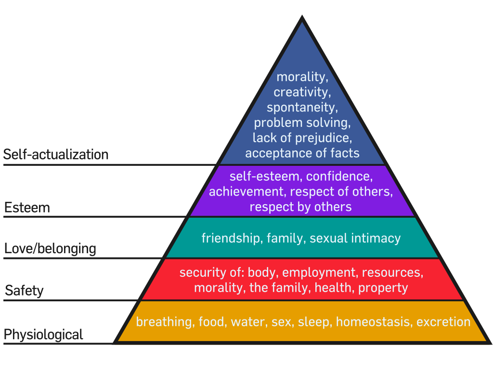

<iframe width="100%" height="468" src="https://www.youtube.com/embed/mUELAiHbCxc?start=573" title="Humanistic Psychology" frameborder="0" allow="accelerometer; autoplay; clipboard-write; encrypted-media; gyroscope; picture-in-picture; web-share" allowfullscreen></iframe>

_Humanistic psychology_ is a psychological perspective that arose in the mid-20th century in answer to two theories:
Sigmund Freud's psychoanalytic theory and B. F. Skinner's behaviorism. Abraham Maslow, in this context, established
the need for a "third force" in psychology.

Hierarchy of Needs
------------------

:::note

Source - [Wikipedia](https://en.wikipedia.org/wiki/Abraham_Maslow#Hierarchy_of_needs)

:::

Maslow described human needs as ordered in a prepotent hierarchy - a pressing need would need to be mostly satisfied
before someone would give their attention to the next highest need. None of his published works included a visual
representation of the hierarchy.

The pyramidal diagram illustrating the Maslow needs hierarchy may have been created by a psychology textbook publisher
as an illustrative device. This now iconic pyramid frequently depicts the spectrum of human needs, both physical and
psychological, as accompaniment to articles describing Maslow's needs theory and may give the impression that the
hierarchy of needs is a fixed and rigid sequence of progression. Yet, starting with the first publication of his theory
in 1943, Maslow described human needs as being relatively fluid—with many needs being present in a person simultaneously

According to Maslow's theory, when a human being ascends the levels of the hierarchy having fulfilled the needs in the
hierarchy, one may eventually achieve self-actualization. Late in life, Maslow came to conclude that self-actualization
was not an automatic outcome of satisfying the other human needs.

Human needs as identified by Maslow:

- At the bottom of the hierarchy are the "basic needs or physiological needs" of a human being: food, water, sleep, sex,
  homeostasis, and excretion.
- The next level is "safety needs: security, order, and stability". These two steps are important to the physical
  survival of the person. Once individuals have basic nutrition, shelter and safety, they attempt to accomplish more.
- The third level of need is "love and belonging", which are psychological needs; when individuals have taken care of
  themselves physically, they are ready to share themselves with others, such as with family and friends.
- The fourth level is achieved when individuals feel comfortable with what they have accomplished. This is the "esteem"
  level, the need to be competent and recognized, such as through status and level of success.
- Then there is the "cognitive" level, where individuals intellectually stimulate themselves and explore.
- After that is the "aesthetic" level, which is the need for harmony, order and beauty.
- At the top of the pyramid, "need for self-actualization" occurs when individuals reach a state of harmony and
  understanding because they are engaged in achieving their full potential. Once a person has reached the
  self-actualization state they focus on themselves and try to build their own image. They may look at this in terms of
  feelings such as self-confidence or by accomplishing a set goal.

The first four levels are known as deficit needs or D-needs. This means that if there are not enough of one of those
four needs, there will be a need to get it. Getting them brings a feeling of contentment. These needs alone are not
motivating.

Maslow wrote that [there are certain conditions that must be fulfilled in order for the basic needs to be satisfied. For
example, freedom of speech, freedom to express oneself, and freedom to seek new information](#preconditions-for-satisfying-basic-needs)
(_A Theory of Human Motivation_) are a few of the prerequisites. Any blockages of these freedoms could prevent the
satisfaction of the basic needs.

Self-actualization
------------------

Maslow defined self-actualization as achieving the fullest use of one's talents and interests—the need "to become
everything that one is capable of becoming". As implied by its name, self-actualization is highly individualistic and
reflects Maslow's premise that the self is "sovereign and inviolable" and entitled to "his or her own tastes, opinions,
values, etc." Indeed, some have characterized self-actualization as "healthy narcissism"

### Qualities of Self-actualizing People

Maslow realized that the self-actualizing individuals he studied had similar personality traits. All were "reality
centered", able to differentiate what was fraudulent from what was genuine. They were also "problem centered", meaning
that they treated life's difficulties as problems that demanded solutions. These individuals also were comfortable being
alone and had healthy personal relationships. They had only a few close friends and family rather than a large number of
shallow relationships.

Self-actualizing people tend to focus on problems outside themselves; have a clear sense of what is true and what is
false; are spontaneous and creative; and are not bound too strictly by social conventions.

Maslow noticed that self-actualized individuals had a better insight of reality, deeply accepted themselves, others and
the world, and also had faced many problems and were known to be impulsive people. These self-actualized individuals
were very independent and private when it came to their environment and culture, especially their very own individual
development on "potentialities and inner resources".

According to Maslow, self-actualizing people share the following qualities:

- Truth: honest, reality, beauty, pure, clean and unadulterated completeness
- Goodness: rightness, desirability, uprightness, benevolence, honesty
- Beauty: rightness, form, aliveness, simplicity, richness, wholeness, perfection, completion,
- Wholeness: unity, integration, tendency to oneness, interconnectedness, simplicity, organization, structure, order,
  not dissociated, synergy
- Dichotomy-transcendence: acceptance, resolution, integration, polarities, opposites, contradictions
- Aliveness: process, not-deadness, spontaneity, self-regulation, full-functioning
- Uniqueness: idiosyncrasy, individuality, non comparability, novelty
- Perfection: nothing superfluous, nothing lacking, everything in its right place, just-rightness, suitability, justice
- Necessity: inevitability: it must be just that way, not changed in any slightest way
- Completion: ending, justice, fulfillment
- Justice: fairness, suitability, disinterestedness, non partiality,
- Order: lawfulness, rightness, perfectly arranged
- Simplicity: abstract, essential skeletal, bluntness
- Richness: differentiation, complexity, intricacy, totality
- Effortlessness: ease; lack of strain, striving, or difficulty
- Playfulness: fun, joy, amusement
- Self-sufficiency: autonomy, independence, self-determining.

__Maslow based his theory partially on his own assumptions about human potential and partially on his case studies of
historical figures whom he believed to be self-actualized, including Albert Einstein and Abraham Lincoln. Consequently,
Maslow argued, the way in which essential needs are fulfilled is just as important as the needs themselves. Together,
these define the human experience. To the extent a person finds cooperative social fulfillment, he establishes
meaningful relationships with other people and the larger world. In other words, he establishes meaningful connections
to an external reality - an essential component of self-actualization. In contrast, to the extent that vital needs find
selfish and competitive fulfillment, a person acquires hostile emotions and limited external relationships - his
awareness remains internal and limited__.

Reading Notes - [_Motivation And Personality_, 2nd Ed, Maslow](https://archive.org/details/in.ernet.dli.2015.198216/mode/2up)
--------------------------------------------------------------

:::tip[Key Argument of the Book]

__In order for individuals to thrive and excel, a health-fostering culture must be created.__

:::

### Chapter 2 - Focusing on _Problems_ not _Methods_

:::tip[Key Point]

- The essence of science lies in its problems, questions, functions, or goals rather than the instruments, techniques,
  procedures, apparatus, and its methods.
- (I think) This applies to everything from personal development to business

:::

- Means centering tends to push people to become the "apparatus men, "rather than the "question askers" and the problem
  solvers
- Means centering tends strongly to overvalue quantification indiscriminately and as an end in itself
- Means-centered people tends to fit problems to techniques rather than the contrary
- Means-centered culture creates cleavage between teams

If workers looked on themselves as question askers and problem solvers rather than specialized technicians, there would
be more autonomous and creative work outcome that targets more on the _problems_ rathern than the _means_

### Chapter 3 - The 16 Propositions about Motivation 

1. Individual is an integrated, organized whole
2. _Hunger_ is not a paradigm for all other motivations
3. Most of our desires are _means to an end_ rather than _ends in themselves_.

   - This implies that the study of motivation must be in part the study of the ultimate human goals or desires or needs
   - _Means_ are usually conscious while _end_ are often unconscious. They are related in complicated way and we must
     study a person in whole to see their unconscious _end_.

4. (Human desire) _Ends in themselves_ are universal although the _means to these ends_ taken by different people can be
   dramatically different 
5. A conscious act or wish has more than one possible unconscious motivations
6. Motivation never ends, because is keeps triggering other motivations
7. Human being is never satisfied.

   - We must thrive to explore a chain of motivations rather than a single one

8. There is not "list of drives"
9. Instead, there are unconscious fundamental goals/needs
10. Motivation theory must be anthropocentric (human) rather than animalcentric (white rat)
11. Environment shapes motivation
12. Integrated person can behave disintegrated under certain overwhelming situations so that main capacities of the
    person are still left free for the more important or more challenging problems that it faces
13. Not all behaviors are motivation-driven, for example

    - self-actualization
    - growth
    - maturation
    - expression
   
14. Human are wish-realistic
15. Reality shapes the dynamics between Freudian Id and Ego
16. Focusing on healthy person instead of psychotherapists's neurotic sufferers.

### Chapter 4 - Basic Needs: Just the Basic

What we are talking about here is also called _Gratification Theory_ - gratifying a lower need bumps a person to the
next level of need. The [validity](https://youtu.be/NKEhdsnKKHs?t=411) of this theory is justified given the following
premises being true:

1. Frustration Theory
2. Learning Theory
3. Theory of Neurosis
4. Theory of Psychological Health
5. Theory of values
6. Theory of discipline, will, responsibility, etc

In addition, it must be kept in mind that there are determinants other than the Basic Need gratifications.

#### Basic Needs

:::tip[UNCONSCIOUS CHARACTER OF NEEDS]

The following needs tend to be more unconscious than conscious

:::

1. __Physiological Needs__

   - Nutritions for survival
   - Indicated by specific appetites
   - Those that are deprived of a person are regarded as being more important than something else higher

2. __Safety Needs__

   - Indication: preference for undisrupted routine or rhythm. e.g. justice, consistency, ordered world
   - Permissiveness within limits, rather than unrestricted permissiveness is preferred as well as needed by children.
     Perhaps one could express this more accurately by saying that the child needs an organized and structured world
     rather than an unorganized or unstructured one
   - Those with excessive expression of closeness with their parents might suggest they are seeing themselves facing a
     world of much greater danger, because infant tend to cling to parents at times of feeling unsafe
   - To identify the degree of safety needs of a person requires us to look at that person from an economic and social 
     context
   - Psychologically, these behaviors also shows people's attempts to seek safety

     - people's preference for familiar/known rather than unfamiliar/unknown things
     - tendency to have some religion or world philosophy
     - too freaking-out about some world events that seems to be a catastrophe to them; they seem to be looking for a
       Fuehrer

   - The neurotic individual may be described with great usefulness as a grown-up person who retains his childhood
     attitudes toward the world. That is to say, a neurotic adult may be said to behave as if he were actually afraid of
     a spanking, or of his mother's disapproval, or of being abandoned by his parents, or having his food taken away from
     him. It is as if his childish attitudes of fear and threat reaction to a dangerous world had gone underground, and
     untouched by the growing up and learning processes, were now ready to be called out by any stimulus that would make
     a child feel endangered and threatened. Horney[^1] especially has written well about "basic anxiety"

3. __Sense of Belong and Love__

   - Lots of activities within our societies are driven by the hunger for belongness.
   - Love is not sex. Love is about giving and receiving

4. __Esteem Needs__ (strength & reputation)
5. __Self-Actualization__ (He or she must be true to their own nature)

   - The desire to become more and more what one idiosyncratically is, to become everything that one is capable of
     becoming
   - Individual differences are greatest at this level

It should be noted that such order of hierarchy is not rigidly fixed for everyone. The arrangement of basic needs
differs according to different people's priority or potency. For example, some seek self-esteem (_Esteem Needs_) before
_Sense of Belong and Love_; some simply lost the desire for love. In addition, everyone has all 5 needs partially filled
and unfilled while climbing up the pyramid and people tend to develop all 5 levels at the same time with different
speed. With that said then, most human behaviors are _multimotivated_

The needs above are all driven motivations. Not all behaviors, however, are motivation-driven. Motivation-driven
behaviors are what we called _expressive behaviors_. On the other hand, _coping behaviors_ is purposive goal seeking.

A _satisfied_ need does not motivate us anymore. If that's the case, the author postulates further that what really
motivates us is "__the need to develop and actualize our fullest potentialities and capacities__."

### Chapter 5 - Consequences of Basic Needs

- People learn in a certain way toward certain learning goal _exclusively_ for the gratification of the basic needs.
- Early-childhood gratifications tends to shape a healthier adult
- Different degrees of gratifications shapes personalities
- People with gratifications of higher levels tend to be more psychologically healthier

### Chapter 6 - Something I Really Don't Care

### Chapter 7 - Higher v.s. Lower Needs

1. Higher need is a later phyletic or evolutionary development
2. Higher needs are later ontogenetic developments
3. Higher the need the less imperative at as for sheer survival, the longer gratification can be postponed, and the
   easter it as for the need to disappear permanently
4. Higher needs are less urgent subjectively
5. Higher need gratifications produce more desirable subjective results
6. Pursuit and gratification of higher needs represent a general healthward trend,  a trend away from psychopathology.
7. The higher need has more preconditions
8. A greater value is usually placed upon the higher need than upon the lower by those who have been gratified in both
9. The pursuit and gratification of the higher needs leads to greater, stronger, and truer individualism

### Chapter 8

[^1]: Horney, K, _The Neurotic Personality of Our Time_, New York Norton, 1937
