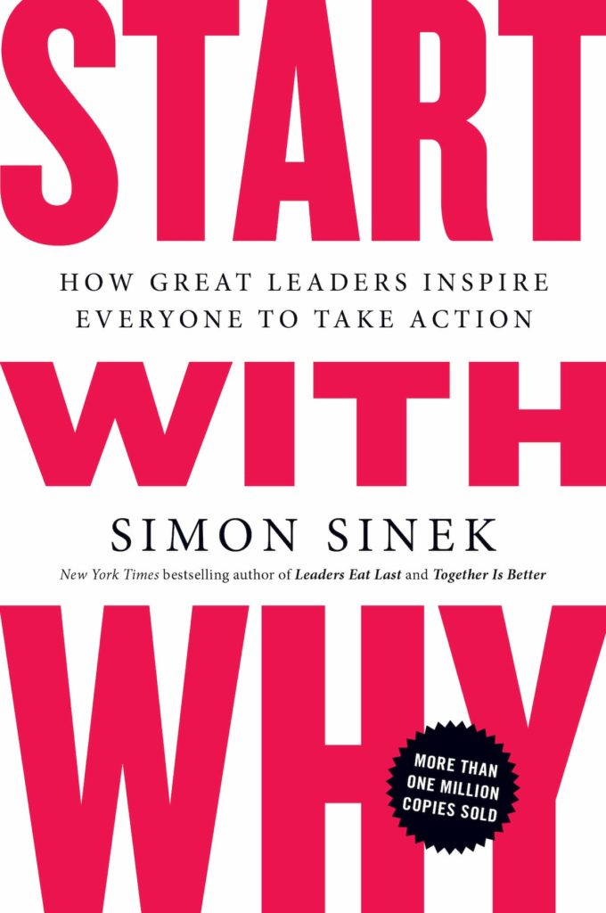
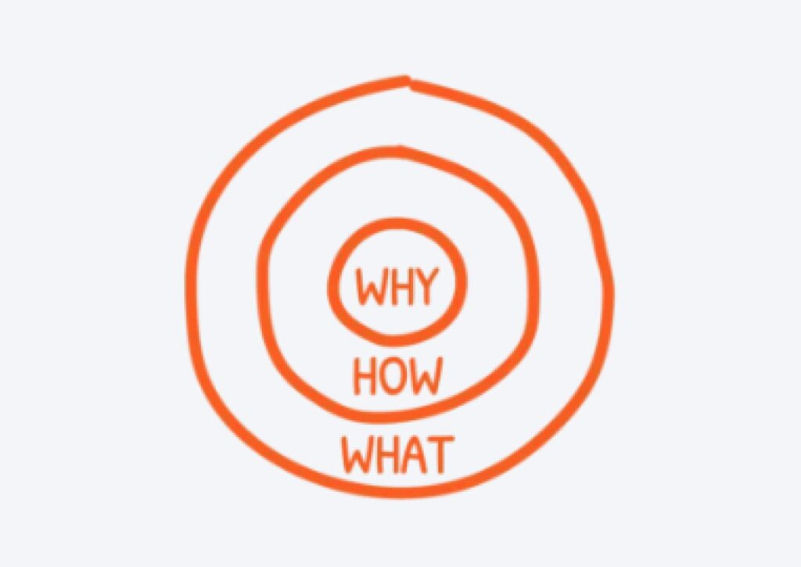
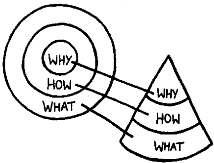

TED Talk by Simon
-----------------

<iframe width="100%" height="468" src="https://www.youtube.com/embed/qp0HIF3SfI4" title="How great leaders inspire action | Simon Sinek | TED" frameborder="0" allow="accelerometer; autoplay; clipboard-write; encrypted-media; gyroscope; picture-in-picture; web-share" allowfullscreen></iframe>

### Video Transcript

:::tip[Source]
[TED - How great leaders inspire action](https://www.ted.com/talks/simon_sinek_how_great_leaders_inspire_action/transcript?subtitle=en)
with minor corrections.
:::

How do you explain when things don't go as we assume? Or better, how do you explain when others are able to achieve
things that seem to defy all of the assumptions? For example: Why is Apple so innovative? Year after year, after year,
after year, they're more innovative than all their competition. And yet, they're just a computer company. They're just
like everyone else. They have the same access to the same talent, the same agencies, the same consultants, the same
media. Then why is it that they seem to have something different? Why is it that Martin Luther King led the Civil Rights
Movement? He wasn't the only man who suffered in a pre-civil rights America, and he certainly wasn't the only great
orator of the day. Why him? And why is it that the Wright Brothers were able to figure out controlled, powered man
flight when there were certainly other teams who were better qualified, better funded… and they didn't achieve powered
man flight, and the Wright Brothers beat them to it. There's something else at play here.

About three and a half years ago, I made a discovery. And this discovery profoundly changed my view on how I thought the
world worked, and it even profoundly changed the way in which I operate in it. As it turns out, there's a pattern. As it
turns out, all the great and inspiring leaders and organizations in the world, whether it's Apple or Martin Luther King
or the Wright Brothers, they all think, act and communicate the exact same way. And it's the complete opposite to
everyone else. All I did was codifying it, and it's probably the world's simplest idea. I call it the __Golden Circle__.

Why? How? What? This little idea explains why some organizations and some leaders are able to inspire where others
aren't. Let me define the terms really quickly. Every single person, every single organization on the planet knows what
they do, 100 percent. Some know how they do it, whether you call it your differentiated value proposition or your
proprietary process or your USP. But very, very few people or organizations know why they do what they do. And by "why"
I don't mean "to make a profit." That's a result. It's always a result. By "why," I mean: What's your purpose? What's
your cause? What's your belief? Why does your organization exist? Why do you get out of bed in the morning? And why
should anyone care? Well, as a result, the way we think, the way we act, the way we communicate is from the outside in.
It's obvious. We go from the clearest thing to the fuzziest thing. But the inspired leaders and the inspired
organizations -- regardless of their size, regardless of their industry -- all think, act, and communicate from the
inside out.

Let me give you an example. I use Apple because they're easy to understand and everybody gets it. If Apple were like
everyone else, a marketing message from them might sound like this: "We make great computers. They're beautifully
designed, simple to use and user friendly. Wanna buy one?" "Meh." And that's how most of us communicate. That's how most
marketing is done; that's how most sales are done, and that's how we communicate interpersonally. We say what we do, we
say how we're different or how we're better; we expect some sort of a behavior, a purchase, a vote, something like that.
Here's our new law firm: We have the best lawyers with the biggest clients, we always perform for our clients. Do
business with us. Here's our new car: It gets great gas mileage, it has leather seats. Buy our car. But it's
uninspiring.

Here's how Apple actually communicates. "Everything we do, we believe in challenging the status quo. We believe in
thinking differently. The way we challenge the status quo is by making our products beautifully designed, simple to use
and user friendly. We just happen to make great computers. Wanna buy one?" Totally different, right? You're ready to buy
a computer from me. All I did was I reversed the order of the information. What it proves to us is that people don't buy
what you do; people buy why you do it. People don't buy what you do; they buy why you do it.

This explains why every single person in this room is perfectly comfortable buying a computer from Apple. But we're also
perfectly comfortable buying an MP3 player from Apple, or a phone from Apple, or a DVR from Apple. But as I said before,
Apple's just a computer company. There is nothing that distinguishes them structurally from any of their competitors. 
Their competitors are equally qualified to make all of these products. In fact, they tried. A few years ago, Gateway
came out with flat-screen TVs. They're eminently qualified to make flat-screen TVs. They've been making flat-screen
monitors for years. Nobody bought one. Dell came out with MP3 players and PDAs, and they make great quality products,
and they can make perfectly well-designed products -- and nobody bought one. In fact, talking about it now, we can't
even imagine buying an MP3 player from Dell. Why would you buy MP3 player from a computer company? But we do it every
day. People don't buy what you do; they buy why you do it. The goal is not to do business with everybody who needs what
you have. The goal is to do business with people who believe what you believe.

Here's the best part: None of what I'm telling you is my opinion. It's all grounded in the tenets of biology. Not
psychology, biology. If you look at a cross-section of the human brain, looking from the top down, what you see is the
human brain is actually broken into three major components that correlate perfectly with the golden circle. Our newest
brain, our Homo sapien brain, our neocortex, corresponds with the "what" level. The neocortex is responsible for all of
our rational and analytical thought and language. The middle two sections make up our limbic brains, and our limbic
brains are responsible for all of our feelings, like trust and loyalty. It's also responsible for all human behavior,
all decision-making, and it has no capacity for language.

In other words, when we communicate from the outside in, yes, people can understand vast amounts of complicated
information like features and benefits and facts and figures. It just doesn't drive behavior. When we communicate from
the inside out, we're talking directly to the part of the brain that controls behavior, and then we allow people to
rationalize it with the tangible things we say and do. This is where gut decisions come from. You know sometimes you can
give somebody all the facts and figures, and they say, "I know what all the facts and details say, but it just doesn't
feel right." Why would we use that verb, it doesn't "feel" right? Because the part of the brain that controls
decision-making doesn't control language. And the best we can muster up is, "I don't know. It just doesn't feel right."
Or sometimes you say you're leading with your heart, or you're leading with your soul. Well, I hate to break it to you,
those aren't other body parts controlling your behavior. It's all happening here in your limbic brain, the part of the
brain that controls decision-making and not language.

But if you don't know why you do what you do, and people respond to why you do what you do, then how will you ever get
people to vote for you, or buy something from you, or, more importantly, be loyal and wanna be a part of what it is that
you do. Again, the goal is not just to sell to people who need what you have; the goal is to sell to people who believe
what you believe. The goal is not just to hire people who need a job; it's to hire people who believe what you believe.
I always say that, you know, if you hire people just because they can do a job, they'll work for your money, but if you
hire people who believe what you believe, they'll work for you with blood and sweat and tears. And nowhere else is there
a better example of this than with the Wright Brothers.

Most people don't know about Samuel Pierpont Langley. And back in the early 20th century, the pursuit of powered man
flight was like the dot com of the day. Everybody was trying it. And Samuel Pierpont Langley had, what we assume, to be
the recipe for success. I mean, even now, you ask people, "Why did your product or why did your company fail?" and
people always give you the same permutation of the same three things: under-capitalized, the wrong people, bad market
conditions. It's always the same three things, so let's explore that. Samuel Pierpont Langley was given 50,000 dollars
by the War Department to figure out this flying machine. Money was no problem. He held a seat at Harvard and worked at
the Smithsonian and was extremely well-connected; he knew all the big minds of the day. He hired the best minds money
could find and the market conditions were fantastic. The New York Times followed him around everywhere, and everyone was
rooting for Langley. And how come we've never heard of Samuel Pierpont Langley?

A few hundred miles away in Dayton, Ohio, Orville and Wilbur Wright, they had none of what we consider to be the recipe
for success. They had no money; they paid for their dream with the proceeds from their bicycle shop. Not a single person
on the Wright Brothers' team had a college education, not even Orville or Wilbur. And The New York Times followed them
around nowhere.

The difference was, Orville and Wilbur were driven by a cause, by a purpose, by a belief. They believed that if they
could figure out this flying machine, it'll change the course of the world. Samuel Pierpont Langley was different. He
wanted to be rich, and he wanted to be famous. He was in pursuit of the result. He was in pursuit of the riches. And lo
and behold, look what happened. The people who believed in the Wright Brothers' dream worked with them with blood and
sweat and tears. The others just worked for the paycheck. They tell stories of how every time the Wright Brothers went
out, they would have to take five sets of parts, because that's how many times they would crash before they came in for
supper.

And, eventually, on December 17th, 1903, the Wright Brothers took flight, and no one was there to even experience it. We
found out about it a few days later. And further proof that Langley was motivated by the wrong thing: the day the Wright
Brothers took flight, he quit. He could have said, "That's an amazing discovery, guys, and I will improve upon your
technology," but he didn't. He wasn't first, he didn't get rich, he didn't get famous, so he quit.

People don't buy what you do; they buy why you do it. And If you talk about what you believe, you will attract those who
believe what you believe.

But why is it important to attract those who believe what you believe? Something called the law of diffusion of
innovation, and if you don't know the law, you definitely know the terminology. The first 2.5% of our population are our
innovators. The next 13.5% of our population are our early adopters. The next 34% are your early majority, your late
majority and your laggards. The only reason these people buy touch-tone phones is because you can't buy rotary phones
anymore.

(Laughter)

We all sit at various places at various times on this scale, but what the law of diffusion of innovation tells us is
that if you want mass-market success or mass-market acceptance of an idea, you cannot have it until you achieve this
tipping point between 15 and 18 percent market penetration, and then the system tips. And I love asking businesses,
"What's your conversion on new business?" And they love to tell you, "Oh, it's about 10 percent," proudly. Well, you can
trip over 10% of the customers. We all have about 10% who just "get it." That's how we describe them, right? That's like
that gut feeling, "Oh, they just get it."

The problem is: How do you find the ones that get it before you're doing business with them versus the ones who don't
get it? So it's this here, this little gap that you have to close, as Jeffrey Moore calls it, "Crossing the Chasm" --
because, you see, the early majority will not try something until someone else has tried it first. And these guys, the
innovators and the early adopters, they're comfortable making those gut decisions. They're more comfortable making those
intuitive decisions that are driven by what they believe about the world and not just what product is available. These
are the people who stood in line for six hours to buy an iPhone when they first came out, when you could've just walked
into the store the next week and bought one off the shelf. These are the people who spent 40,000 dollars on flat-screen
TVs when they first came out, even though the technology was substandard. And, by the way, they didn't do it because the
technology was so great; they did it for themselves. It's because they wanted to be first. People don't buy what you do;
they buy why you do it and what you do simply proves what you believe. In fact, people will do the things that prove
what they believe. The reason that person bought the iPhone in the first six hours, stood in line for six hours, was
because of what they believed about the world, and how they wanted everybody to see them: they were first. People don't
buy what you do; they buy why you do it.

So let me give you a famous example, a famous failure and a famous success of the law of diffusion of innovation. First,
the famous failure. It's a commercial example. As we said before a second ago, the recipe for success is money and the 
right people and the right market conditions, right? You should have success then. Look at TiVo. From the time TiVo came
out about eight or nine years ago to this current day, they are the single highest-quality product on the market, hands
down, there is no dispute. They were extremely well-funded. Market conditions were fantastic. I mean, we use TiVo as
verb. I TiVo stuff on my piece-of-junk Time Warner DVR all the time.

(Laughter)

But TiVo's a commercial failure. They've never made money. And when they went IPO, their stock was at about 30 or 40
dollars and then plummeted, and it's never traded above 10. In fact, I don't think it's even traded above six, except
for a couple of little spikes.

Because you see, when TiVo launched their product, they told us all what they had. They said, "We have a product that
pauses live TV, skips commercials, rewinds live TV and memorizes your viewing habits without you even asking." And the
cynical majority said, "We don't believe you. We don't need it. We don't like it. You're scaring us."

What if they had said, "If you're the kind of person who likes to have total control over every aspect of your life,
boy, do we have a product for you. It pauses live TV, skips commercials, memorizes your viewing habits, etc., etc."
People don't buy what you do; they buy why you do it, and what you do simply serves as the proof of what you believe.

Now let me give you a successful example of the law of diffusion of innovation. In the summer of 1963, 250,000 people
showed up on the mall in Washington to hear Dr. King speak. They sent out no invitations, and there was no website to
check the date. How do you do that? Well, Dr. King wasn't the only man in America who was a great orator. He wasn't the
only man in America who suffered in a pre-civil rights America. In fact, some of his ideas were bad. But he had a gift.
He didn't go around telling people what needed to change in America. He went around and told people what he believed. "I
believe, I believe, I believe," he told people. And people who believed what he believed took his cause, and they made
it their own, and they told people. And some of those people created structures to get the word out to even more people.
And lo and behold, 250,000 people showed up on the right day on the right time to hear him speak.

How many of them showed up for him? Zero. They showed up for themselves. It's what they believed about America that got
them to travel in a bus for eight hours to stand in the sun in Washington in the middle of August. It's what they
believed, and it wasn't about black versus white: 25% of the audience was white.

Dr. King believed that there are two types of laws in this world: those that are made by a higher authority and those
that are made by men. And not until all the laws that are made by men are consistent with the laws that are made by the 
higher authority will we live in a just world. It just so happened that the Civil Rights Movement was the perfect thing
to help him bring his cause to life. We followed, not for him, but for ourselves. And by the way, he gave the "I have a
dream" speech, not the "I have a plan" speech.

(Laughter)

Listen to politicians now, with their comprehensive 12-point plans. They're not inspiring anybody. Because there are
leaders and there are those who lead. Leaders hold a position of power or authority, but those who lead inspire us.
Whether they're individuals or organizations, we follow those who lead, not because we have to, but because we want to.
We follow those who lead, not for them, but for ourselves. And it's those who start with "why" that have the ability to
inspire those around them or find others who inspire them.

Thank you very much.

Reading Notes - Start with WHY
------------------------------

:::tip[Book]

[_Start with Why: How Great Leaders Inspire Everyone to Take Action_](https://www.earthgifts.com.au/ebook/simon-sinek-start-with-why.pdf), 
Simon Sinek, Portfolio, 2011.

:::

### Phenomenons That Don't Start with Why (Part 1)

#### Assuming Too Much in the Beginning

Not all decisions work out to be the right ones, because our decisions are based on a perception of the world that may
not be completely accurate. The inaccurate information brings false assumptions. Although logic, more information and
data, and more advices from others could help, they still do not guarantee. 

Ultimately, the book authors argues that there must be something outside of our rational realm that's missing from our
decision making process. He further gives an example where he compares American and Japanese automakers. A group of
American car executives went to Japan to see a Japanese assembly line. At the end of the line, the doors were put on the
hinges, the same as in America. But something was missing. In the United States, a line worker would take a rubber
mallet and tap the edges of the door to ensure that it fit perfectly. In Japan, that job didn't seem to exist. Confused,
the American auto executives asked at what point they made sure the door fit perfectly. Their Japanese guide looked at
them and smiled sheepishly. "We make sure it fits when we design it." In the Japanese auto plant, they didn't examine
the problem and accumulate data to figure out the best solution—they engineered the outcome they wanted from the
beginning. If they didn't achieve their desired outcome, they understood it was because of a decision they made at the
start of the process.

This example is a metaphor of solving problems with short-term tactics/decisions v.s. actively assuming less from the
very beginning.

#### Manipulations

- Vicious circle of price game
- Incentives/Promotions
- Fear-based advertisement - "Every thirty-six seconds, someone dies of a heart attack"
- Aspiration messages - "Six easy steps to losing weight" (⚠️ Aspirational messages are most effective with those who
  lack discipline or have a nagging fear or insecurity that they don't have the ability to achieve their dreams on their
  own. Someone who lives a healthy lifestyle and is in a habit of exercising does not respond to "six easy steps to
  losing weight.")
- Expert/Celebrity-based endorsement in advertisement
- Novelty

Manipulations are short-termed and doesn't trigger loyalty. The reality is, in today's world, manipulations are the
norm. This book talks about an alternative - The __golden circle__:

> Source: [Golden Circle for Organizations](https://simonsinek.com/product/golden-circle-for-organizations/),
> [_Start with WHY_](https://simonsinek.com/books/start-with-why/)

Unlike manipulations which manipulates in _HOW_ and _WHAT_ level, inspiration comes from the _WHY_ level. When we are
inspired, the decisions we make have more to do with who we are and less to do with the companies or the products we're
buying.

### Golden Circle (Part 2) - It's What You Can't See That Matters

We should focus on the _WHY_ behind customers' needs, because it's not logic or facts but our hopes and dreams, our
hearts and our guts, that drive us to try new things. Products with a clear sense of WHY give people a way to tell the
outside world who they are and what they believe.

Individual can trust their gut decision by following that they love. It's not scalable thought, because the gut decision
can be a perfectly good strategy for an individual or a small organization, not for more people being able to make the
same decision that all feel right.

That's when the power of WHY come into play. The ability to put a WHY into words provides the emotional context for
decisions. When we know our WHY, we are able to put this subconsciousness into words. The rational of WHAT simply offers
the proof for the feeling of WHY.

The goal of business should not be to do business with anyone who simply wants what you have. It should be to focus on
the people who believe what you believe. When we are selective about doing business only with those who believe in our
WHY, trust emerges.

### Applications of Golden Circle (Part 3)

#### Trust (Ch. 6)

- We trust some people and companies even when things go wrong, and we don't trust others even though everything might
  have gone exactly as it should have
- Trust begins to emerge when we have a sense that another person or organization is driven by things other than their
  own self-gain
- You have to earn trust by communicating and demonstrating that you share the same values and beliefs. You have to talk
  about your _WHY_ and prove it with _WHAT_ you do. Again, a _WHY_ is just a belief, _HOW_s are the actions we take to 
  realize that belief, and _WHAT_s are the results of those actions.

##### Constructing Team's Culture Builds up Trust

- Cultures are groups of people who come together around a common set of values and beliefs
- When we share values and beliefs with others, we form trust
- In general, we do better in places that reflect our own values and beliefs

  - the goal is not to do business with anyone who simply wants what you have, but to do business with people who
    believe what you believe
  - live and work in a place where you will naturally thrive because your values and beliefs align with the values 
    and beliefs of that culture
  - It's the culture - the strong sense of beliefs and values that everyone, from the CEO to the receptionist, all 
    share, that brings such group of people together

    - the goal is not to hire people who simply have a skill set you need, the goal is to hire people who believe what
      you believe

- The role of a leader is not to come up with all the great ideas. The role of a leader is to create an environment in
  which great ideas can happen

### Applications of Golden Circle to Organizaiton (Part 4)

#### Inspire with Charisma (The "Why") (Ch. 8)

- Charisma comes from a clarity of _WHY_
- Regardless of WHAT we do in our lives, our WHY - our driving purpose, cause or belief - never changes

  - When a WHY is clear, those who share that belief will be drawn to it and maybe want to take part in bringing it to
    life.

##### Inspiring is the Beginning; Driving Movement is Next - Golden Circle Applied in Organization (3D World) (The "How") (Ch. 8)

- WHY = CEO (imagines the destination)
- HOW = The people who know better HOW to do that (find the route to get there)
- WHAT = Results

#### The "WHAT" (Ch. 9)

- The only contact that the organized system has with the disorganized system is at the base - the _WHAT_ level.
  Clearing communicating from _WHY_ level to _WHAT_ level requires communications (Ch. 10)
