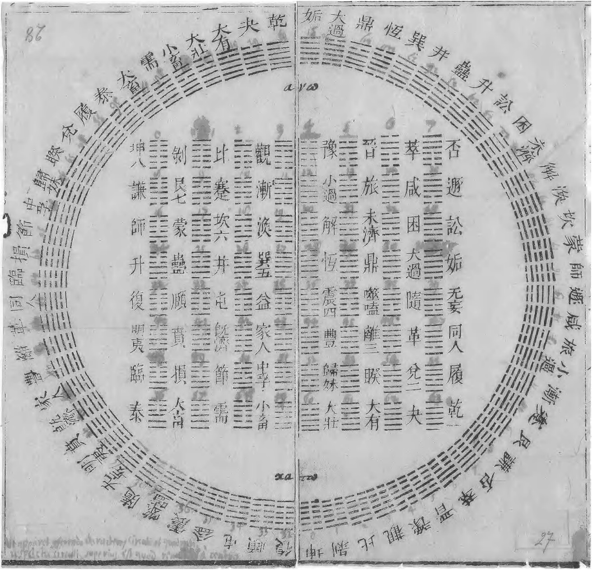

Overview of Leibniz
-------------------

_Gottfried Wilhelm Leibniz_ is a very interesting many-sided man (or more easily known as the
[_German Genius_](https://trello.com/c/rkU6jLnK)). He may have been the first computer scientist and information
theorist[^2]. He puzzled over the origins of the Slavic languages and was fascinated by classical Chinese. Leibniz was
also an expert in the Sanskrit language.[^2] He was also perhaps the first major European intellectual to take a close
interest in Chinese civilization[^2], which he knew by corresponding with, and reading other works by, European
Christian missionaries posted in China. He apparently read
[_Confucius Sinarum Philosophus_](https://en.wikipedia.org/wiki/Philippe_Couplet) in the first year of its publication.
He came to the conclusion that Europeans could learn much from the Confucian ethical tradition. He mulled over the
possibility that the Chinese characters were an unwitting form of his
[universal characteristic](https://en.wikipedia.org/wiki/Characteristica_universalis). He noted how the
[I Ching](https://en.wikipedia.org/wiki/I_Ching) (易经) hexagrams correspond to the binary numbers from 000000 to
111111, and concluded that this mapping was evidence of major Chinese accomplishments in the sort of philosophical
mathematics he admired. Leibniz was one of the western philosophers of the time who attempted to accommodate Confucian
ideas to prevailing European beliefs.

> A diagram of I Ching hexagrams sent to Leibniz from Joachim Bouvet. The Arabic numerals were added by Leibniz.

Leibniz's attraction to Chinese philosophy originates from his perception that Chinese philosophy was similar to his own
The historian E.R. Hughes suggests that Leibniz's ideas of "simple substance" and
"[pre-established harmony](https://en.wikipedia.org/wiki/Pre-established_harmony)" were directly influenced by
Confucianism, pointing to the fact that they were conceived during the period when he was reading _Confucius Sinarum
Philosophus_.

Theodicy
--------

On page 138 of _Theodicy_, the only book-length treatise that he published during his lifetime[^3], Leibniz wrote

> _Hence the conclusion that God wills all good in himself antecedently, that he wills the best consequently as an end,
> that he wills what is indifferent, and physical evil, sometimes as a means, but that he will only permit 
> moral evil as the sine quo non or as a hypothetical necessity which connects it with the best. Therefore the
> consequent will of God, which has sin for its object, is only permissive._

Leibniz thinks that the world that we live in is ABSOLUTELY the best possible world because it was created by a perfect
God. That means that there is no "excess" evil; evil always serves some sort of purpose. This has a lot to do with
[The Principal of Sufficient Reason](https://en.wikipedia.org/wiki/Principle_of_sufficient_reason). Evil can exist in a
perfect world because it has sufficient reason to be there. In fact the evil is necessary. He argues this in a few ways.
Evil is necessary for a true type of free will. For free will to be truly admirable the individual needs to be able to
choose from a full range of options (not just good ones). He also says that some ultimate goods (like free will, but we
can think of others like courage, forgiveness, compassion) need suffering in order to exist. The evil is necessary. So
God would allow for these evils in order to make greater good possible[^1].

[^1]: [Help with Leibniz's Theodicy](https://www.reddit.com/r/askphilosophy/comments/1so41y/comment/cdziue3/?utm_source=share&utm_medium=web3x&utm_name=web3xcss&utm_term=1&utm_content=share_button)
[^2]: [Wikipedia - Gottfried Wilhelm Leibniz](https://en.wikipedia.org/wiki/Gottfried_Wilhelm_Leibniz)
[^3]: Stanford Encyclopedia of Philosophy, [Leibniz on the Problem of Evil](https://plato.stanford.edu/entries/leibniz-evil/)
