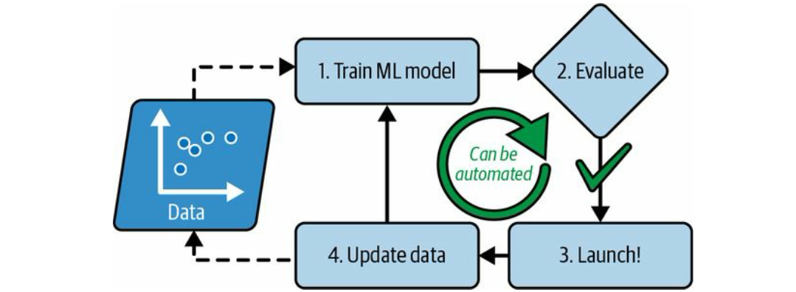
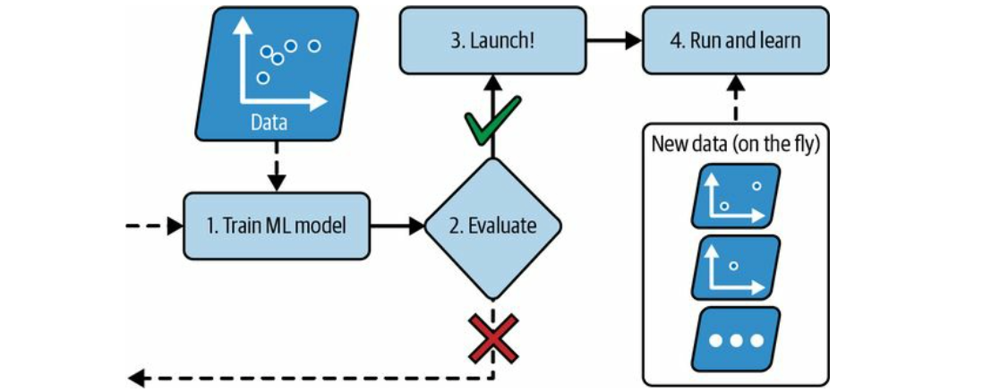

:::kokomi[Working with Real Data]

Machine Learning is about inferencing values from data. Studying about machine learning, therefore, comes out best by
experimenting with real-world data, not artificial datasets. Fortunately, there are thousands of open datasets to
choose from, ranging across all sorts of domains. Here are a few places we can look at:

- Natural Language Processing

  - [LibriSpeech ASR](https://www.openslr.org/12)
  - [Common Voice dataset](https://huggingface.co/mozilla-foundation/datasets): a series of crowd-sourced datasets where
    speakers record text from Wikipedia in various languages

- [OpenML.org](https://www.openml.org/)
- [PapersWithCode.com](https://paperswithcode.com/datasets)
- [UC Irvine Machine Learning Repository](https://archive.ics.uci.edu/)
- [TensorFlow Datasets](https://www.tensorflow.org/datasets)
- [Kaggle Datasets](https://www.kaggle.com/datasets)
- [Amazon AWS Datasets](https://registry.opendata.aws/)
- [DataPortals.org](https://dataportals.org)
- [Wikipedia's list of machine learning datasets](https://en.wikipedia.org/wiki/List_of_datasets_for_machine-learning_research)

:::

Approximation Theory
--------------------

The purpose of studying Approximation Theory is to better understand the
[Universal Approximation Theorem](https://en.wikipedia.org/wiki/Universal_approximation_theorem), which defines the
limits (or unbounded potential) of AI and Machine Learning on what Neural Networks can learn to solve real-life
problems. Approximation Theory is the foundation of Machine Learning and its usefulness is brought to life by the
advancement of contemporary computing power. For example, Approximation Theory says an approximated function exists by
Math theorem but does not indicate how to reach that approximation. Artificial Neural Network, trained by Big Data,
reaches that optimal function. Approximation theory is the proof of why AI or Machine Learning works.

:::tip[K-Armed Bandit Problem: Reinforcement Learning as an Example of Approximation]

Consider the following learning problem. We are faced repeatedly with a choice among $k$ different options, or actions.
After each choice we receive a numerical reward chosen from a stationary probability distribution that depends on the
action we selected. Our objective is to maximize the expected total reward over some time period, for example, over
1000 action selections, or _time steps_. This is the original form of the _$k$-armed bandit problem_

Mathematically, each of the $k$ actions has an expected or mean reward given that one action is selected; let us call
this the _value_ of that action. We denote the action selected on time step $t$ as $A_t$ and the corresponding reward as
$R_t$, The value of an arbitrary action $a$, denoted $q_*(a)$, is the expected reward given that $a$ is selected:

$$

q_*(a) = \mathbb{E}[R_t|A_t = a]

$$

If we know the value of each action, then it would be trivial to solve the _$k$-armed bandit problem_: we would always
select the action with the highest value. We do not know, however, the action values with certainly in reality, although
we may have estimates. We denote the estimated value of action $a$ at time step $t$ as $Q_t(a)$. We would like $Q_t(a)$
to be close to $q_*(a)$.

If we maintain estimates of the action values, then at any time step there is at least one action whose estimated value
is greatest. We call these the _greedy_ actions. When we select one of these actions, we say that we are _exploiting_
our current knowledge of the values of the actions. If instead we select one of the non-greedy actions, then we say we
are _exploring_, because this enables us to improve our estimate of the non-greedy action's value. Exploitation is the
right thing to do to maximize the expected reward on the one step, but exploration may produce the greater total reward
in the long run.

Given that exploring and exploiting is not possible in any single action, systematic methods are used to balance the
exploration and exploitation. This is the basic idea behind reinforcement learning.

:::

Defining Machine Learning
-------------------------

__Machine Learning__ addresses the question of how to build computer programs that improve their performance at some
task through experience.

:::tip[Definition of Learning]

A computer program is said to __learn__ from experience/data $E$ with respect to some class of tasks $T$ and performance
measure $P$, it its performance at tasks in $T$, as measured by $P$, improves with experience $E$.

:::

The problem of [inducing general functions from specific training examples](#approximation-theory) is central to
learning. 

:::tip[Machine Learning v.s. Data Mining]

Machine Learning and Data Mining often employ the same methods and overlap significantly, but while machine learning
focuses on prediction, based on _known_ properties learned from the training data, [data mining] focuses on the
discovery of (previously) _unknown_ properties in the data (this is the analysis step of knowledge discovery in
databases)

:::

There are so many different types of machine learning systems that it is useful to classify them in broad categories,
based on the following criteria:

- How they are supervised during training ([supervised, unsupervised, semi-supervised, self-supervised](#supervised-unsupervised-semi-supervised-self-supervised-reinforcement-learning), and others)
- Whether or not they can learn incrementally on the fly ([online v.s. batch learning](#online-vs-batch-learning))
- Whether they work by simply comparing new data points to known data points, or instead by detecting patterns in the
  training data and building a predictive model, much like scientists do (
  [instance-based v.s. model-based learning](#instance-based-vs-model-based-learning))

### Supervised, Unsupervised, Semi-Supervised, Self-Supervised, Reinforcement Learning

Machine learning systems can be classified according to the amount and type of supervision they get during training. The
main categories are

- __Supervised learning__: the training set we feed to the algorithm includes the desired solutions, called __labels__.
  A typical supervised learning task is _classification_, such as spam detector in email
- __Unsupervised learning__: the training data is unlabeled. _Clustering and 2D/3D Visualization_ are examples.
- __Semi-supervised learning__: when labeling data is time-consuming and we end up having some labeled instances and
  some unlabeled, simi-supervised learning can deal with this situation.
- __Self-supervised learning__: generate a fully labeled dataset from a fully unlabeled one
- __Reinforcement learning__: the learning system, called an __agent__ in this context, can observe the environment,
  select and perform actions, and get _rewards_ or _penalties_ in return. It must then learn by itself what is the best
  strategy, called a __policy__, to get the most reward over time. A policy defines what action the agent should choose
  when it is in a given situation.

### Online v.s. Batch Learning

#### Batch learning

In batch learning, the system is trained using all the available data. This will generally take a lot of time and
computing resources, so it is typically done offline. First the system is trained, and then it is launched into
production and runs without learning anymore; it just applies what it has learned. This is called _offline learning_.

The batch learning can be automated fairly easily when it needs a new round of training with new data:



:::kokomi[Practical Batch Learning]

Automated batch learning is simple and often works fine, ___but___

- training using the full set of data can take many hours, so we would typically train a new system only every 24 hours
  or even just weekly. If our system needs to adapt to rapidly changing data (e.g., to predict stock prices), then we
  need a more reactive solution.
- training on the full set of data requires a lot of computing resources (CPU, memory space, disk space, disk I/O,
  network I/O, etc.). If we have a lot of data and we automate your system to train from scratch every day, it will end
  up costing us a lot of money. If the amount of data is huge, it may even be impossible to use a batch learning
  algorithm.
- if our system needs to be able to learn autonomously and it has limited resources (e.g., a smartphone application or a
  rover on Mars), then carrying around large amounts of training data and taking up a lot of resources to train for
  hours every day is a showstopper.

:::

A model's performance tends to decay slowly over time, simply because the world continues to evolve while the model
remains unchanged. This phenomenon is often called __model rot__ or __data drift__ ⚠️. The solution is to regularly
retrain the model on up-to-date data. How often we need to do that depends on the use case

#### Online Learning

In online learning, we train the system incrementally by feeding it data instances sequentially, either individually or
in small groups called mini-batches. Each learning step is fast and cheap, so the system can learn about new data on
the fly, as it arrives



One important parameter of online learning systems is how fast they should adapt to changing data: this is called the
__learning rate__ (not to be confused with _learning rate_ as a hyperparameter). If we set a high learning rate, then
our system will rapidly adapt to new data, but it will also tend to quickly forget the old data (for example, a spam 
filter would then flag only the latest kinds of spam). Conversely, if we set a low learning rate, the system will have
more inertia; that is, it will learn more slowly, but it will also be less sensitive to noise in the new data or to
sequences of nonrepresentative data points (outliers).

:::kokomi[Practical Online Learning]

A big challenge with online learning is that if bad data is fed to the system, the system's performance will decline,
possibly quickly. To reduce this risk, we need to monitor our system closely and promptly switch learning off (and
possibly revert to a previously working state) if we detect a drop in performance. We may also want to monitor the input
data and react to abnormal data; for example, using an anomaly detection algorithm

:::

### Instance-Based v.s. Model-Based Learning

One more way to categorize machine learning systems is by how they _generalize_. Most machine learning tasks are about
making predictions. This means that given a number of training examples, the system needs to be able to make good
predictions for (generalize to) examples it has never seen before. Having a good performance measure on the training
data is good, but insufficient; the true goal is to perform well on new instances.

There are 2 main approaches to generalization:

1. [instance-based learning](#instance-based-learning), and
2. [model-based learning](#model-based-learning)

#### Instance-Based Learning

Possibly the most trivial form of learning is simply to learn by heart. A spam email detection would measure the
similarity between two emails. A (very basic) similarity measure between two emails could be to count the number of
words they have in common. The system would flag an email as spam if it has many words in common with a known spam
email.

This is called _instance-based learning_: the system learns the examples by heart, then generalizes to new cases by
using a similarity measure to compare them to the learned examples (or a subset of them). 

#### Model-Based Learning

Another way to generalize from a set of examples is to build a model of these examples and then use that model to make
_predictions_. This is called _model-based learning_ <a href="https://colab.research.google.com/github/QubitPi/machine-learning/blob/master/01_the_machine_learning_landscape.ipynb" class="google-colab-link" style="color: white; text-decoration: none; margin: 0 5px 0 1px" target="_blank">Explore in Colab</a> <a href="https://kaggle.com/kernels/welcome?src=https://github.com/QubitPi/machine-learning/blob/master/01_the_machine_learning_landscape.ipynb" class="kaggle-link" style="color: white; text-decoration: none; margin: 0 1px 0 5px" target="_blank">Explore in Kaggle</a>

Main Challenges of Machine Learning
-----------------------------------

### Insufficient Quantity of Training Data

It takes a lot of data for most machine learning algorithms to work properly. Even for very simple problems we typically
need thousands of examples, and for complex problems such as image or speech recognition we may need millions of
examples.

:::kokomi[The Unreasonable Effectiveness of Data]

In a [famous paper](https://dl.acm.org/doi/10.3115/1073012.1073017) published in 2001, Microsoft researchers Michele
Banko and Eric Brill showed that very different machine learning algorithms, including fairly simple ones, performed
almost identically well on a complex problem of natural language disambiguation once they were given enough data

As the authors put it, "these results suggest that we may want to reconsider the trade-off between spending time and
money on algorithm development versus spending it on corpus development".

The idea that data matters more than algorithms for complex problems was further popularized by Peter Norvig et al. in a
paper titled
"[The Unreasonable Effectiveness of Data](https://static.googleusercontent.com/media/research.google.com/en//pubs/archive/35179.pdf)", 
published in 2009.

:::

### Nonrepresentative Training Data

<a href="https://colab.research.google.com/github/QubitPi/machine-learning/blob/master/01_the_machine_learning_landscape.ipynb" class="google-colab-link" style="color: white; text-decoration: none; margin: 0 5px 0 1px" target="_blank">Explore in Colab</a> <a href="https://kaggle.com/kernels/welcome?src=https://github.com/QubitPi/machine-learning/blob/master/01_the_machine_learning_landscape.ipynb" class="kaggle-link" style="color: white; text-decoration: none; margin: 0 1px 0 5px" target="_blank">Explore in Kaggle</a>

In order to generalize well, it is crucial that our training data be representative of the new cases we want to
generalize to. This is true whether we use instance-based learning or model-based learning and is often harder than it
sounds: if the sample is too small, we will have __sampling noise__ (i.e., non-representative data as a result of
chance), but even very large samples can be non-representative if the sampling method is flawed. This is called
__sampling bias__.

### Overfitting the Training Data

<a href="https://colab.research.google.com/github/QubitPi/machine-learning/blob/master/01_the_machine_learning_landscape.ipynb" class="google-colab-link" style="color: white; text-decoration: none; margin: 0 5px 0 1px" target="_blank">Explore in Colab</a> <a href="https://kaggle.com/kernels/welcome?src=https://github.com/QubitPi/machine-learning/blob/master/01_the_machine_learning_landscape.ipynb" class="kaggle-link" style="color: white; text-decoration: none; margin: 0 1px 0 5px" target="_blank">Explore in Kaggle</a>

Say we are visiting a foreign country and the taxi driver rips us off. We might be tempted to say that _all_ taxi
drivers in that country are thieves. Overgeneralizing is something that we humans do all too often, and unfortunately
machines can fall into the same trap if we are not careful. In machine learning this is called __overfitting__: it means
that the model performs well on the training data, but it does not generalize well. See an accompanying Jupyter notebook
example that illustrate such phenomenon and its possible solutions

### Underfitting the Training Data

Underfitting is the opposite of overfitting: it occurs when our model is too simple to learn the underlying structure of
the data. For example, a linear model of life satisfaction is prone to underfit; reality is just more complex than the
model, so its predictions are bound to be inaccurate, even on the training examples.

Here are the main options for fixing this problem:

- Select a more powerful model, with more parameters.
- Feed better features to the learning algorithm (__Feature Engineering__).
- Reduce the constraints on the model

Testing and Validating
----------------------

The only way to know how well a model will generalize to new cases is to actually try it out on new cases. One way to do
that is to split our data into two sets:

1. the __1️⃣ training set__, and
2. the __2️⃣ test set__

As these names imply, we train our model using the training set, and we test it using the test set. The error rate on
new cases is called the __generalization error__ (or out-of-sample error), and by evaluating the model on the test set,
we get an estimate of this error. This value tells us how well the model will perform on instances it has never seen
before. If the training error is low but the generalization error is high, it means that the model is overfitting the
training data for example.

:::tip

It is common to use 80% of the data for training and hold out 20% for testing. However, this depends on the size of the
dataset: if it contains 10 million instances, then holding out 1% means the test set will contain 100,000 instances,
probably more than enough to get a good estimate of the generalization error.

:::

In another situation, suppose we are hesitating between 2 candidate models. How do we decide between them? One option is
to train both and compare how well they generalize using the test set. Suppose further that the linear model generalizes
better, but we want to apply some regularization to avoid overfitting. The question is, how do we choose the value of
the regularization hyperparameter? One option is to train 100 different models using 100 different values for this
hyperparameter. Finally we launch the model with the best hyperparameter value which produces the smallest
generalization error of 5% into production, but unfortunately it does not perform as well as expected and produces 15%
errors. What just happened?

The problem is that we measured the generalization error multiple times on the test set, and we adapted the model and
hyperparameters to produce the best model for that particular set. This means the model is unlikely to perform as well
on new data. A common solution to this problem is called __holdout validation__:  simply hold out part of the training
set to evaluate several candidate models and select the best one. The new held-out set is called the __3️⃣ validation
set__ (or the development set, or dev set). The steps are:

1. train multiple models with various hyperparameters on the reduced training set (i.e., the full training set minus the
   validation set)
2. select the model that performs best on the validation set.
3. train the best model on the full training set (including the validation set), which gives us the final model.
4. evaluate this final model on the test set to get an estimate of the generalization error

Machine Learning Project Checklist
----------------------------------

As a well-organized data scientist, the first thing we should do before any serious business project is to pull out our
machine learning project checklist which can guide us through our machine learning projects in 8 main steps:

:::tip

There is a complete end-to-end notebook project that demonstrate this process - <a href="https://colab.research.google.com/github/QubitPi/machine-learning/blob/master/02_end_to_end_machine_learning_project.ipynb" class="google-colab-link" style="color: white; text-decoration: none; margin: 0 5px 0 1px" target="_blank">Explore in Colab</a> <a href="https://kaggle.com/kernels/welcome?src=https://github.com/QubitPi/machine-learning/blob/master/02_end_to_end_machine_learning_project.ipynb" class="kaggle-link" style="color: white; text-decoration: none; margin: 0 1px 0 5px" target="_blank">Explore in Kaggle</a>

:::

1. __Document everything along the way__
2. Frame the problem and look at the bit picture

   1. Define the objective in business terms
   2. How will the solution be used?
   3. What are the current solutions/workarounds (if any)?
   4. How should this problem to framed (i.e. supervised/unsupervised, online/offline, etc.)?
   5. How should performance be measured
   6. Is the performance measure aligned with business objective?
   7. What would be the minimum performance needed to reach the business objective?
   8. What are comparable problems? Can we reuse experience or tools?
   9. Is human expertise available?
   10. How would we solve the problem manually?
   11. List the assumptions we or others have made so far
   12. Verify assumptions if possible

3. Get the data

   :::tip

   Automate as much as possible so we can get fresh data easily

   :::

4. Explore the data to gain insights
5. Prepare the data to better expose the underlying data patterns to machine learning algorithms
6. Explore many different models and shortlist the best ones
7. Fine-tune our models and combine them into a solution
8. Present solution

   - Make sure the big picture is hightlighted first 
   - Explain why this solution achieves the business objective 
   - Describe what worked and what didn't
   - List assumptions and system's limitations
   - Ensure keys findings are communicated through beautiful visualizations or easy-to-remember statements

9. Launch, monitor, and maintain the system

Neural Networks
---------------

The area of Neural Networks has originally been primarily inspired by the goal of modeling biological neural systems,
but has since diverged and become a matter of engineering and achieving good results in Machine Learning tasks.
Therefore, the Neural Networks and AI in general is essentially the discipline of Machine Learning

### Biological Motivation and Connections

Historically, digital computers such as the [von Neumann model](https://en.wikipedia.org/wiki/Von_Neumann_model) operate
via the execution of explicit instructions with access to memory by a number of processors. Some neural networks, on the
other hand, originated from efforts to model information processing in biological systems through the framework of
[connectionism](https://en.wikipedia.org/wiki/Connectionism). Unlike the von Neumann model, connectionist computing does
not separate memory and processing.

:::tip[Basic Principles of Connectionism]

The central connectionist principle is that mental phenomena can be described by interconnected networks of simple and
often uniform units. The form of the connections and the units can vary from model to model. For example, units in the
network could represent neurons and the connections could represent synapses, as in the human brain.

- __Activation function__: Internal states of any network change over time due to neurons sending a signal to a
  succeeding layer of neurons in the case of a feedforward network, or to a previous layer in the case of a recurrent
  network. _The activation function defines under what circumstances will a neuron send a signal outward to other
  neurons_. This can be, for example, a function of probability whose range describes the probability of the neuron
  firing the signal
- __Memory and learning__: Neural networks follow two basic principles:

    1. Any mental state can be described as a $n$-dimensional vector of numeric activation values over neural units in a
       network.
    2. Memory and learning are created by modifying the 'weights' of the connections between neural units, generally
       represented as an $(n \times m)$ matrix. The weights are adjusted according to some learning rule or algorithm

:::

The basic computational unit of the brain is a __neuron__. Approximately 86 billion neurons can be found in the human
nervous system and they are connected with approximately $10^{14}$ - $10^{15}$ synapses. The diagram below shows a
cartoon drawing of a biological neuron (left) and a common mathematical model (right).


Each neuron receives input signals from its __dendrites__ and produces output signals along its (single) __axon__. The
axon eventually branches out and connects via synapses to dendrites of other neurons.

In the computational model of a neuron, the signals that travel along the axons (e.g. $x_0$) interact multiplicatively
(e.g. $w_0x_0$) with the dendrites of the other neuron based on the synaptic strength at that synapse (e.g. $w_0$). The
idea is that the synaptic strengths (the weights $w$) are learnable and control the strength of influence (and its
direction: excitory (__positive weight__) or inhibitory (__negative weight__)) of one neuron on another. In the basic
model, the dendrites carry the signal to the cell body where they all get summed. If the final sum is above a certain
threshold, the neuron can fire, sending a spike along its axon. In the computational model, we assume that the precise
timings of the spikes do not matter, and that only the frequency of the firing communicates information. Based on this
rate code interpretation, we model the firing rate of the neuron with an __activation function $f$__, which represents
the frequency of the spikes along the axon. Historically, a common choice of activation function is the sigmoid
function $σ$, since it takes a real-valued input (the signal strength after the sum) and squashes it to range between 0
and 1. An example code for forward-propagating a single neuron might look as follows:

```python
class Neuron(object):
    # ... 
    def forward(self, inputs):
        """ assume inputs and weights are 1-D numpy arrays and bias is a number """
        cell_body_sum = np.sum(inputs * self.weights) + self.bias
        firing_rate = 1.0 / (1.0 + math.exp(-cell_body_sum)) # sigmoid activation function
        return firing_rate
```

In other words, each neuron performs a dot product with the input and its weights, adds the bias and applies the
non-linearity (or activation function), in this case the sigmoid

$$

\sigma(x) = \frac{1}{1 + e^{-x}}

$$

:::warning[Coarse model]

It's important to stress that this model of a biological neuron is very coarse. For example, there are many different
types of neurons, each with different properties. The dendrites in biological neurons perform complex nonlinear
computations. The synapses are not just a single weight, they are a complex non-linear dynamical system. The exact
timing of the output spikes in many systems is known to be important, suggesting that the rate code approximation may
not hold. Due to all these and many other simplifications, be prepared to hear groaning sounds from anyone with some
neuroscience background if we draw analogies between Neural Networks and real brains. See this
[review](https://www.sciencedirect.com/science/article/abs/pii/S0959438814000130) if people are interested.

:::

Neural Networks are modeled as collections of neurons that are connected in an acyclic graph. In other words, the
outputs of some neurons can become inputs to other neurons. Cycles are not allowed since that would imply an infinite
loop in the forward pass of a network. Instead of an amorphous blobs of connected neurons, Neural Network models are
often organized into distinct layers of neurons.

### Convolutional Neural Networks (CNNs)

Convolutional Neural Networks (__ConvNets__ or __CNNs__) are a category of Neural Networks that have proven very
effective in areas such as image recognition and classification. ConvNets have been successful in identifying faces,
objects and traffic signs apart from powering vision in robots and self-driving cars.


In the figure above, a ConvNet is able to recognize scenes and the system is able to suggest relevant captions ("a
soccer player is kicking a soccer ball") while figure below shows an example of ConvNets being used for recognizing
everyday objects, humans and animals. Lately,
[ConvNets have been effective in several Natural Language Processing tasks](#convolutional-neural-networks-for-nlp)
(such as sentence classification) as well.


Essentially, every image can be represented as a matrix of pixel values.


[Channel](https://en.wikipedia.org/wiki/Channel_(digital_image)) is a conventional term used to refer to a certain
component of an image. An image from a standard digital camera will have three channels - red, green and blue - we can
imagine those as three 2d-matrices stacked over each other (one for each color), each having pixel values in the range 0
to 255. A [grayscale](https://en.wikipedia.org/wiki/Grayscale) image, on the other hand, has just one channel. We will
only consider grayscale images, so we will have a single 2d matrix representing an image. The value of each pixel in the
matrix will range from 0 to 255 - zero indicating black and 255 indicating white.

#### Convolution Step

ConvNets derive their name from the ["convolution" operator](http://en.wikipedia.org/wiki/Convolution). The primary
purpose of convolution in case of a ConvNet is to extract features from the input image. Convolution preserves the
spatial relationship between pixels by learning image features using small squares of input data. We will not go into
the mathematical details of Convolution here, but will try to understand how it works over images.

As we discussed above, every image can be considered as a matrix of pixel values. Consider a 5 x 5 image whose pixel
values are only 0 and 1 (note that for a grayscale image, pixel values range from 0 to 255, the green matrix below is a
special case where pixel values are only 0 and 1):


Also, consider another 3 x 3 matrix as shown below:


Then, the Convolution of the 5 x 5 image and the 3 x 3 matrix can be computed as shown in the animation below:


We slide the orange matrix over our original image (green) by 1 pixel (also called __stride__) and for every position,
we compute element wise multiplication (between the two matrices) and add the multiplication outputs to get the final
integer which forms a single element of the output matrix (pink). Note that the 3×3 matrix sees only a part of the input
image in each stride. In CNN terminology, the 3×3 matrix is called a __filter__ or [__kernel__](https://en.wikipedia.org/wiki/Kernel_(image_processing)) or __feature detector__
and the matrix formed by sliding the filter over the image and computing the dot product is called the __Convolved
Feature__ or __Activation Map__ or the __Feature Map__. It is important to note that filters acts as feature detectors
from the original input image.

In practice, a CNN learns the values of these filters on its own during the training process (although we still need to specify parameters such as number of filters, filter size, architecture of the network etc. before the training process). The more filters we have, the more image features get extracted and the better our network becomes at recognizing patterns in unseen images.

The size of the Feature Map is controlled by 3 parameters that we need to decide before the convolution step is
performed:

1. __Depth__: Depth corresponds to the number of filters we use for the convolution operation. In the network shown
   below, we are performing convolution of the original boat image using three distinct filters, thus producing three
   different feature maps as shown. We can think of these three feature maps as stacked 2d matrices

   

2. __Stride__: Stride is the number of pixels by which we slide our filter matrix over the input matrix. When the stride
   is 1 then we move the filters one pixel at a time. When the stride is 2, then the filters jump 2 pixels at a time as
   we slide them around. Having a larger stride will produce smaller feature maps.
3. __Zero-padding__: Sometimes, it is convenient to pad the input matrix with zeros around the border, so that we can
   apply the filter to bordering elements of our input image matrix. A nice feature of zero padding is that it allows us
   to control the size of the feature maps. Adding zero-padding is also called _wide convolution_, and not using
   zero-padding would be a _narrow convolution_.

#### Pooling Step

Spatial Pooling (also called subsampling or downsampling) reduces the dimensionality of each feature map but retains the
most important information. Spatial Pooling can be of different types: Max, Average, Sum etc.

In case of Max Pooling, we define a spatial neighborhood (for example, a 2×2 window) and take the largest element from
the rectified feature map within that window. Instead of taking the largest element we could also take the average
(Average Pooling) or sum of all elements in that window. In practice, Max Pooling has been shown to work better.


Pooling

- makes the input representations (feature dimension) smaller and more manageable
- reduces the number of parameters and computations in the network, therefore, controlling overfitting
- makes the network invariant to small transformations, distortions and translations in the input image
- helps us arrive at an almost scale invariant representation of our image. This is very powerful since we can detect
  objects in an image no matter where they are located

#### Architecture

A convolutional neural network consists of an input layer, hidden layers and an output layer. In a convolutional neural
network, __the hidden layers include one or more layers that perform [convolutions](#convolution-step) followed by other
layers such as [pooling](#pooling-step) layers and fully connected layers__

After several convolutional and max pooling layers, the final classification is done via fully connected layers. Neurons
in a fully connected layer have connections to neurons in the previous layer. The input to this fully connected layer
is a one-dimensional vector, which is the flattened output of the convolutional/pooling layers.

:::kokomi[What does the flattening look like?]

In a Convolutional Neural Network (CNN), the input to the fully connected network (FCN) is the output of the final
convolutional layer or pooling layer. This input is typically a 3-dimensional tensor with height, width, and depth
representing the extracted features. The flattening on this 3D tensor is essentially "unfolding" all the dimensions
together. The resulting one-dimensional vector will have a size equal to the product of the original dimensions. For
example, a $5 \times 5 \times 2$ tensor has the flattened vector with size of $5 \times 5 \times 2 = 50$, which is the
number of neurons of the FCN input layers.

:::


There are two aspects of this computation worth paying attention to: 

1. __Location Invariance__: Let's say we want to classify whether or not there's an elephant in an image. Because we are
   sliding our filters over the whole image we don't really care where the elephant occurs. In practice,
   [pooling](#pooling-step) also gives us invariance to translation, rotation and scaling.
2. __Compositionality__: Each filter composes a local patch of lower-level features into higher-level representation.
   That's why CNNs are so powerful in Computer Vision. It makes intuitive sense that you build edges from pixels, shapes
   from edges, and more complex objects from shapes.

#### Convolutional Neural Networks for NLP

Instead of image pixels, the input to most NLP tasks are sentences or documents represented as a matrix. Each row of the
matrix corresponds to one token, typically a word, but it could be a character. That is, each row is vector that
represents a word. Typically, these vectors are word embeddings (low-dimensional representations) like
[word2vec](https://en.wikipedia.org/wiki/Word2vec) or [GloVe](https://nlp.stanford.edu/projects/glove/), but they could
also be one-hot vectors that index the word into a vocabulary. For a 10 word sentence using a 100-dimensional embedding
we would have a 10×100 matrix as our input. That's our "image".

In vision, our filters slide over local patches of an image, but in NLP we typically use filters that slide over full
rows of the matrix (words). Thus, the "width" of our filters is usually the same as the width of the input matrix. The
height, or __region size__, may vary, but sliding windows over 2-5 words at a time is typical. Putting all the above
together, a Convolutional Neural Network for NLP may look like this:


In the illustration of this Convolutional Neural Network (CNN) architecture for sentence classification above, we depict
three filter region sizes: 2, 3 and 4, each of which has 2 filters. Every filter performs convolution on the sentence
matrix and generates (variable-length) feature maps. Then 1-max pooling is performed over each map, i.e., the largest
number from each feature map is recorded. Thus a univariate feature vector is generated from all six maps, and these 6
features are concatenated to form a feature vector for the penultimate layer. The final softmax layer then receives this
feature vector as input and uses it to classify the sentence; here we assume binary classification and hence depict two
possible output states.

What about the nice intuitions we had for Computer Vision? Location Invariance and local Compositionality made intuitive
sense for images, but not so much for NLP. We probably do care a lot where in the sentence a word appears (Except for
Latin). Pixels close to each other are likely to be semantically related (part of the same object), but the same isn't
always true for words. In many languages, parts of phrases could be separated by several other words. The compositional
aspect isn't obvious either. Clearly, words compose in some ways, like an adjective modifying a noun, but how exactly
this works what higher level representations actually "mean" isn’t as obvious as in the Computer Vision case. Given all
this, [Recurrent Neural Networks](#recurrent-neural-networks-rnns) make more intuitive sense. They resemble how we
process language, or at least how we think we process language: Reading sequentially from left to right.

Recurrent Neural Networks (RNNs)
--------------------------------

A glaring limitation of Vanilla Neural Networks (and also [Convolutional Networks](#convolutional-neural-networks-cnns))
is that their API is too constrained. They accept a fixed-sized vector as input (e.g. an image) and produce a
fixed-sized vector as output (e.g. probabilities of different classes). In addition, these models perform this mapping
using a fixed amount of computational steps (e.g. the number of layers in the model). The core reason that recurrent
nets are more exciting is that they allow us to operate over sequences of vectors: Sequences in the input, the output,
or in the most general case both. We will illustrate this now

### Introduction

We all heard of this buz word "LLM" (Large Language Model). But let's put that aside for just a second and look at a
much simpler one called "character-level language model" where, for example, we input a prefix of a word such as "hell"
and the model outputs a complete word "hello". That is, this language model predicts the next character of a character
sequence. This is like a Math function where we have:

$$
f(\text{“hell"}) = \text{“hello"}
$$

where we call inputs like "hell" a __sequence__.

How do we obtain a function like this? One approach is to have 4 black boxes, each of which takes a single character as
input and calculates an output:


But one might have noticed that if the 3rd function (box) produces $f('l') = 'l'$, then why would the 4th function
(box), given the same input, gives a different output of 'o'? This suggest that we should take the __history__ into
account. Instead of having $f$ depend on 1 parameter, we now have it take 2 parameters.

1. a character;
2. a variable that summarizes the previous calculations:


Now it makes much more sense with:

$$
f(\text{‘l'}, h_2) = \text{‘l'}
$$

$$
f(\text{‘l'}, h_3) = \text{‘o'}
$$

But what if we want to predict a longer or shorter word? For example, how about predicting "cat" by "ca"? That's simple,
we will have 2 black boxes to do the work.


What if the function $f$ is not smart enough to produce the correct output everytime? We will simply collect a lot of
examples such as "cat" and "hello", and feed them into the boxes to train them until they can output correct vocabulary
like "cat" and "hello".

This is the idea behind [RNN](https://en.wikipedia.org/wiki/Recurrent_neural_network). It's recurrent because the boxed
function gets invoked repeatedly for each element of the sequence. In the case of our character-level language model,
element is a character such as "e" and sequence is a string like "hell"


Each function $f$ is a network unit containing 2 perceptrons. One perceptron computes the "history" like $h_1$, $h_2$,
$h_3$.

One great thing about the RNNs is that they offer a lot of flexibility on how we wire up the neural network
architecture. Normally when we are working with neural networks, we are given a fixed sized input vector (red boxes
below), then we process it with some hidden layers (green), and we produce a fixed sized output vector (blue). The
left-most model in figure below is the [__Vanilla Neural Networks__](#architecture), which receives a single input and
produce one output (_The green box in between actually represents __layers__ of neurons_). The rest of the models on the
right are all __Recurrent Neural Networks__ that allow us to operate over sequences of input, output, or both at the
same time:

- An example of __one-to-many__ model is image captioning where we are given a fixed sized image and produce a sequence
  of words that describe the content of that image through RNN
- An example of __many-to-one__ task is sentiment classification in NLP where we are given a sequence of words of a
- sentence and then classify what sentiment (e.g. positive or negative) that sentence is.
- An example of __many-to-many__ task is machine translation in NLP, where we can have an RNN that takes a sequence of
  words of a sentence in English, and then this RNN is asked to produce a sequence of words of a sentence in German.
- There is also a __variation of many-to-many__ task as shown in the last model in figure below, where the model
  generates an output at every timestep. An example of this many-to-many task is video classification on a frame level
  where the model classifies every single frame of video with some number of classes. We should note that we don't want
  this prediction to only be a function of the current timestep (current frame of the video), but also all the timesteps
  (frames) that have come before this video.


:::tip

A [CNN](#convolutional-neural-networks-cnns) learns to recognize patterns across __space__. So a CNN will learn to
recognize components of an image (e.g., lines, curves, etc.) and then learn to combine these components to recognize
larger structures (e.g., faces, objects, etc.)

A RNN will similarly learn to recognize patterns across __time__. So a RNN that is trained to translate text might learn
that "dog" should be translated differently if preceded by the word "hot".

The mechanism by which the two kinds of NNs represent these patterns is different, however. In the case of a CNN, we are
looking for the same patterns on all the different subfields of the image. In the case of a RNN we are (in the simplest
case) feeding the hidden layers from the previous step as an additional input into the next step. While the RNN builds
up memory in this process, it is not looking for the same patterns over different slices of time in the same way that a
CNN is looking for the same patterns over different regions of space.

It should be noted that "time" and "space" here shouldn't be taken too literally. We could run a RNN on a single image
for image captioning, for instance, and the meaning of "time" would simply be the order in which different parts of the
image are processed. So objects initially processed will inform the captioning of later objects processed.

:::

The sequence regime of operation is much more powerful compared to fixed networks that are doomed from the get-go by a
fixed number of computational steps. Moreover, as we’ll see in a bit, RNNs combine the input vector with their state
vector with a fixed (but learned) function to produce a new state vector. This can in programming terms be interpreted
as running a fixed program with certain inputs and some internal variables. Viewed this way, RNNs essentially describe
programs. In fact, it is known that [RNNs are Turing-Complete](http://binds.cs.umass.edu/papers/1995_Siegelmann_Science.pdf)
in the sense that they can simulate arbitrary programs (with proper weights).

:::kokomi[Space → Time v.s. Function → Program]

If training [vanilla neural nets](#convolutional-neural-networks-cnns) is optimization over functions, training
recurrent nets is optimization over programs.

If our data is not in form of sequences, we can still formulate and train powerful models that learn to process it
sequentially. We're learning stateful programs that process our fixed-sized data.

:::

At the core, RNNs accept an input vector `x` and give us an output vector `y`. This output vector's contents are
influenced not only by the input we just fed in, but also on the entire history of inputs we've fed in from the past. 
The RNN's API consists of a single step function:

```python
rnn = RNN()
y = rnn.step(x) # x is an input vector, y is the RNN's output vector
```

This is where RNN starts to model the notion of "memory": The RNN class has some internal state that is updated
every time `step()` is called. In the simplest case this state consists of a single hidden vector `h`:

```python
class RNN:
    # ...
    def step(self, x):
        # update the hidden state
        self.h = np.tanh(np.dot(self.W_hh, self.h) + np.dot(self.W_xh, x))
        # compute the output vector
        y = np.dot(self.W_hy, self.h)
        return y
```

The step function above specifies the forward pass of RNN. There are 3 parameters $W_hh$, $W_xh$, and $W_hy$. The hidden
vector, or more generally the hidden state, is defined by

$$
h^{(t)} = g_1\left( W_{hh}h^{(t - 1)} + W_{xh}x^{(t)} + b_h \right)
$$

where $t$ is the index of the "black boxes" shown earlier. In our example of "hell", $t \in \{ 1, 2, 3, 4 \}$. The
hidden state $h$ is usually initialized with zero vector (simulating "no memory at all"). There are 2 terms inside the
$g_1$:

1. one term based on the previous hidden state $W_{hh}h^{(t - 1)}$, and
2. the other term based on the current input $W_{xh}x^{(t)}$

In the program above we use numpy `np.dot` which is a matrix multiplication. The 2 terms interact with addition.

We initialize matrices $W_hh$, $W_xh$, and $W_hy$ with random numbers and the bulk of work during training goes into
finding the matrices that gives rise to the desirable behavior, as measured with some [loss function](#loss-function-of-rnn)
that expresses our preferences to what kind of output `y` we would like to see in response to our input sequence `x`

The value $y$ is given by

$$
o^{(t)} = g_2\left( W_{yh}h^{(t)} + b_o \right)
$$

:::tip[What are $g_1$ and $g_2$?]

They are __activation functions__ which are used to change the linear function in a perceptron to a non-linear function.
Please refer to _Machine Learning_ by Mitchell, Tom M. (1997), Paperback (page 96) for why we bump it to non-linear

A typical activation function for $g_1$ is $tanh$:

$$
tanh(x) = \frac{e^x - e^{-x}}{e^x + e^{-x}}
$$

which squashes the activations to the range $[0, 1]$

In practice, $g_2$ is constance, i.e. $g_2 = 1$

:::

We get RNNs as neural networks if we stack up as follows:

```python
y1 = rnn1.step(x)
y = rnn2.step(y1)
```

In other words we have two separate RNNs: One RNN is receiving the input vectors and the second RNN is receiving the
output of the first RNN as its input. Except neither of these RNNs know or care - it’s all just vectors coming in and
going out, and some gradients flowing through each module during backpropagation.

### Forward Propagation Equations for RNN

We now develop the forward propagation equations for the RNN. We assume the hyperbolic tangent activation function,
i.e. $tanh(x) = \frac{e^x - e^{-x}}{e^x + e^{-x}}$ and that the output is discrete, as if the RNN is used to predict
words or characters. A natural way to represent discrete variables is to regard the output $\boldsymbol{o}$ as giving
the unnormalized log probabilities of each possible value of the discrete variable. We can then apply the softmax
(discussed shortly) operation as a post-processing step to obtain a vector $\boldsymbol{\hat{y}^{(t)}}$ of normalized
probabilities over the output.

Forward propagation begins with a specification of the initial state $\boldsymbol{h}^{(0)}$. The dimension of the hidden
state $\boldsymbol{h}$, in contract to our [previous overview](#introduction), is independent of the dimension of the
input or output sequences. In fact, $\boldsymbol{h}$ is a 3D array, whose 1st-dimensional size is exactly the number of
RNN parameters.

Then, for each time step from $t = 1$ to $t = \tau$, we apply the following update equations:

$$
\color{green} \boxed{
\begin{gather*}
\boldsymbol{h}^{(t)} = \tanh\left( \boldsymbol{W_{hh}}h^{(t - 1)} + \boldsymbol{W_{xh}}x^{(t)} + \boldsymbol{b_h} \right) \\ \\
\boldsymbol{o}^{(t)} = \boldsymbol{W_{yh}}\boldsymbol{h}^{(t)} + \boldsymbol{b_o} \\ \\
\boldsymbol{\hat{y}^{(t)}} = softmax(\boldsymbol{o}^{(t)})
\end{gather*}
}
$$

where

- $\boldsymbol{h}^{(t)}$ is the hidden state vector of size $(\tau + 1)$
- $\boldsymbol{o}^{(t)}$ is the output produced by the model at step $t$ where $t \in \{1, 2, \cdots, \tau\}$
- $\boldsymbol{\hat{y}^{(t)}}$ is the normalized probability of $\boldsymbol{o}^{(t)}$ at $\tau = t$
- $\boldsymbol{b_h}$ is the hidden bias vector of size $\tau$
- $\boldsymbol{b_o}$ is the output bias vector of size $\tau$
- the size of $\boldsymbol{W_{xh}}$ is $(\tau - 1) \times \tau$
- the size of $\boldsymbol{W_{hh}}$ is $(\tau - 1) \times (\tau - 1)$
- the size of $\boldsymbol{W_{xh}}$ is $\tau \times (\tau - 1)$

Note that this recurrent network maps an input sequence to an output sequence of the same length.

### Loss Function of RNN

According to the discussion of _Machine Learning by Mitchell_, Tom M. (1997), the key for training RNN or any neural
network is through "specifying a measure for the training error". We call this measure a __loss function__.

In RNN, the total loss for a given sequence of input $\boldsymbol{x}$ paired with a sequence of expected
$\boldsymbol{y}$ is the sum of the losses over all the time steps, i.e.

$$
\mathcal{L}\left( \{ \boldsymbol{x}^{(1)}, ..., \boldsymbol{x}^{(\tau)} \}, \{ \boldsymbol{y}^{(1)}, ..., \boldsymbol{y}^{(\tau)} \} \right) = \sum_t^{\tau} \mathcal{L}^{(t)}
$$

Knowing the exact form of $\mathcal{L}^{(t)}$ requires our intuitive understanding of [cross-entropy](#cross-entropy)

#### Cross-Entropy

In information theory, the [cross-entropy](https://en.wikipedia.org/wiki/Cross-entropy) between two probability
distributions $p$ and $q$ over the same underlying set of events measures the average number of bits needed to identify
an event drawn from the set if a coding scheme used for the set is optimized for an estimated probability distribution
$q$, rather than the true distribution $p$

Confused? Let's put it in the context of Machine Learning. Machine Learning sees the world based on probability. The
"probability distribution" identifies the various tasks to learn. For example, a daily language such as English or
Chinese, can be seen as a probability distribution. The probability of "name" followed by "is" is far greater than "are"
as in "My name is Jack". We call such language distribution $p$. The task of RNN (or Machine Learning in general) is to
learn an approximated distribution of $p$; we call this approximation $q$

"The average number of bits needed" is can be seen as the distance between $p$ and $q$ given an event. In analogy of
language, this can be the *quantitative* measure of the deviation between a real language phrase "My name is Jack" and
"My name are Jack".

At this point, it is easy to imagine that, in the Machine Learning world, the cross entropy indicates the distance
between what the model believes the output distribution should be and what the original distribution really is.

Now we have an intuitive understanding of cross entropy, let's formally define it. The cross-entropy of the discrete
probability distribution $q$ relative to a distribution $p$ over a given set is defined as

$$
H(p, q) = -\sum_x p(x)\log q(x)
$$

Since we assume the softmax probability distribution earlier, the probability distribution of $q(x)$ is:

$$
\mathcal{L} = -\sum_t p(t)\log\sigma(\boldsymbol{o}^{(t)}) = -\sum_t\log\sigma(\boldsymbol{o}^{(t)}) = -\sum_t^{\tau}\log\boldsymbol{\hat{y}}^{(t)}
$$

where $\boldsymbol{o}$ is the predicted sequence by RNN and $o_i$ is the _i_-th element of the predicted sequence

Therefore, the total loss for a given sequence of input $\boldsymbol{x}$ paired with a sequence of expected
$\boldsymbol{y}$ is the sum of the losses over all the time steps, i.e.

$$
\color{green} \boxed{
\mathcal{L}\left( \{ \boldsymbol{x}^{(1)}, ..., \boldsymbol{x}^{(\tau)} \}, \{ \boldsymbol{y}^{(1)}, ..., \boldsymbol{y}^{(\tau)} \} \right) = \sum_t^{\tau} \mathcal{L}^{(t)} = -\sum_t^{\tau}\log\boldsymbol{\hat{y}}^{(t)}
}
$$

:::tip[What is the Mathematical form of $p(i)$ in RNN? Why would it become 1?]

By definition, $p(i)$ is the _true_ distribution whose exact functional form is unknown. In the language of
Approximation Theory, $p(i)$ is the function that RNN is trying to learn or approximate mathematically.

Although the $p(i)$ makes the exact form of $\mathcal{L}$ unknown, computationally $p(i)$ is perfectly defined in each
training example. Taking our "hello" example:


The 4 probability distributions of $q(x)$ is "reflected" in the output layer of this example. They are "reflecting" the
probability distribution of $q(x)$ because they are only $o$ values and have not been transformed to the $\sigma$
distribution yet. But in this case, we are 100% sure that the true probability distribution $p(i)$ for the 4 outputs are

$$
\begin{pmatrix}0\\1\\0\\0\end{pmatrix}, \begin{pmatrix}0\\0\\1\\0\end{pmatrix}, \begin{pmatrix}0\\0\\1\\0\end{pmatrix}, \begin{pmatrix}0\\0\\0\\1\end{pmatrix}
$$

respectively. That is all we need for calculating the $\mathcal{L}$

:::

The [softmax function](https://en.wikipedia.org/wiki/Softmax_function) takes as input a vector $z$ of $K$ real numbers,
and normalizes it into a probability distribution consisting of $K$ probabilities proportional to the exponentials of
the input numbers. That is, prior to applying softmax, some vector components could be negative, or greater than one;
and might not sum to 1; but after applying softmax, each component will be in the interval $(0, 1)$ and the components
will add up to 1, so that they can be interpreted as probabilities. Furthermore, the larger input components will
correspond to larger probabilities.

For a vector $z$ of $K$ real numbers, the the standard (unit) softmax function $\sigma: \mathbb{R}^K \mapsto (0, 1)^K$,
where $K \ge 1$ is defined by

$$
\sigma(\boldsymbol{z})_i = \frac{e^{z_i}}{\sum_{j = 1}^Ke^{z_j}}
$$

where $i = 1, 2, ..., K$ and $\boldsymbol{x} = (x_1, x_2, ..., x_K) \in \mathbb{R}^K$

In the context of RNN,

$$
\sigma(\boldsymbol{o})_i = -\frac{e^{o_i}}{\sum_{j = 1}^ne^{o_j}}
$$

where

- $n$ is the length of a sequence feed into the RNN
- $o_i$ is the output by perceptron unit `i`
- $i = 1, 2, ..., n$,
- $\boldsymbol{o} = (o_1, o_2, ..., o_n) \in \mathbb{R}^n$

The softmax function takes an N-dimensional vector of arbitrary real values and produces another N-dimensional vector
with real values in the range (0, 1) that add up to 1.0. It maps $\mathbb{R}^N \rightarrow \mathbb{R}^N$

$$
\sigma(\boldsymbol{o}): \begin{pmatrix}o_1\\o_2\\\dots\\o_n\end{pmatrix} \rightarrow \begin{pmatrix}\sigma_1\\\sigma_2\\\dots\\\sigma_n\end{pmatrix}
$$

This property of softmax function that it outputs a probability distribution makes it suitable for probabilistic
interpretation in classification tasks. Neural networks, however, are commonly trained under a log loss (or
cross-entropy) regime

We are going to compute the derivative of the softmax function because we will be using it for training our RNN model
shortly. But before diving in, it is important to keep in mind that Softmax is fundamentally a vector function. It takes
a vector as input and produces a vector as output; in other words, it has multiple inputs and multiple outputs.
Therefore, we cannot just ask for "the derivative of softmax"; We should instead specify:

1. Which component (output element) of softmax we're seeking to find the derivative of.
2. Since softmax has multiple inputs, with respect to which input element the partial derivative is computed.

What we're looking for is the partial derivatives of

$$
\frac{\partial \sigma_i}{\partial o_k} = \frac{\partial }{\partial o_k} \frac{e^{o_i}}{\sum_{j = 1}^ne^{o_j}}
$$

where $\frac{\partial \sigma_i}{\partial o_k}$ is the partial derivative of the i-th output with respect with the k-th
input.

We'll be using the quotient rule of derivatives. For $h(x) = \frac{f(x)}{g(x)}$ where both $f$ and $g$ are
differentiable and $g(x) \ne 0$, The [quotient rule](https://en.wikipedia.org/wiki/Quotient_rule) states that the
derivative of $h(x)$ is

$$
h'(x) = \frac{f'(x)g(x) - f(x)g'(x)}{g^2(x)}
$$

In our case, we have

$$
f'(o_k) = \frac{\partial}{\partial o_k} e^{o_i} = \begin{cases}
e^{o_k}, & \text{if}\ i = k \\
0,       & \text{otherwise}
\end{cases}
$$

$$
g'(o_k) = \frac{\partial}{\partial o_k} \sum_{j = 1}^ne^{o_j} = \left( \frac{\partial e^{o_1}}{\partial o_k} + \frac{\partial e^{o_2}}{\partial o_k} + \dots + \frac{\partial e^{o_k}}{\partial o_k} + \dots + \frac{\partial e^{o_n}}{\partial o_k} \right) = \frac{\partial e^{o_k}}{\partial o_k} = e^{o_k}
$$

The rest of it becomes trivial then. When $i = k$,

$$
\frac{\partial \sigma_i}{\partial o_k} = \frac{e^{o_k} \sum_{j = 1}^ne^{o_j} - e^{o_k} e^{o_i}}{\left( \sum_{j = 1}^ne^{o_j} \right)^2}
= \frac{e^{o_i} \sum_{j = 1}^ne^{o_j} - e^{o_i} e^{o_i}}{\left( \sum_{j = 1}^ne^{o_j} \right)^2}
= \frac{e^{o_i}}{\sum_{j = 1}^ne^{o_j}} \frac{\sum_{j = 1}^ne^{o_j} - e^{o_i}}{\sum_{j = 1}^ne^{o_j}} \\
= \sigma_i\left( \frac{\sum_{j = 1}^ne^{o_j}}{\sum_{j = 1}^ne^{o_j}} - \frac{e^{o_i}}{\sum_{j = 1}^ne^{o_j}} \right)
= \sigma_i \left( 1 - \sigma_i \right)
$$

When $i \ne k$:

$$
\frac{\partial \sigma_i}{\partial o_k} = \frac{-e^{o_k} e^{o_i}}{\left( \sum_{j = 1}^ne^{o_j} \right)^2} = -\sigma_i\sigma_k
$$

This concludes the derivative of the softmax function:

$$
\frac{\partial \sigma_i}{\partial o_k} = \begin{cases}
\sigma_i \left( 1 - \sigma_i \right), & \text{if}\ i = k \\
-\sigma_i\sigma_k,                    & \text{otherwise}
\end{cases}
$$

### Deriving Gradient Descent Weight Update Rule

Training a RNN model of is the same thing as searching for the optimal values for the following parameters of the
[Forward Progagation Equations](#forward-propagation-equations-for-rnn):

1. $W_{xh}$
2. $W_{hh}$
3. $W_{yh}$
4. $b_h$
5. $b_o$

By the Gradient Descent discussed in [_Machine Learning_ by Mitchell, Tom M. (1997), Paperback], we should derive the
weight update rule by taking partial derivatives with respect to all of the variables above. Let's start with $W_{yh}$

[_Machine Learning_ by Mitchell, Tom M. (1997), Paperback] has also mentioned gradients and partial derivatives as being
important for an optimization algorithm to update, say, the model weights of a neural network to reach an optimal set of
weights. The use of partial derivatives permits each weight to be updated independently of the others, by calculating
the gradient of the error curve with respect to each weight in turn.

Many of the functions that we usually work with in machine learning are multivariate, vector-valued functions, which
means that they map multiple real inputs $n$ to multiple real outputs $m$:

$$
f: \mathbb{R}^n \rightarrow \mathbb{R}^m
$$

In training a neural network, the backpropagation algorithm is responsible for sharing back the error calculated at the
output layer among the neurons comprising the different hidden layers of the neural network, until it reaches the input.

If our RNN contains only 1 perceptron unit, the error is propagated back by, using the
[Chain Rule](https://en.wikipedia.org/wiki/Chain_rule) of $\frac{dz}{dx} = \frac{dz}{dy}\frac{dy}{dx}$:

$$
\frac{\partial \mathcal{L}}{\partial W} = \frac{\partial \mathcal{L}}{\partial o}\frac{\partial o}{\partial W}
$$

Note that in the RNN mode, $\mathcal{L}$ is not a direct function of $W$. Thus its first order derivative cannot be
computed unless we connect the $\mathcal{L}$ to $o$ first and then to $W$, because both the first order derivatives of
$\frac{\partial \mathcal{L}}{\partial o}$ and $\frac{\partial o}{\partial W}$ are defined by the model presented earlier
above

It is more often the case that we'd have many connected perceptrons populating the network, each attributed a different
weight. Since this is the case for RNN, we can generalise multiple inputs and multiple outputs using the
[__Generalized Chain Rule__](https://machinelearningmastery.com/the-chain-rule-of-calculus-for-univariate-and-multivariate-functions/):

:::tip[Generalized Chain Rule]

Consider the case where $x \in \mathbb{R}^m$ and $u \in \mathbb{R}^n$; an inner function, $f$, maps $m$ inputs to $n$
outputs, while an outer function, $g$, receives $n$ inputs to produce an output, $h \in \mathbb{R}^k$. For
$i = 1, \dots, m$  the generalized chain rule states:

$$
\frac{\partial h}{\partial x_i} = \frac{\partial h}{\partial u_1} \frac{\partial u_1}{\partial x_i} + \frac{\partial h}{\partial u_2} \frac{\partial u_2}{\partial x_i} + \dots + \frac{\partial h}{\partial u_n} \frac{\partial u_n}{\partial x_i} = \sum_{j = 1}^n \frac{\partial h}{\partial u_j} \frac{\partial u_j}{\partial x_i}
$$

:::

Therefore, the error propagation of Gradient Descent in RNN is

$$
\color{green} \boxed{
\begin{align}
\frac{\partial \mathcal{L}}{\partial W_{yh}} = \sum_{t = 1}^\tau \sum_{i = 1}^n \frac{\partial \mathcal{L}}{\partial o_i^{(t)}} \frac{\partial o_i^{(t)}}{\partial W_{yh}} \\
\frac{\partial \mathcal{L}}{\partial W_{hh}} = \sum_{t = 1}^\tau \sum_{i = 1}^n \frac{\partial \mathcal{L}}{\partial h_i^{(t)}} \frac{\partial h_i^{(t)}}{\partial W_{hh}} \\
\frac{\partial \mathcal{L}}{\partial W_{xh}} = \sum_{t = 1}^\tau \sum_{i = 1}^n \frac{\partial \mathcal{L}}{\partial h_i^{(t)}} \frac{\partial h_i^{(t)}}{\partial W_{xh}}
\end{align}
}
$$

where $n$ is the length of a RNN sequence and $t$ the index of timestep

:::note[On $\sum_{t = 1}^\tau$]

We assume the error is the sum of all errors of each timestep, which is why we include the $\sum_{t = 1}^\tau$ term

:::

Let's look at $\frac{\partial \mathcal{L}}{W_{yh}}$ first

$$
\frac{\partial \mathcal{L}}{W_{yh}} = \sum_{t = 1}^\tau \sum_{i = 1}^n \frac{\partial \mathcal{L}}{\partial o_i^{(t)}} \frac{\partial o_i^{(t)}}{\partial W_{yh}}
$$

Since $o_i = \left( W_{yh}h_i + b_o \right)$

$$
\frac{\partial o_i}{W_{yh}} = \frac{\partial }{W_{yh}}\left( W_{yh}h_i + b_o \right) = h_i
$$

For the $\frac{\partial \mathcal{L}}{\partial o_i}$ we shall recall from the earlier discussion on softmax derivative
that we CANNOT simply have

$$
\frac{\partial \mathcal{L}}{\partial o_i} = -\frac{\partial}{\partial o_i}\sum_i^np(i)\log\sigma_i
$$

because we need to

1. specify which component (output element) we're seeking to find the derivative of
2. with respect to which input element the partial derivative is computed

Therefore:

$$
\frac{\partial \mathcal{L}}{\partial o_i} = -\frac{\partial}{\partial o_i}\sum_j^np(j)\log\sigma_j = -\sum_j^n\frac{\partial}{\partial o_i}p(j)\log\sigma_j = -\sum_j^np(j)\frac{\partial \log\sigma_j}{\partial o_i}
$$

where $n$ is the number of timesteps (or the length of a sequence such as "hell")

Applying the chain rule again:

$$
-\sum_j^np(j)\frac{\partial \log\sigma_j}{\partial o_i} = -\sum_j^np(j)\frac{1}{\sigma_j}\frac{\partial\sigma_j}{\partial o_i}
$$

Recall we have already derived that

$$
\frac{\partial \sigma_i}{\partial o_j} = \begin{cases}
\sigma_i \left( 1 - \sigma_i \right), & \text{if}\ i = j \\
-\sigma_i\sigma_j,                    & \text{otherwise}
\end{cases}
$$

$$
-\sum_j^np(j)\frac{1}{\sigma_j}\frac{\partial\sigma_j}{\partial o_i} = -\sum_{i = j}^np(j)\frac{1}{\sigma_j}\frac{\partial\sigma_j}{\partial o_i} -\sum_{i \ne j}^np(j)\frac{1}{\sigma_j}\frac{\partial\sigma_j}{\partial o_i} = -p(i)(1 - \sigma_i) + \sum_{i \ne j}^np(j)\sigma_i
$$

Observing that

$$
\sum_{j}^np(j) = 1
$$

$$
-p(i)(1 - \sigma_i) + \sum_{i \ne j}^np(j)\sigma_i = -p(i) + p(i)\sigma_i + \sum_{i \ne j}^np(j)\sigma_i = \sigma_i - p(i)
$$

$$
\color{green} \boxed{\frac{\partial \mathcal{L}}{\partial o_i} = \sigma_i - p(i)}
$$

$$
\color{green} \boxed{ \frac{\partial \mathcal{L}}{\partial W_{yh}} = \sum_{t = 1}^\tau \sum_i^n\left[ \sigma_i - p(i) \right] h_i = \sum_{t = 1}^\tau \left( \boldsymbol{\sigma} - \boldsymbol{p} \right) \boldsymbol{h}^{(t)} }
$$

$$
\frac{\partial \mathcal{L}}{\partial b_o} = \sum_{t = 1}^\tau \sum_i^n\frac{\partial \mathcal{L}}{\partial o_i^{(t)}}\frac{\partial o_i^{(t)}}{\partial b_o^{(t)}} = \sum_{t = 1}^\tau \sum_i^n\left[ \sigma_i - p(i) \right] \times 1
$$

$$
\color{green} \boxed{ \frac{\partial \mathcal{L}}{\partial b_o} = \sum_{t = 1}^\tau \sum_i^n\left[ \sigma_i - p(i) \right] = \sum_{t = 1}^\tau \boldsymbol{\sigma} - \boldsymbol{p} }
$$

We have at this point derived backpropagating rule for $W_{yh}$ and $b_o$:

1. $W_{xh}$
2. $W_{hh}$
3. ✅ $W_{yh}$
4. $b_h$
5. ✅ $b_o$

Now let's look at $\frac{\partial \mathcal{L}}{\partial W_{hh}}$:

Recall from _Deep Learning_, section 6.5.2, p. 207 that the vector notation of
$\frac{\partial z}{\partial x_i} = \sum_j \frac{\partial z}{\partial y_j}\frac{\partial y_j}{\partial x_i}$ is

$$
\nabla_{\boldsymbol{x}}z = \left( \frac{\partial \boldsymbol{y}}{\partial \boldsymbol{x}} \right)^\intercal \nabla_{\boldsymbol{y}}z
$$

This gives us a start with:

$$
\begin{align}
\frac{\partial \mathcal{L}}{\partial W_{hh}} &= \sum_{t = 1}^\tau \sum_{i = 1}^n \frac{\partial \mathcal{L}}{\partial h_i^{(t)}} \frac{\partial h_i^{(t)}}{\partial W_{hh}} \\
& = \sum_{t = 1}^\tau \left( \frac{\partial \mathcal{L}}{\partial \boldsymbol{h}^{(t)}} \right)^\intercal \nabla_{\boldsymbol{W_{hh}}}\boldsymbol{h}^{(t)} \\
& = \sum_{t = 1}^\tau \left( \frac{\partial \mathcal{L}}{\partial \boldsymbol{h}^{(t)}} \right)^\intercal \left( \frac{\partial \boldsymbol{h}^{(t)}}{\partial \boldsymbol{W_{hh}}} \right)^\intercal \nabla_{\boldsymbol{h}^{(t)}}\boldsymbol{h}^{(t)} \\
& = \sum_{t = 1}^\tau \left( \frac{\partial \mathcal{L}}{\partial \boldsymbol{h}^{(t)}} \right)^\intercal \left( \frac{\partial \boldsymbol{h}^{(t)}}{\partial \boldsymbol{W_{hh}}} \right)^\intercal \\
& = \sum_{t = 1}^\tau \left( \frac{\partial \boldsymbol{h}^{(t)}}{\partial \boldsymbol{W_{hh}}} \right)^\intercal \frac{\partial \mathcal{L}}{\partial \boldsymbol{h}^{(t)}} \\
& = \sum_{t = 1}^\tau \left( \frac{\partial \boldsymbol{h}^{(t)}}{\partial \boldsymbol{h}^{(t - 1)}} \right)^\intercal \left( \frac{\partial \boldsymbol{h}^{(t - 1)}}{\partial \boldsymbol{W_{hh}}} \right)^\intercal \frac{\partial \mathcal{L}}{\partial \boldsymbol{h}^{(t)}} \\
& = \sum_{t = 1}^\tau \left( \frac{\partial \boldsymbol{h}^{(t)}}{\partial \boldsymbol{h}^{(t - 1)}} \right)^\intercal \left( \frac{\partial \boldsymbol{h}^{(t - 1)}}{\partial \boldsymbol{h}^{(t)}}\frac{\partial \boldsymbol{h}^{(t)}}{\partial \boldsymbol{h}^{(t)}}\frac{\partial \boldsymbol{h}^{(t)}}{\partial \boldsymbol{W_{hh}}} \right)^\intercal \frac{\partial \mathcal{L}}{\partial \boldsymbol{h}^{(t)}} \\
& = \sum_{t = 1}^\tau \left( \frac{\partial \boldsymbol{h}^{(t)}}{\partial \boldsymbol{h}^{(t - 1)}} \right)^\intercal \left( \frac{\partial \boldsymbol{h}^{(t - 1)}}{\partial \boldsymbol{h}^{(t)}}\frac{\partial \boldsymbol{h}^{(t)}}{\partial \boldsymbol{W_{hh}}}\frac{\partial \boldsymbol{h}^{(t)}}{\partial \boldsymbol{h}^{(t)}} \right)^\intercal \frac{\partial \mathcal{L}}{\partial \boldsymbol{h}^{(t)}} \\
& = \sum_{t = 1}^\tau \left( \frac{\partial \boldsymbol{h}^{(t)}}{\partial \boldsymbol{h}^{(t - 1)}} \right)^\intercal \left( \frac{\partial \boldsymbol{h}^{(t - 1)}}{\partial \boldsymbol{h}^{(t)}} \right)^\intercal  \left( \frac{\partial \boldsymbol{h}^{(t)}}{\partial \boldsymbol{W_{hh}}} \right)^\intercal \left( \frac{\partial \boldsymbol{h}^{(t)}}{\partial \boldsymbol{h}^{(t)}} \right)^\intercal \frac{\partial \mathcal{L}}{\partial \boldsymbol{h}^{(t)}} \\
& = \sum_{t = 1}^\tau \left( \frac{\partial \boldsymbol{h}^{(t)}}{\partial \boldsymbol{W_{hh}}} \right)^\intercal \left( \frac{\partial \boldsymbol{h}^{(t)}}{\partial \boldsymbol{h}^{(t)}} \right)^\intercal \frac{\partial \mathcal{L}}{\partial \boldsymbol{h}^{(t)}} \\
& = \sum_{t = 1}^\tau diag\left[ 1 - \left(\boldsymbol{h}^{(t)}\right)^2 \right] \boldsymbol{h}^{(t - 1)} \nabla_{\boldsymbol{h}^{(t)}}\mathcal{L} \\
& = \sum_{t = 1}^\tau diag\left[ 1 - \left(\boldsymbol{h}^{(t)}\right)^2 \right] \left( \nabla_{\boldsymbol{h}^{(t)}}\mathcal{L} \right) {\boldsymbol{h}^{(t - 1)}}^\intercal
\end{align}
$$

$$
\color{green} \boxed{ \frac{\partial \mathcal{L}}{\partial W_{hh}} = \sum_{t = 1}^\tau diag\left[ 1 - \left(\boldsymbol{h}^{(t)}\right)^2 \right] \left( \nabla_{\boldsymbol{h}^{(t)}}\mathcal{L} \right) {\boldsymbol{h}^{(t - 1)}}^\intercal }
$$

The equation above leaves us with a term $\nabla_{\boldsymbol{h}^{(t)}}\mathcal{L}$, which we calculate next. Note that
the back propagation on $\boldsymbol{h}^{(t)}$ has source from both $\boldsymbol{o}^{(t)}$ and
$\boldsymbol{h}^{(t + 1)}$. It's gradient, therefore, is given by

$$
\begin{align}
\nabla_{\boldsymbol{h}^{(t)}}\mathcal{L} &= \left( \frac{\partial \boldsymbol{o}^{(t)}}{\partial \boldsymbol{h}^{(t)}} \right)^\intercal \nabla_{\boldsymbol{o}^{(t)}}\mathcal{L} + \left( \frac{\partial \boldsymbol{h}^{(t + 1)}}{\partial \boldsymbol{h}^{(t)}} \right)^\intercal \nabla_{\boldsymbol{h}^{(t + 1)}}\mathcal{L} \\
&= \left( \boldsymbol{W_{yh}} \right)^\intercal \nabla_{\boldsymbol{o}^{(t)}}\mathcal{L} + \left( diag\left[ 1 - (\boldsymbol{h}^{(t + 1)})^2 \right] \boldsymbol{W_{hh}} \right)^\intercal \nabla_{\boldsymbol{h}^{(t + 1)}}\mathcal{L} \\
&= \left( \boldsymbol{W_{yh}} \right)^\intercal \nabla_{\boldsymbol{o}^{(t)}}\mathcal{L}+ \boldsymbol{W_{hh}}^\intercal \nabla_{\boldsymbol{h}^{(t + 1)}}\mathcal{L} \left( diag\left[ 1 - (\boldsymbol{h}^{(t + 1)})^2 \right] \right)
\end{align}
$$

$$
\color{green} \boxed{ \nabla_{\boldsymbol{h}^{(t)}}\mathcal{L} = \left( \boldsymbol{W_{yh}} \right)^\intercal \nabla_{\boldsymbol{o}^{(t)}}\mathcal{L} + \boldsymbol{W_{hh}}^\intercal \nabla_{\boldsymbol{h}^{(t + 1)}}\mathcal{L} \left( diag\left[ 1 - (\boldsymbol{h}^{(t + 1)})^2 \right] \right) }
$$

Note that the 2nd term
$\boldsymbol{W_{xh}}^\intercal \nabla_{\boldsymbol{h}^{(t + 1)}}\mathcal{L} \left( diag\left[ 1 - (\boldsymbol{h}^{(t + 1)})^2 \right] \right)$
is zero at first iteration propagating back because for the last-layer (unrolled) of RNN , there's no gradient update
flow from the next hidden state.

So far we have derived backpropagating rule for $W_{hh}$

1. $W_{xh}$
2. ✅ $W_{hh}$
3. ✅ $W_{yh}$
4. $b_h$
5. ✅ $b_o$

Let's tackle the remaining $\frac{\partial \mathcal{L}}{\partial W_{xh}}$ and $b_h$:

$$
\begin{align}
\frac{\partial \mathcal{L}}{\partial W_{xh}} &= \sum_{t = 1}^\tau \sum_{i = 1}^n \frac{\partial \mathcal{L}}{\partial h_i^{(t)}} \frac{\partial h_i^{(t)}}{\partial W_{xh}} \\
&= \sum_{t = 1}^\tau \left( \frac{\partial \boldsymbol{h}^{(t)}}{\partial \boldsymbol{W_{xh}}} \right)^\intercal \nabla_{\boldsymbol{h}^{(t)}}\mathcal{L} \\
&= \sum_{t = 1}^\tau \left( diag\left[ 1 - (\boldsymbol{h}^{(t)})^2 \right] \boldsymbol{x}^{(t)} \right)^\intercal \nabla_{\boldsymbol{h}^{(t)}}\mathcal{L} \\
&= \sum_{t = 1}^\tau \left( diag\left[ 1 - (\boldsymbol{h}^{(t)})^2 \right] \right)^\intercal \nabla_{\boldsymbol{h}^{(t)}}\mathcal{L} \left( \boldsymbol{x}^{(t)} \right)
\end{align}
$$

$$
\color{green} \boxed{ \frac{\partial \mathcal{L}}{\partial W_{xh}} = \sum_{t = 1}^\tau \left( diag\left[ 1 - (\boldsymbol{h}^{(t)})^2 \right] \right)^\intercal \nabla_{\boldsymbol{h}^{(t)}}\mathcal{L} \left( \boldsymbol{x}^{(t)} \right) }
$$

$$
\begin{align}
\frac{\partial \mathcal{L}}{\partial b_h} &= \sum_{t = 1}^\tau \sum_{i = 1}^n \frac{\partial \mathcal{L}}{\partial h_i^{(t)}} \frac{\partial h_i^{(t)}}{\partial b_h^{(t)}} \\
&= \sum_{t = 1}^\tau \left( \frac{\partial h_i^{(t)}}{\partial b_h^{(t)}} \right)^\intercal \nabla_{\boldsymbol{h}^{(t)}}\mathcal{L} \\
&= \sum_{t = 1}^\tau \left( diag\left[ 1 - (\boldsymbol{h}^{(t)})^2 \right] \right)^\intercal \nabla_{\boldsymbol{h}^{(t)}}\mathcal{L}
\end{align}
$$

$$
\color{green} \boxed{ \frac{\partial \mathcal{L}}{\partial b_h} = \sum_{t = 1}^\tau \left( diag\left[ 1 - (\boldsymbol{h}^{(t)})^2 \right] \right)^\intercal \nabla_{\boldsymbol{h}^{(t)}}\mathcal{L} }
$$

This concludes our propagation rules for training RNN:

$$
\color{green} \boxed{
\begin{align*}
& \frac{\partial \mathcal{L}}{\partial W_{xh}} = \sum_{t = 1}^\tau \left( diag\left[ 1 - (\boldsymbol{h}^{(t)})^2 \right] \right)^\intercal \nabla_{\boldsymbol{h}^{(t)}}\mathcal{L} \left( \boldsymbol{x}^{(t)} \right) \\ \\
& \frac{\partial \mathcal{L}}{\partial W_{hh}} = \sum_{t = 1}^\tau diag\left[ 1 - \left(\boldsymbol{h}^{(t)}\right)^2 \right] \left( \nabla_{\boldsymbol{h}^{(t)}}\mathcal{L} \right) {\boldsymbol{h}^{(t - 1)}}^\intercal \\ \\
& \frac{\partial \mathcal{L}}{\partial W_{yh}} = \sum_{t = 1}^\tau \left( \boldsymbol{\sigma} - \boldsymbol{p} \right) \boldsymbol{h}^{(t)} \\ \\
& \frac{\partial \mathcal{L}}{\partial b_h} = \sum_{t = 1}^\tau \left( diag\left[ 1 - (\boldsymbol{h}^{(t)})^2 \right] \right)^\intercal \nabla_{\boldsymbol{h}^{(t)}}\mathcal{L} \\ \\
& \frac{\partial \mathcal{L}}{\partial b_o} = \sum_{t = 1}^\tau \boldsymbol{\sigma} - \boldsymbol{p}
\end{align*}
}
$$

According to page 91 of [_Machine Learning_ by Mitchell, Tom M. (1997), Paperback], the amount of updates in direction
$i$ is given by

$$

\Delta{w_i} = -\eta\frac{\partial E}{\partial w_i}

$$

The update rules for training RNN with a learning rate of $\eta$, therefore, are:

$$
\color{green} \boxed{
\begin{align*}
& \Delta W_{xh} = -\eta\sum_{t = 1}^\tau \left( diag\left[ 1 - (\boldsymbol{h}^{(t)})^2 \right] \right)^\intercal \nabla_{\boldsymbol{h}^{(t)}}\mathcal{L} \left( \boldsymbol{x}^{(t)} \right) \\ \\
& \Delta W_{hh} = -\eta\sum_{t = 1}^\tau diag\left[ 1 - \left(\boldsymbol{h}^{(t)}\right)^2 \right] \left( \nabla_{\boldsymbol{h}^{(t)}}\mathcal{L} \right) {\boldsymbol{h}^{(t - 1)}}^\intercal \\ \\
& \Delta W_{yh} = -\eta\sum_{t = 1}^\tau \left( \boldsymbol{\sigma} - \boldsymbol{p} \right) \boldsymbol{h}^{(t)} \\ \\
& \Delta b_h = -\eta\sum_{t = 1}^\tau \left( diag\left[ 1 - (\boldsymbol{h}^{(t)})^2 \right] \right)^\intercal \nabla_{\boldsymbol{h}^{(t)}}\mathcal{L} \\ \\
& \Delta b_o = -\eta\sum_{t = 1}^\tau \boldsymbol{\sigma} - \boldsymbol{p}
\end{align*}
}
$$

where

$$
\color{green} \boxed{ \nabla_{\boldsymbol{h}^{(t)}}\mathcal{L} = \left( \boldsymbol{W_{yh}} \right)^\intercal \nabla_{\boldsymbol{o}^{(t)}}\mathcal{L} + \boldsymbol{W_{hh}}^\intercal \nabla_{\boldsymbol{h}^{(t + 1)}}\mathcal{L} \left( diag\left[ 1 - (\boldsymbol{h}^{(t + 1)})^2 \right] \right) }
$$

:::note

A Python implementation of the RNN discussed in this article can be found at [here](https://github.com/QubitPi/RNN)

:::

### Graph Neural Network

Large Language Model (LLM)
--------------------------

### RAG & GraphRAG

#### What Is Retrieval-Augmented Generation (RAG)?

Engaging in a conversation with a company's AI assistant can be frustrating. Chatbots give themselves away by returning
generic responses that often don't answer the question. This is because Large language models (LLMs), like OpenAI's GPT
models, excel at general language tasks but have trouble answering specific questions for several reasons:

- LLMs have a broad knowledge base but often lack in-depth industry- or organization-specific context.
- LLMs may generate responses that are incorrect, known as hallucinations.
- LLMs lack explainability, as they can't verify, trace, or cite sources.
- An LLM's knowledge is based on static training data that doesn't update with real-time information.

This doesn't have to be the case. Imagine a different scenario: interacting with a chatbot that provides detailed,
precise responses. This chatbot sounds like a human with deep institutional knowledge about the company and its products
and policies. This chatbot is actually helpful. The second scenario is possible through a machine learning approach
called __Retrieval-Augmented Generation__ (__RAG__).

RAG is a technique that enhances Large Language Model (LLM) responses by retrieving source information from external
data stores to augment generated responses. These data stores, including databases, documents, or websites, may contain
domain-specific, proprietary data that enable the LLM to locate and summarize specific, contextual information beyond
the data the LLM was trained on.

RAG applications are becoming the industry standard for organizations that want smarter generative AI applications. With
RAG, we can reduce hallucination, provide explainability, draw upon the most recent data, and expand the range of what
our LLM can answer. As we improve the quality and specificity of its response, we also __create a better user
experience__.

#### How Does RAG Work?

At a high level, the RAG architecture involves 3 key processes:

1. __understanding queries__: the process begins when a user asks a question. The query goes through the LLM API to the
   RAG application, which analyzes it to understand the user's intent and determine what information to look for.
2. __retrieving information__: the application uses advanced algorithms to find the most relevant pieces of information
   in the company's database. These algorithms match vector embeddings based on semantic similarity to identify the
   information that can best answer the user's question.
3. __generating responses__: the application combines the retrieved information with the user's original prompt to
   create a more detailed and context-rich prompt. It then uses the new prompt to generate a response tailored to the
   organization's internal data.


Before implementing an RAG application, it's important to clean up our data to make it easy for the RAG application to
quickly search and retrieve relevant information. This process is called __data indexing__.

Frameworks like [LangChain make it easy to build RAG applications](https://python.langchain.com/docs/tutorials/rag/) by
providing a unified interface to connect LLMs to external databases via APIs.
[Neo4j vector index](https://neo4j.com/blog/developer/langchain-library-full-support-neo4j-vector-index/) on the
LangChain library helps simplify the indexing process.

#### RAG is Not the Final Answer

People just started building RAG systems would feel like magic: retrieve the right documents and let the model generate.
No hallucinations or hand holding, and we get clean and grounded answers. But then the cracks showed over time. RAG
worked fine on simple questions, but when the input is longer and poorly structured, or when multi-step reasoning is
involved, it starts to struggle. Tweaking chunk sizes or plying with hybrid search for example have been shown to
improve the output only _slightly_.

The core issue is that RAG retrieves but it doesn't reason or plan. Due to its limitations, RAG has been widely regarded
a _starting point_, not a solution. if we are inputting real world queries, we need memory and planning. One better
example would be to wrap RAG in a task planner instead of endless fine-tuning.

For example, if we use RAG with some technical manuals and ask "explain this differently, make it easier to digest, and
give me a class on this subject as an instructor would". That is going to be a great use case for RAG when paired with a
strong prompt strategy and clear retrieval scope. If the technical manuals are well-structured and chunked, a RAG system
can definitely retrieve relevant sections and reframe them into simplified, instructional content. For more dynamic
behavior like teaching styles, adapting explanations to learner feedback, or building a step-by-step curriculum,
however, we would likely benefit from layering in agentic behavior or an instructional persona agent on top of RAG.
That's where combining memory, reasoning, and planning starts to elevate the experience beyond static retrieval.
[Googles Notebook LM](https://notebooklm.google.com/) would be a good playground to demonstrate this.

This is not RAG's fault, because __"RAG cannot plan" is like saying Elasticsearch or Google search cannot plan. These
are information retrieval systems, they are not supposed to plan anything but to retrieve information__. If we want
planning capabilities, we should add agents and that is a very different level of complexity. Therefore people
interested in exploring this direction is recommended checking out
[_Building Business-Ready Generative AI Systems_](https://github.com/Denis2054/Building-Business-Ready-Generative-AI-Systems).
It goes deep into combining RAG with agentic design, memory, and reasoning flows basically everything that starts where
traditional RAG ends.

::tip

At the end of the day, RAG should be a component of agentic frameworks that we use to get our system to reply
appropriately beyond the information retrieval. __Planning would be a true AI feature, LLMs are not it__

:::

#### GraphRAG

Rather than using documents as a source to vectorize and retrieve from,
[Knowledge Graphs](https://learn-graphrag.qubitpi.org/) can be used. One can start with a set of documents,
books, or other bodies of text, and convert them to a knowledge graph using one of many methods, including language
models. Once the knowledge graph is created, subgraphs can be vectorized, stored in a vector database, and used for
retrieval as in plain RAG. The advantage here is that graphs has more recognizable structure than strings of text and
this structure can help retrieve more relevant facts for generation. This approach is called __GraphRAG__

Reinforcement Learning
----------------------

Recall from the K-Armed Bandit Problem at the beginning of [this post](#approximation-theory), we now look more closely
at methods for estimating the values of actions and for using the estimates to make action selection decisions, which we
collectively call __action-value methods__.

:::note[Action-Value Methods]

There are 2 parts involved:

1. An estimation method for the value of an action
2. How to use the estimates to select action

:::

Recall that the true value of an action is the mean reward when that action is selected:

$$

Q_t(a) = \mathbb{E}[R_t|A_t = a] = \frac{\text{sum of rewards when action } a \text{ taken prior to } t}{\text{number of times } a \text{ taken prior to } t} = \frac{\sum_{i = 1}^{t - 1}R_i \dot X_{A_i = a}}{\sum_{i = 1}^{t - 1}X_{A_i = a}}

$$

where $X_{\text{predicate}}$ denotes the random variable that is 1 if _predicate_ is true and 0 if it is not.
If action $a$ is not taken at all, i.e. the denominator is $0$, then we give $Q_t(a)$ some default value, such as $0$.
In addition, $Q_t(a)$ should converge to $q_*(a)$ as the denominator goes to infinity.

:::important

The equation above assumes that the estimate value is calculated by averaging the rewards actually received. In this
sense, we call this the _sample-average_ method for estimating action values. _It should be noted that this is just one
way to estimate action values_.

:::

As for the question of how the estimate might be used to selection actions, the simplest selection rule is to select the
one with the highest estimated value, i.e. a greedy action:

$$

A_t = \argmax_a Q_t(a)

$$

[data mining]: https://github.com/QubitPi/data-mining

[Google Colab badge]: https://img.shields.io/badge/Open%20in%20Colab-968dd8?style=for-the-badge&logo=googlecolab&logoColor=white&labelColor=2e2e59

[_Machine Learning_ by Mitchell, Tom M. (1997), Paperback]: https://trello.com/c/bccmQ6jv
