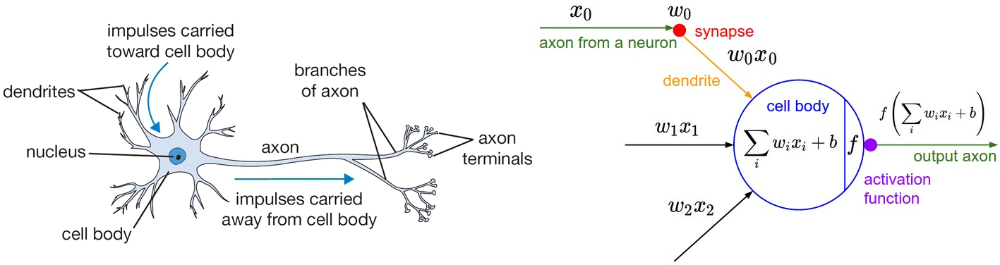
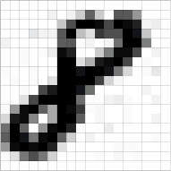
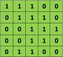

The area of Neural Networks has originally been primarily inspired by the goal of modeling biological neural systems,
but has since diverged and become a matter of engineering and achieving good results in Machine Learning tasks.
Therefore, the Neural Networks and AI in general is essentially the discipline of Machine Learning

Biological Motivation and Connections
-------------------------------------

Historically, digital computers such as the [von Neumann model](https://en.wikipedia.org/wiki/Von_Neumann_model) operate
via the execution of explicit instructions with access to memory by a number of processors. Some neural networks, on the
other hand, originated from efforts to model information processing in biological systems through the framework of
[connectionism](https://en.wikipedia.org/wiki/Connectionism). Unlike the von Neumann model, connectionist computing does
not separate memory and processing.

:::tip[Basic Principles of Connectionism]

The central connectionist principle is that mental phenomena can be described by interconnected networks of simple and
often uniform units. The form of the connections and the units can vary from model to model. For example, units in the
network could represent neurons and the connections could represent synapses, as in the human brain.

- __Activation function__: Internal states of any network change over time due to neurons sending a signal to a
  succeeding layer of neurons in the case of a feedforward network, or to a previous layer in the case of a recurrent
  network. _The activation function defines under what circumstances will a neuron send a signal outward to other
  neurons_. This can be, for example, a function of probability whose range describes the probability of the neuron
  firing the signal
- __Memory and learning__: Neural networks follow two basic principles:

  1. Any mental state can be described as a $n$-dimensional vector of numeric activation values over neural units in a
     network.
  2. Memory and learning are created by modifying the 'weights' of the connections between neural units, generally
     represented as an $(n \times m)$ matrix. The weights are adjusted according to some learning rule or algorithm

:::

The basic computational unit of the brain is a __neuron__. Approximately 86 billion neurons can be found in the human
nervous system and they are connected with approximately $10^{14}$ - $10^{15}$ synapses. The diagram below shows a
cartoon drawing of a biological neuron (left) and a common mathematical model (right).



Each neuron receives input signals from its __dendrites__ and produces output signals along its (single) __axon__. The 
axon eventually branches out and connects via synapses to dendrites of other neurons.

In the computational model of a neuron, the signals that travel along the axons (e.g. $x_0$) interact multiplicatively
(e.g. $w_0x_0$) with the dendrites of the other neuron based on the synaptic strength at that synapse (e.g. $w_0$). The
idea is that the synaptic strengths (the weights $w$) are learnable and control the strength of influence (and its
direction: excitory (__positive weight__) or inhibitory (__negative weight__)) of one neuron on another. In the basic
model, the dendrites carry the signal to the cell body where they all get summed. If the final sum is above a certain
threshold, the neuron can fire, sending a spike along its axon. In the computational model, we assume that the precise
timings of the spikes do not matter, and that only the frequency of the firing communicates information. Based on this
rate code interpretation, we model the firing rate of the neuron with an __activation function $f$__, which represents
the frequency of the spikes along the axon. Historically, a common choice of activation function is the sigmoid
function $σ$, since it takes a real-valued input (the signal strength after the sum) and squashes it to range between 0
and 1. An example code for forward-propagating a single neuron might look as follows:

```python
class Neuron(object):
    # ... 
    def forward(self, inputs):
        """ assume inputs and weights are 1-D numpy arrays and bias is a number """
        cell_body_sum = np.sum(inputs * self.weights) + self.bias
        firing_rate = 1.0 / (1.0 + math.exp(-cell_body_sum)) # sigmoid activation function
        return firing_rate
```

In other words, each neuron performs a dot product with the input and its weights, adds the bias and applies the
non-linearity (or activation function), in this case the sigmoid

$$

\sigma(x) = \frac{1}{1 + e^{-x}}

$$

:::warning[Coarse model]

It's important to stress that this model of a biological neuron is very coarse. For example, there are many different
types of neurons, each with different properties. The dendrites in biological neurons perform complex nonlinear
computations. The synapses are not just a single weight, they are a complex non-linear dynamical system. The exact
timing of the output spikes in many systems is known to be important, suggesting that the rate code approximation may
not hold. Due to all these and many other simplifications, be prepared to hear groaning sounds from anyone with some
neuroscience background if we draw analogies between Neural Networks and real brains. See this
[review](https://www.sciencedirect.com/science/article/abs/pii/S0959438814000130) if people are interested.

:::

Neural Networks are modeled as collections of neurons that are connected in an acyclic graph. In other words, the
outputs of some neurons can become inputs to other neurons. Cycles are not allowed since that would imply an infinite
loop in the forward pass of a network. Instead of an amorphous blobs of connected neurons, Neural Network models are
often organized into distinct layers of neurons.

Convolutional Neural Networks (CNNs)
------------------------------------

Convolutional Neural Networks (__ConvNets__ or __CNNs__) are a category of Neural Networks that have proven very
effective in areas such as image recognition and classification. ConvNets have been successful in identifying faces,
objects and traffic signs apart from powering vision in robots and self-driving cars.


In the figure above, a ConvNet is able to recognize scenes and the system is able to suggest relevant captions ("a
soccer player is kicking a soccer ball") while figure below shows an example of ConvNets being used for recognizing
everyday objects, humans and animals. Lately,
[ConvNets have been effective in several Natural Language Processing tasks](#convolutional-neural-networks-for-nlp)
(such as sentence classification) as well.


Essentially, every image can be represented as a matrix of pixel values.



[Channel](https://en.wikipedia.org/wiki/Channel_(digital_image)) is a conventional term used to refer to a certain
component of an image. An image from a standard digital camera will have three channels - red, green and blue - we can
imagine those as three 2d-matrices stacked over each other (one for each color), each having pixel values in the range 0
to 255. A [grayscale](https://en.wikipedia.org/wiki/Grayscale) image, on the other hand, has just one channel. We will
only consider grayscale images, so we will have a single 2d matrix representing an image. The value of each pixel in the
matrix will range from 0 to 255 - zero indicating black and 255 indicating white.

### Convolution Step

ConvNets derive their name from the ["convolution" operator](http://en.wikipedia.org/wiki/Convolution). The primary
purpose of convolution in case of a ConvNet is to extract features from the input image. Convolution preserves the
spatial relationship between pixels by learning image features using small squares of input data. We will not go into
the mathematical details of Convolution here, but will try to understand how it works over images.

As we discussed above, every image can be considered as a matrix of pixel values. Consider a 5 x 5 image whose pixel
values are only 0 and 1 (note that for a grayscale image, pixel values range from 0 to 255, the green matrix below is a
special case where pixel values are only 0 and 1):



Also, consider another 3 x 3 matrix as shown below:


Then, the Convolution of the 5 x 5 image and the 3 x 3 matrix can be computed as shown in the animation below:


We slide the orange matrix over our original image (green) by 1 pixel (also called __stride__) and for every position,
we compute element wise multiplication (between the two matrices) and add the multiplication outputs to get the final
integer which forms a single element of the output matrix (pink). Note that the 3×3 matrix sees only a part of the input
image in each stride. In CNN terminology, the 3×3 matrix is called a __filter__ or [__kernel__](https://en.wikipedia.org/wiki/Kernel_(image_processing)) or __feature detector__
and the matrix formed by sliding the filter over the image and computing the dot product is called the __Convolved
Feature__ or __Activation Map__ or the __Feature Map__. It is important to note that filters acts as feature detectors
from the original input image.

In practice, a CNN learns the values of these filters on its own during the training process (although we still need to specify parameters such as number of filters, filter size, architecture of the network etc. before the training process). The more filters we have, the more image features get extracted and the better our network becomes at recognizing patterns in unseen images.

The size of the Feature Map is controlled by 3 parameters that we need to decide before the convolution step is
performed:

1. __Depth__: Depth corresponds to the number of filters we use for the convolution operation. In the network shown
   below, we are performing convolution of the original boat image using three distinct filters, thus producing three
   different feature maps as shown. We can think of these three feature maps as stacked 2d matrices

   

2. __Stride__: Stride is the number of pixels by which we slide our filter matrix over the input matrix. When the stride
   is 1 then we move the filters one pixel at a time. When the stride is 2, then the filters jump 2 pixels at a time as
   we slide them around. Having a larger stride will produce smaller feature maps.
3. __Zero-padding__: Sometimes, it is convenient to pad the input matrix with zeros around the border, so that we can
   apply the filter to bordering elements of our input image matrix. A nice feature of zero padding is that it allows us
   to control the size of the feature maps. Adding zero-padding is also called _wide convolution_, and not using
   zero-padding would be a _narrow convolution_.

### Pooling Step

Spatial Pooling (also called subsampling or downsampling) reduces the dimensionality of each feature map but retains the
most important information. Spatial Pooling can be of different types: Max, Average, Sum etc.

In case of Max Pooling, we define a spatial neighborhood (for example, a 2×2 window) and take the largest element from
the rectified feature map within that window. Instead of taking the largest element we could also take the average
(Average Pooling) or sum of all elements in that window. In practice, Max Pooling has been shown to work better.


Pooling

- makes the input representations (feature dimension) smaller and more manageable
- reduces the number of parameters and computations in the network, therefore, controlling overfitting
- makes the network invariant to small transformations, distortions and translations in the input image
- helps us arrive at an almost scale invariant representation of our image. This is very powerful since we can detect
  objects in an image no matter where they are located

### Architecture

A convolutional neural network consists of an input layer, hidden layers and an output layer. In a convolutional neural
network, the hidden layers include one or more layers that perform [convolutions](#convolution-step) followed by other
layers such as [pooling](#pooling-step) layers and fully connected layers

After several convolutional and max pooling layers, the final classification is done via fully connected layers. Neurons
in a fully connected layer have connections to neurons in the previous layer. The input to this fully connected layer
is a one-dimensional vector, which is the flattened output of the convolutional/pooling layers.

:::important[What does the flattening look like?]

In a Convolutional Neural Network (CNN), the input to the fully connected network (FCN) is the output of the final
convolutional layer or pooling layer. This input is typically a 3-dimensional tensor with height, width, and depth
representing the extracted features. The flattening on this 3D tensor is essentially "unfolding" all the dimensions
together. The resulting one-dimensional vector will have a size equal to the product of the original dimensions. For
example, a $5 \times 5 \times 2$ tensor has the flattened vector with size of $5 \times 5 \times 2 = 50$, which is the
number of neurons of the FCN input layers.

:::


### Convolutional Neural Networks for NLP

Instead of image pixels, the input to most NLP tasks are sentences or documents represented as a matrix. Each row of the
matrix corresponds to one token, typically a word, but it could be a character. That is, each row is vector that
represents a word. Typically, these vectors are word embeddings (low-dimensional representations) like
[word2vec](https://en.wikipedia.org/wiki/Word2vec) or [GloVe](https://nlp.stanford.edu/projects/glove/), but they could
also be one-hot vectors that index the word into a vocabulary. For a 10 word sentence using a 100-dimensional embedding
we would have a 10×100 matrix as our input. That's our "image".

In vision, our filters slide over local patches of an image, but in NLP we typically use filters that slide over full
rows of the matrix (words). Thus, the "width" of our filters is usually the same as the width of the input matrix. The
height, or __region size__, may vary, but sliding windows over 2-5 words at a time is typical. Putting all the above
together, a Convolutional Neural Network for NLP may look like this:


In the illustration of this Convolutional Neural Network (CNN) architecture for sentence classification above, we depict
three filter region sizes: 2, 3 and 4, each of which has 2 filters. Every filter performs convolution on the sentence
matrix and generates (variable-length) feature maps. Then 1-max pooling is performed over each map, i.e., the largest
number from each feature map is recorded. Thus a univariate feature vector is generated from all six maps, and these 6
features are concatenated to form a feature vector for the penultimate layer. The final softmax layer then receives this
feature vector as input and uses it to classify the sentence; here we assume binary classification and hence depict two
possible output states. 

Graph Neural Network
--------------------