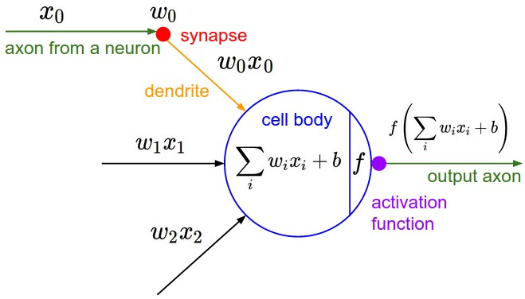

The area of Neural Networks has originally been primarily inspired by the goal of modeling biological neural systems,
but has since diverged and become a matter of engineering and achieving good results in Machine Learning tasks.
Therefore, the Neural Networks and AI in general is essentially the discipline of Machine Learning

Biological Motivation and Connections
-------------------------------------

The basic computational unit of the brain is a __neuron__. Approximately 86 billion neurons can be found in the human
nervous system and they are connected with approximately $10^{14}$ - $10^{15}$ synapses. The diagram below shows a
cartoon drawing of a biological neuron (left) and a common mathematical model (right).

Each neuron receives input signals from its __dendrites__ and produces output signals along its (single) __axon__. The 
axon eventually branches out and connects via synapses to dendrites of other neurons. In the computational model of a
neuron, the signals that travel along the axons (e.g. $x_0$) interact multiplicatively (e.g. $w_0x_0$) with the
dendrites of the other neuron based on the synaptic strength at that synapse (e.g. $w_0$). The idea is that the synaptic
strengths (the weights $w$) are learnable and control the strength of influence (and its direction: excitory (__positive
weight__) or inhibitory (__negative weight__)) of one neuron on another. In the basic model, the dendrites carry the
signal to the cell body where they all get summed. If the final sum is above a certain threshold, the neuron can fire,
sending a spike along its axon. In the computational model, we assume that the precise timings of the spikes do not
matter, and that only the frequency of the firing communicates information. Based on this rate code interpretation, we
__model the firing rate of the neuron with an activation function $f$__, which represents the frequency of the spikes
along the axon. Historically, a common choice of activation function is the sigmoid function $σ$, since it takes a
real-valued input (the signal strength after the sum) and squashes it to range between 0 and 1. 

Neural Network Architectures
----------------------------

(to be continued...)
