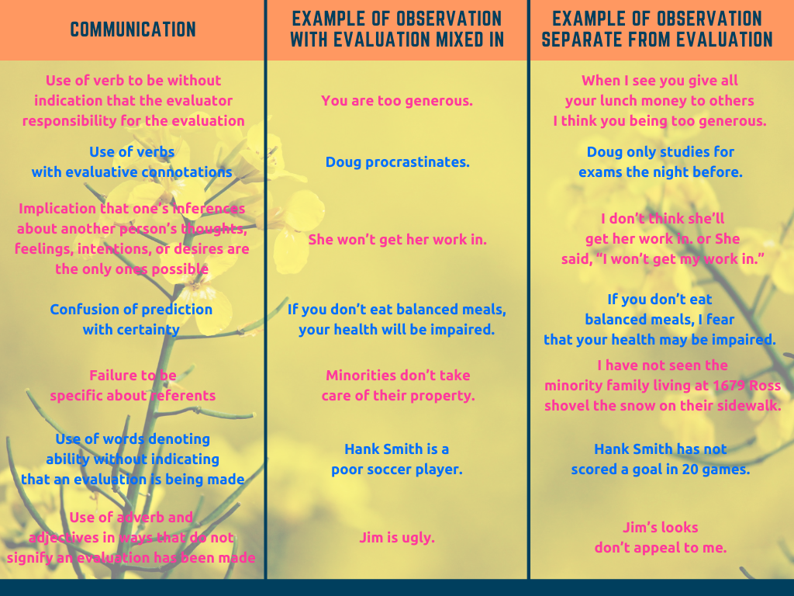

<iframe width="100%" height="468" src="https://www.youtube.com/embed/8sjA90hvnQ0" title="NonViolent Communication by Marshal Rosenberg: Animated Book Summary" frameborder="0" allow="accelerometer; autoplay; clipboard-write; encrypted-media; gyroscope; picture-in-picture; web-share" allowfullscreen></iframe>

Why Marshall Started to Think Differently
-----------------------------------------

The book starts with author's childhood, a summer of 1943 at Detroit. A severe race-war was going on at that time:

- [1943 Riots (YouTube)](https://www.youtube.com/watch?v=6YP9cbo5CkU&list=PL-CLnI8tPXu_RDkYU9BOeuzFqrEL8dQ1l&index=9)
- [Detroit 1943 Race Riot Footage in HD](https://www.youtube.com/watch?v=D8BrJmF-jv4&list=PL-CLnI8tPXu_RDkYU9BOeuzFqrEL8dQ1l&index=10)
- [Race Riot of 1943 (Encyclopedia Of Detroit)](https://detroithistorical.org/learn/encyclopedia-of-detroit/race-riot-1943)

Under that terrible circumstance, the author was humiliated by 2 white boys in school. After that experience Marshall
(the author) started thinking about 2 questions

1. What happens to disconnect us from our compassionate nature, leading us to behave violently and exploitatively?
2. What allows some people to stay connected to their compassionate nature under even the most trying circumstances?

If I were treated horribly, I would almost have never had that though process. So what's unique about Marshall that
triggered his life-long research? I did some research by looking for Marshall's biography. I also noticed that Marshall
was also a Jews, according to the book:

:::tip[Quote]

"I had never heard the word before and didn't know some people used it in a derogatory way to refer to Jews."

:::

Knowing that Jews people had some hard time surviving themselves in the course of our history, I thought a deep longing
for peace might be the biggest desire in the bottom of each Jewish people.

So I settled down to his relation to Judaism and found this part of a wikipedia article on "Judaism and peace" shall be
the answer to the question above:

:::tip[Judaism and peace from [_Wikipedia_](https://en.wikipedia.org/wiki/Judaism_and_peace#Rejection_of_violence)]

### Rejection of violence

Judaism's religious texts overwhelmingly endorse compassion and peace, and the Hebrew Bible contains the well-known
commandment to "love thy neighbor as thyself".

In fact, the love of peace and the pursuit of peace is one of the key principles in Jewish law. While Jewish tradition
permits waging war and killing in certain cases, however, the requirement is that one always seek a just peace before
waging war.

According to the 1947 Columbus Platform of Reform Judaism, "Judaism, from the days of the prophets, has proclaimed to
mankind the ideal of universal peace, striving for spiritual and physical disarmament of all nations. Judaism rejects
violence and relies upon moral education, love and sympathy."

#### Judaism opposes violence

The philosophy of nonviolence has roots in Judaism, going back to the Jerusalem Talmud of the middle third century.
While absolute nonviolence is not a requirement of Judaism, the religion so sharply restricts the use of violence, that
nonviolence often becomes the only way to fulfilling a life of truth, justice and peace, which Judaism considers to be
the three tools for the preservation of the world.

Jewish law (past and present) does not permit any use of violence unless it is in self-defense. Any person that even
raises his hand in order to hit another person is called "evil."

#### Avoidance of violence

The ancient orders (like those) of wars for Israel to eradicate idol worshiping does not apply today. Jews are not
taught to glorify violence. The rabbis of the Talmud saw war as an avoidable evil. They taught: "The sword comes to the
world because of delay of justice and through perversion of justice."

Jews have always hated war and "Shalom" expresses the hope for peace, in Judaism war is evil, but at times a necessary
one, yet, Judaism teaches that one has to go to great length to avoid it.

:::

At this moment, I realized that it was the tradition of this unique philosophy that brewed Marshall's tendency to,
combined with his unique experience at Detroit in 1943, think in a way that led his passion for seeking compassionate
and healthy relationship among people.

The reading of this book shall incorporate an important principle in mind - it's not just about learning technical
communication skills, it's more about appreciating the Jewish culture, a history that seeks, embrace, and promote peace
for the world.

<iframe width="100%" height="468" src="https://www.youtube.com/embed/TG55ErfdaeY" title="Christianity from Judaism to Constantine: Crash Course World History #11" frameborder="0" allow="accelerometer; autoplay; clipboard-write; encrypted-media; gyroscope; picture-in-picture; web-share" allowfullscreen></iframe>

Connect to Compassionate Nature
-------------------------------

The language, according to Marshall, plays the key role to help people stay connected to their compassionate nature.
This is a language technique called NVC (nonviolent communication). 4 Components of NVC are

1. __Observation__ - The concrete actions we are observing that are affecting our well-being 
2. __Feeling__ - How we feel in relation to what we are observing 
3. __Needs__ - The needs, values, desires, etc. that are creating our feelings 
4. __Request__ - The concrete actions we request in order to enrich our lives.

Example that includes the 4 components: "Felix, when I see two balls of soiled socks under the coffee table and another
three next to the TV, I feel irritated because I am needing more order in the rooms that we share in common. Would you
be willing to put your socks in your room or in the washing machine?"

Communication That Blocks Compassion
------------------------------------

### Moralistic Judgements (≠ Value Judgments, like peace & freedom)

Use of moralistic judgements that imply wrongness or badness on the part of people who don't act in harmony with our
values. For example:

- The problem with you is that you are selfish
- She's lazy
- They are prejudiced
- It's inappropriate
- Blame, insults, put-downs, labels, criticism, comparisons, diagnoses

Classifying and judging people promote violence

### Making Comparisons

If people have a sincere desire to make life miserable for themselves, they might learn to compare themselves to otherpeople

### Denial Of Responsibility

We deny responsibility for our actions when we attribute their cause to:

- __Vague, impersonal forces__ - "I cleaned my room because I had to."
- __Our condition, diagnosis, personal or psychological history__ - "I drink because I am an alcoholic."
- __The actions of others__ - "I hit my child because he ran into the street."
- __The dictates of authority__ - "I lied to the client because the boss told me to."
- __Group pressure__ - "I started smoking because all my friends did."
- __Institutional policies, rules, and regulations__ - "I have to suspend you for this infraction because it's the
  school policy."
- __Gender roles, social roles, or age roles__ - "I hate going to work, but I do it because I am a husband and a
  father."
- __Uncontrollable impulses__ - "I was overcome by my urge to eat the candy bar."

We can replace language that implies lack of choice with language that acknowledges choice.

Observing without Evaluating
----------------------------

When we combine observation with evaluation, people are apt to hear criticism.

Identifying and Expressing Feelings
-----------------------------------

Expressing our feelings are very important. Feelings are not being clearly expressed when the word "feel" is followed
by:

- words such as "that", "like", as if:

  - "I feel that you should know better."
  - "I feel like a failure."
  - "I feel as if I'm living with a wall."

- the pronouns "I", "you", "he", "she", "they", "it":

  - "I feel I am constantly on call."
  - "I feel it is useless."

- names or nouns referring to people:

  - "I feel Amy has been pretty responsible."
  - "I feel my boss is being manipulative.

In addition, we should

1. distinguish between words that express actual feelings and those that describe what we think we are.
2. differentiate between words that describe what we think others are doing around us, and words that describe actual
   feelings

Taking Responsibilities for Our Feelings
----------------------------------------

When we receive negative messages, we should

- sense our own feelings and needs
- sense other's feelings and needs

If we don't value our needs, others may not either. Connect your feeling with your need using __I feel ... because I
...__ The more directly we can connect our feelings to our own needs, the easier it is for others to response
compassionately to our needs. Someone on the other side might not say that explicitly, instead they express their needs
through judgements, criticisms, diagnoses, and interpretations. Judgements, criticisms, diagnoses, and interpretations
of others are all alienated expressions of our needs. There are some pre-defined and basic human needs that we can pick
up as we interpret other's needs:

- Autonomy

  - to choose one's dreams, goals, and values
  - to choose one's plan for fulfilling one's dreams, goals, and values

- Celebration

  - to celebrate the creation of life and dreams fulfilled
  - to celebrate losses: loved ones, dreams, etc. (mourning)

- Integrity

  - authenticity
  - creativity
  - meaning

- Interdependence

  - acceptance
  - appreciation
  - closeness
  - community
  - consideration
  - contribution to the enrichment of life (to exercise one's power by giving that which contributes to life)
  - emotional safety
  - empathy
  - honesty (the empowering honesty that enables us to learn from our limitations)
  - love
  - reassurance
  - respect
  - support
  - trust
  - understanding
  - warmth

- Play

  - fun
  - laughter

- Spiritual Communion

  - beauty
  - harmony
  - inspiration
  - order
  - peace

- Physical Nurturance

  - air
  - food
  - movement, exercise
  - protection from life-threatening forms of life: viruses, bacteria, insects, predatory animals
  - rest
  - sexual expression
  - shelter
  - touch
  - water

Requesting That Which Would Enrich Life
---------------------------------------

Use positive language when making requests. When requests are worded in the negative, people's reaction is "when I am
told not to do it, I feel I won't follow that." People are often confused as to what is actually being requested, and
furthermore, negative requests are likely to provoke resistance.

Use more often something like "We'd like you to ...". Avoid vague, abstract, or ambiguous phrasing and to word our
requests in the form of concrete actions that others can undertake. The clearer we are about what we want back, the more
likely it is that we'll get it.

### Asking for a Reflection

To make sure the message we sent is the message that's received, ask the listener to reflect it back. On some occasions,
a simple question like "Is that clear" will suffice. Express appreciation when your listener tires to meet your request
for a reflection. For example: "I'm grateful to you for telling me what you heard. I can see that I didn't make myself
as clear as I'd liked, so let me try again"

After we express ourselves vulnerably, we often want to know

1. __what the listener is feeling__ - "I would like you to tell me how you feel about what I just said, and your reasons
   for feeling as you do"
2. __what the listener is thinking__ - "I'd like you to tell me if you predict that my proposal would be success, and if
   not, what you believe would prevent its success"
3. __whether the listener would be willing to take a particular action__ - "I'd like you to tell me if you would be
   willing to postpone our meeting for one week"

### Requests v.s. Demands

Requests are received as demands when others believe they will be blamed or punished if they do not comply.

## Receiving Empathically

Empathy is a respectful understanding of what others are experiencing. Empathy occurs only when we have successfully
shed all preconceived ideas and judgments about them. It demands of you a reaction that cannot be prepared beforehand.

In reality, however, instead of empathy, we tend to have a strong urge to give advice or reassurance and to explain our
own position or feeling. Empathy, on the other hand, requires focusing full attention on the other person's message. We
give to others the time and space they need to express themselves fully and to feel understood. It is often frustrating
for someone needing empathy to have us assume that they want reassurance or "fix-it" advice.

Non-empathically behaviors:

- Advising
- One-upping - "That's nothing; wait'll you hear what happened to me"
- Educating
- Consoling - "It wasn't your fault; you did the best you could"
- Story-telling - "That reminds me of the time..."
- Shutting down - "Cheer up. Don't feel so bad"
- Sympathizing - "Oh, you poor thing..."
- Interrogating - "When did this begin?"
- Explaining
- Correcting

When we are thinking about people's words, listening to how they connect to our theories, we are looking at people - we
are not with them. The key ingredient of empathy is presence: we are wholly present with the other party and what they
are experiencing.

### Listening For Feelings And Needs

No matter what others say, we only hear what they are observing, feeling, needing, and requesting. Behind intimidating
messages are simply people appealing to us to meet their needs

### Sustaining Empathy

Allowing others the opportunity to fully express themselves before turning our attention to solutions or requests for
relief

Connecting Compassionately With Ourselves
-----------------------------------------

Avoid "shoulding" yourself. We want to take action out of the desire to contribute to life rather than out of fear,
guilt, shame, or obligation.

:::tip[Example]

"Finally I realized that I was choosing to write the reports solely because I wanted the income they provided. As soon
as I recognized this, I never wrote another clinical report. I can't tell you how joyful I feel just thinking of how
many clinical reports I haven't written since that moment 35 years ago!"

:::

Expressing Anger Fully
-----------------------

Anger is a result of life-alienating thinking that is disconnected from needs. It indicates that we have moved up to our
head to analyze and judge somebody, rather than focus on which of our needs are not getting met. People do not hear our
pain when they believe they are at fault. To practice NVC, we need to proceed slowly, think carefully before we speak,
and often just take a deep breath and not speak at all. Learning the process and applying it both take time.

Self-thought at the End (Not Part of the Book)
----------------------------------------------

Thrive to seek peace between people is what a Jewish-tradition-thoughted people like Marshall most valued. NVC
techniques is one thing; what's more important is, from this book, valuing the value of peace from our heart. Once we
achieve that, we ourselves shall automatically and proactively seek and practice our own NVC ourselves. This makes me
interested in Jewish culture from now on :)
