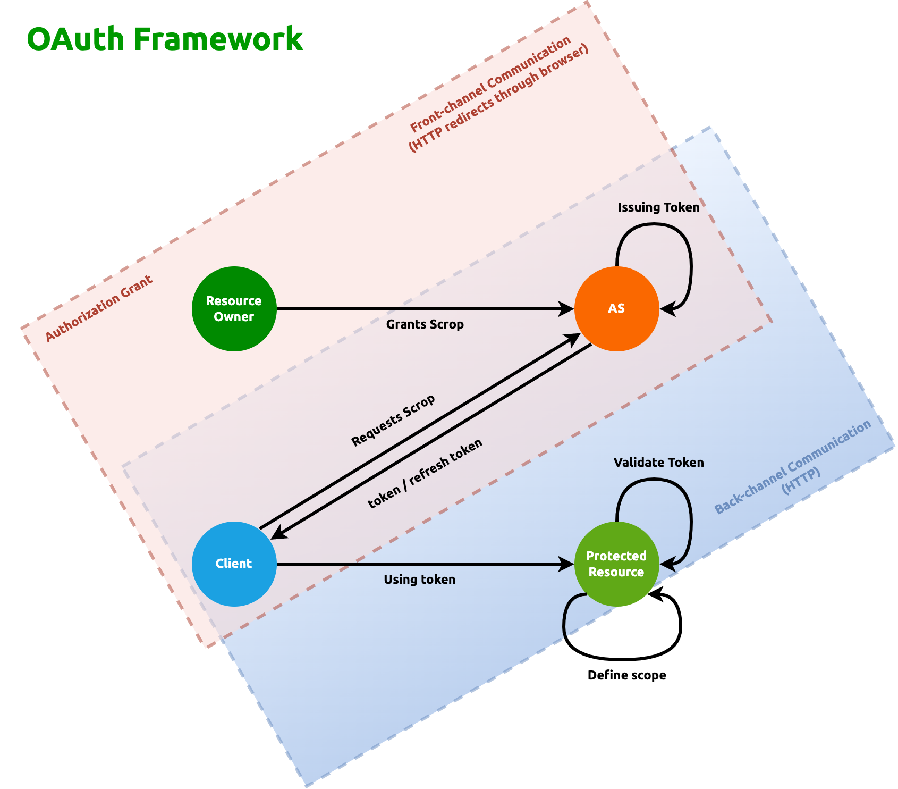
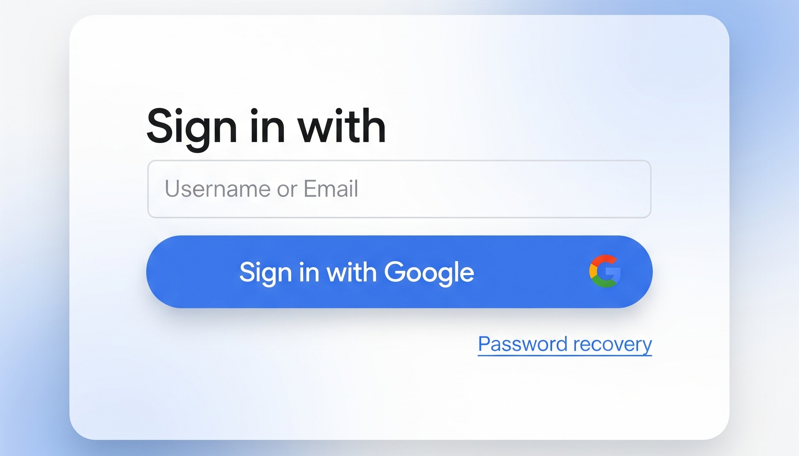
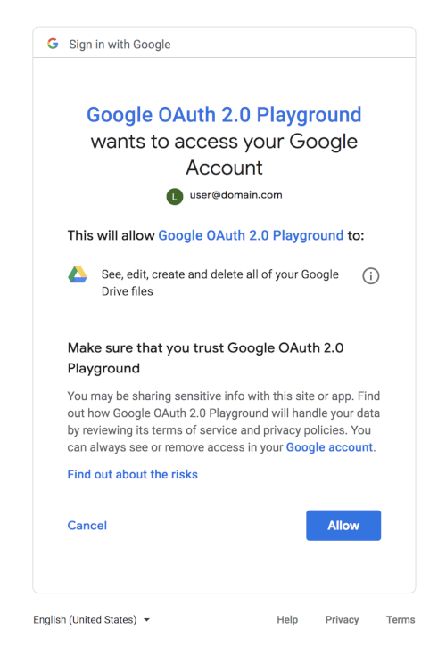

What is OAuth 2.0?
------------------

OAuth 2.0 is a _delegation_ protocol, a means of letting someone who controls a resource allow a software application to
access that resource on their behalf without impersonating them. The application requests authorization from the owner
of the resource and receives tokens that it can use to access the resource. This all happens without the application
needing to impersonate the person who controls the resource, since the token explicitly represents a delegated right of
access.

In many ways, you can think of the OAuth token as a "valet key" for the web. Not all cars have a valet key, but for
those that do, the valet key provides additional security beyond simply handing over the regular key. The valet key of
a car allows the owner of the car to give limited access to someone, the valet, without handing over full control in the
form of the owner's key. Simple valet keys limit the valet to accessing the ignition and doors but not the trunk or
glove box. More complex valet keys can limit the upper speed of the car and even shut the car off if it travels more
than a set distance from its starting point, sending an alert to the owner. _In much the same way, OAuth tokens can
limit the client's access to only the actions that the resource owner has delegated_.

According to the [specification that defines it](https://datatracker.ietf.org/doc/html/rfc6749):

:::note[What does OAuth 2.0 do as a security protocol?]

_The OAuth 2.0 authorization framework enables a third-party application to obtain limited access to an HTTP service,
either on behalf of a resource owner by orchestrating an approval interaction between the resource owner and the HTTP
service, or by allowing the third-party application to obtain access on its own behalf_.

:::

There are 3 components involved here:

1. __resource owner__: a person assumed to have access to a web browser and an API
2. __protected resource__: the component that resource owner has access to, i.e. the API
3. __client__: the software that accesses the protected resource _on behalf_ of the resource owner

:::important

The name "client" might confuse us to think this as the web browser or the person who's paying for our services, but
that's not how the term is used here. In OAuth, the client is whatever _software_ consumes the API that makes up the
protected resource. There are many different forms of client applications, though.

:::

The way OAuth 2.0 is different from the traditional username-password sharing mechanism is by introducing the 4th
component, the __authorization server__ (__AS__), which is trusted by the protected resource to issue special-purpose
security credentials called OAuth __access tokens__ to clients. To acquire a token, the client first sends the resource
owner to the authorization server in order to request that the resource owner authorize this client. The resource owner 
authenticates to the authorization server and is generally presented with a choice of whether to authorize the client
making the request. The client is able to ask for a subset of functionality, or scopes, which the resource owner may be
able to further diminish. Once the authorization grant has been made, the client can then request an access token from
the authorization server. This access token can be used at the protected resource to access the API, as granted by the
resource owner (see figure below)



At no time in this process are the resource owner's credentials exposed to the client: the resource owner authenticates
to the authorization server separately from anything used to communicate with the client. The client is unable to access 
anything on its own and instead must be authorized by a valid resource owner before it can access any protected
resources. This is true even though most OAuth clients have a means of authenticating themselves to the authorization
server. The user generally never has to see or deal with the access token directly. Instead of requiring the user to
generate tokens and paste them into clients, the OAuth protocol facilitates this process and makes it relatively simple
for the client to [request a token](#requesting-access-token) and the user to authorize the client. Clients can then
[manage the tokens](#using-access-token), and users can manage the client applications.

A React Example
---------------

Suppose we stumble upon an interesting web app that needs READ access to our Google Drive data, such as file and folder
names. Let's further assume that the web app requires users to login. After user logins, the web app will be able to
interact with Google Drive API on behalf of user to read their Drive data. The web app uses
[Sign In With Google](https://developers.google.com/identity/gsi/web/guides/overview) which handles the OAuth 2.0 flow
and application access tokens. To get user started with the web app, therefore, there must be a Login button

We will start with the:



The page above can be implemented with basic code below:

```typescript
export const oauthConfig = {
    authEndpoint: "https://accounts.google.com/o/oauth2/v2/auth",
    tokenEndpoint: "https://oauth2.googleapis.com/token",
    fileEndpoint: "https://googleapis.com/drive/v3",
    clientId: "your_client_id",
    clientSecret: "your_client_secret",
    redirectUrl: "http://localhost:3000/callback"
};

function Login() {
    const handleLogin = (e: React.FormEvent): void => {
        e.preventDefault();

        const authUrl = `${oauthConfig.authEndpoint}?client_id=${oauthConfig.clientId}&redirect_uri=${oauthConfig.redirectUrl}&scope=user_data&response_type=code`;
        window.location.href = authUrl;

        (e.currentTarget as HTMLFormElement).reset();
    };

  return (
    <div>
      <button onClick={handleLogin}>Sign in with Google</button>
    </div>
  );
}
```

When a user initiates a login, they will be redirected to the authentication page hosted on Google authentication server
by `window.location.href = authUrl;`. Then the user sees the familiar page like:



After __authorization__ is granted by the user, the Google redirects user back to the app page specified by
`oauthConfig.redirectUrl` which were provided in the snippet earlier.

:::caution

We see why it's not _authentication_ because the user is simply authorizing the app to access the user's data on that
app

:::

### Requesting Access Token

In the redirected page (usually designated by a file called `Callback.tsx`), the app does everything to fetch and saves
the access token to a state management such as [Redux](https://react-redux.qubitpi.org/):

```typescript
import { useEffect } from 'react';
import { useNavigate, useLocation } from 'react-router-dom';

function Callback() {
  const location = useLocation();
  const navigate = useNavigate();

  useEffect(() => {
    const searchParams = new URLSearchParams(location.search);
    const code = searchParams.get('code');

    if (code != null) {
      const payload = {
        client_id: oauthConfig.clientId,
        client_secret: oauthConfig.clientSecret,
        grant_type: 'authorization_code',
        code: code,
        redirect_uri: oauthConfig.redirectUrl
      };

      fetch(oauthConfig/tokenEndpoint, {
        method: 'POST',
        headers: {
          'Content-Type': 'application/x-www-form-urlencoded'
        },
        body: new URLSearchParams(payload)
      })
        .then(response => response.json())
        .then(data => {
          dispatch(setAccessToken(data.access_token as string));
            void navigate('/profile');
        })
        .catch(error => {
          console.error('Error exchanging code for token:', error);
        });
    }
  }, [location, navigate]);

  return (
    <div>
      // some HTML markup for displayiing "loading" status, such as a spinner
    </div>
  );
}
```

### Using Access Token

After that the user is taken to the business page, such as the user's profile page, in which the app fetches the access
token from state store and use that token to send API request to Google.

```javascript
function Profile() {
    const accessToken = useAppSelector(selectAccessToken);
  
    if (!accessToken) {
      return <div>Please login first.</div>;
    }
  
    return (
      <div>
        <h1>Profile</h1>
        <p>Access Token: {accessToken}</p>
      </div>
    );
  }
```

Everything is wired by the app's home page of:

```javascript
import { BrowserRouter as Router, Route, Routes } from 'react-router-dom';

export default function App(): JSX.Element {
    return (
        <Router>
            <Routes>
                <Route path="/" element={<Proposal />} />
                <Route path="/callback" element={<Callback />} />
                <Route path="/graph" element={<Graph />} />
            </Routes>
        </Router>
    );
}
```
