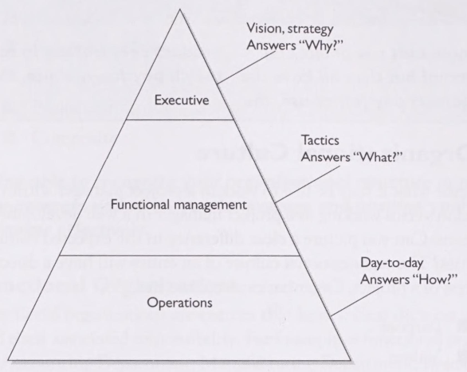
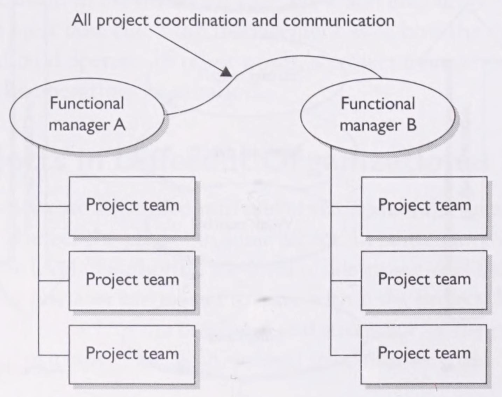

Overview
--------

Project management is the process of supervising the work of a team to achieve all project goals within the given
constraints[^1]. This information is usually described in
[project documentation](https://en.wikipedia.org/wiki/Project_initiation_documentation), created at the beginning of the
development process. The primary constraints are scope, time and budget. The secondary challenge is to optimize the
allocation of necessary inputs and apply them to meet predefined objectives.

A project is a _temporary_ and unique endeavor designed to produce a product, service or result with a defined beginning
and end (usually time-constrained, often constrained by funding or staffing) undertaken to meet unique goals and
objectives, typically to bring about beneficial change or added value.[^2] The temporary nature of projects stands in
contrast with business as usual (or operations), which are repetitive, permanent or semi-permanent functional activities
to produce products or services.

:::tip

- "Temporary" means that the _project has an end date_. "Unique" means that the project's end result is _different from
  the results of other functions of the organization_[^1]
- This "temporary" nature contrasts with the idea of [Infinite Game][The Infinite Game]
- But since an infinite-game must be conducted by every concrete steps, we can consider an instance of project
  management an atomic unity of such step; just as how the [book of Infinite Game][The Infinite Game] stats:

> ___Idealistic - big, bold and ultimately unachievable___[^3]
>
> _When the signers of the Declaration of Independence affirmed that all men "are created equal" and "endowed ... with
> certain unalienable Rights," they were referring primarily to white, Anglo-Saxon, Protestant men. Almost immediately,
> however, there were efforts to advance a more expansive and inclusive understanding of the ideal. During the
> Revolutionary War, for example, George Washington forbade anti-Catholic organizing in his armies and regularly
> attended Catholic services to model the behavior he expected of his men. Nearly a hundred years later, the Civil War
> brought about an end to slavery, and soon after that the Fourteenth Amendment granted citizenship and equal rights to
> African Americans and former slaves. The women’s suffrage movement took another step toward America’s Just Cause when
> it gained the vote for women in 1920. The Civil Rights Act of 1964 and the Voting Rights Act of 1965, which protected
> African Americans and others from discrimination, were two more steps. The nation took yet another step in 2015 with
> the Supreme Court decision in Obergefell v. Hodges, which extended the protections guaranteed by the Fourteenth
> Amendment to gay marriage._
>
> ...
> 
> _Indeed, the abolition of slavery, women’s suffrage, the Civil Rights Act and gay rights are some of the big steps the
> nation has taken to realize its Cause. And though each of those movements, infinite in their own right, are still far
> from complete, they still represent clear steps along the nation’s march toward the ideals enshrined in the
> Declaration of Independence. It is important to celebrate our victories, but we cannot linger on them. For the
> Infinite Game is still going and there is still much work to be done. Those victories must serve as milestones of our
> progress toward an idealized future. They give us a glimpse of what our idealized future can look like and serve as an
> inspiration to keep moving forward._
>
> _This is what the idealized journey of a Just Cause feels like - no matter how much we have achieved, we always feel we
> have further to go. Think of a Just Cause like an iceberg. All we ever see is the tip of that iceberg, the things we
> have already accomplished. In an organization, it is often the founders and early contributors who have the clearest
> vision of the unknown future, of what, to everyone else, remains unseen. The clearer the words of the Just Cause, the
> more likely they will attract and invite the innovators and early adopters, those willing to take the first risks to
> advance something that exists almost entirely in their imaginations. With each success, a little more of the iceberg
> is revealed to others; the vision becomes more visible to others. And when others can see a vision become something
> real, skeptics become believers and even more people feel inspired by the possibility and willingly commit their time
> and energy, ideas and talents to help advance the Cause further. But no matter how much of the iceberg we can see, our
> leaders have the responsibility to remind us that the vast majority still lies unexplored. For no matter how much
> success we may enjoy, the Just Cause for which we are working lies ahead and not behind._

For this, we __must define the _end_ of a project as the _start_ of the next continuing effort__ and make sure each
managed project contributed to the infinite game of an organization

In addition, a project must support the higher vision of the organization and the project manager must understand why
the project is being created and what ist purpose in the organization[^1]. Specifically, the larger entities,
organizations, companies, or communities wil have direct influence over the project itself illustrated below:

- __Why__ is the project important to our organization?
- __What__ is the project purpose?
- __How__ can the work be accomplished?

:::

### History

Until 1900, civil engineering projects were generally managed by creative architects, engineers, and master builders
themselves. In the 1950s, organizations started to apply project-management tools and techniques more systematically to
_complex_ engineering projects.

:::note

__Project management is not needed for simple project__

:::

As a discipline, project management developed from several fields of application including civil construction,
engineering, and heavy defense activity.

The 1950s marked the beginning of the modern project management era

Defining a Project (Projects vs. Operations)
--------------------------------------------

When we look at marketing, sales, manufacturing, and so on. These activities are day-to-day works that goes on in an
organization. They are already on the track of "infinite-game". They are __operations__, not projects. The sign of a
project, however, is that it has an end date and is unique from these activities. Some examples of projects include

- Designing a new product or service
- Converting from one computer application to another
- Building a new warehouse
- Moving from one building to another
- Organizing a political campaign
- Designing and building a new airplane

The end results of projects can result in endless operations

:::note[Defining a Project]

- A project is all about _initiatives_ or _changes_
- A project is a temporary endeavor undertaken to create a unique product or service.
- ___A project eventually ends___

:::

All projects begin as a concept, progress through iterative implementation, and completes by fulfilling the initial
need.

### Types of Project Management

Organizations fall into one of three models:

- __Completing projects for others__  These entities swoop into other organizations and complete the project work based
  on specifications, details, and specification documents. Classical examples of these types of organizations include
  consultants and technology integration companies.
- __Completing projects internally through a system__  Usually SaaS
- __Completing projects as needed__ Staggering governmental or financial institutions which really doesn't do projects
  as much

Defining Project Management
---------------------------

Project management is the supervision and control of the work required to complete the project vision and is comprised
of 9 knowledge areas:

1. Project Integration Management
2. Project Scope Management
3. Project Time Management
4. Project Cost Management
5. Project Quality Management
6. Project Human Resource Management
7. Project Communications Management
8. Project Risk Management
9. Project Procurement Management

It is important to keep in mind that those 9 are not separate but are disolved into the
[5 PM processes](#project-management-processes-project-life-cycle)

### Project Management Processes (Project Life Cycle)

1. __Initiating__

   - Defining needs, such as
   
     - Reducing costs
     - Increasing revenues
     - Eliminating wastes
     - Increasing productivity/efficiency
     - Solving a business/functional problem
     - Taking advantages of market opportunities
     - etc.

   - Project Feasibility Study for the needs (worthiness, cost, time, etc.)

2. __Planning__

   - scope: defining deliverables - what's going to be implemented, what's not
   - schedule
   - cost
   - defined acceptance level of quality in the end

3. __Executing & Controlling__: Overseeing the implementation of project team and reporting progress to the stakeholders

   :::caution[Knowing Stakeholders]

   - Every stakeholder expects differently so it's crucial to know each one of them and their requests
   - Project manager must be able to meet the customer's expectation first and then manage expectations from multiple
     stakeholders at the same time

   :::

4. __Closing__

Skills of a Project Manager
---------------------------

- Communication Skill/Active Listening
- Organizing a Project: ensuring thorough, fast, and reliable access to project data
- Negotiation Skills
- Team Leadership: manage things and lead people

Executing Project Management
----------------------------

- Break projects into phases, each of which comes with a deliverable (or __milestone__) at the end
- Verify each deliverable before continuing into the next phase:

  - Sign-offs from the customer
  - Regulatory inspections and audits
  - Quality metrics
  - Performance metrics
  - Security audits
  - etc.

### Project Management is Highly Coupled with Organization's Environment

Organizations are structured into one of 6 models. Project management in them are very different:

1. _Functional Organizations_ (Classical): Functional organizations do complete projects, but these projects are
   specific to the function of the department the project falls into. For example, the TI Department could implement new
   software for the Finance Department. The role of the TI Department is separate from the Finance Department, but the
   coordination between the two functional departments would be evident. Communication between departments flows through
   __functional managers__ down to the project team. The figure below depicts the relationship between business
   departments and the flow of communication between projects and departments. __Project managers__ of each belonging
   Project team in functional organizations have the following attributes:

   - Little power
   - Little autonomy 
   - Report directly to a functional manager 
   - The project manager may be known as a Project Coordinator or Team Leader
   - The project manager's role is part-time 
   - The project team is part-time 
   - The project manager may have little or no administrative staff to expedite the project management activities

   

   :::caution

   This organizing of specialization by departments leads to operational efficiency, where employees become specialists
   within their own realm of expertise. Such organization also has the downside of rigid, slow, and inflexible
   communication and execution. A functional organization is best suited as a producer of standardized goods and
   services at large volume and low cost.

   :::

2. __Matrix Structures__: The matrix structure is a mix of functional and decentralized forms in order to remedy the
   weakness of the former. An example would be a company that produces 2 products, "product A" and "product B". Using
   the matrix structure, this company would organize functions within the company as follows: "product A" sales
   department, "product A" customer service department, "product A" accounting, "product B" sales department,
   "product B" customer service department, "product B" accounting department.

   - __Weak Matrix__ (strongly functional): A project manager with only limited authority is assigned to oversee the
     cross-functional aspects of the project. The functional managers maintain control over their resources and project
     areas.
   - __Balanced Matrix__: A project manager is assigned to oversee the project. Power is shared equally between the
     project manager and the functional managers
   - __String Matrix__ (strongly decentralized): A project manager is primarily responsible for the project. Functional
     managers provide technical expertise and assign resources as needed.

3. __Projectized Structure__
4. __Hybrid Structure__ mixing the structures above

[^1]: Phillips, Joseph (2004). [_PMP Project Management Professional Study Guide_](https://archive.org/details/pmpprojectmanage00jose/mode/2up). McGraw-Hill/Osborne. p. 354. ISBN 0072230622.
[^2]: Nokes, Sebastian; Kelly, Sean (2007).
[_The Definitive Guide to Project Management: The Fast Track to Getting the Job Done on Time and on Budget_](https://archive.org/details/definitiveguidet0000noke/mode/2up).
Pearson Education. Prentice Hall Financial Times. ISBN 9780273710974.
[^3]: Sinek, Simon (2019). _The Infinite Game_. Portfolio/Penguin. ISBN 9780735213500.

[The Infinite Game]: https://trello.com/c/cj3d6g2A
