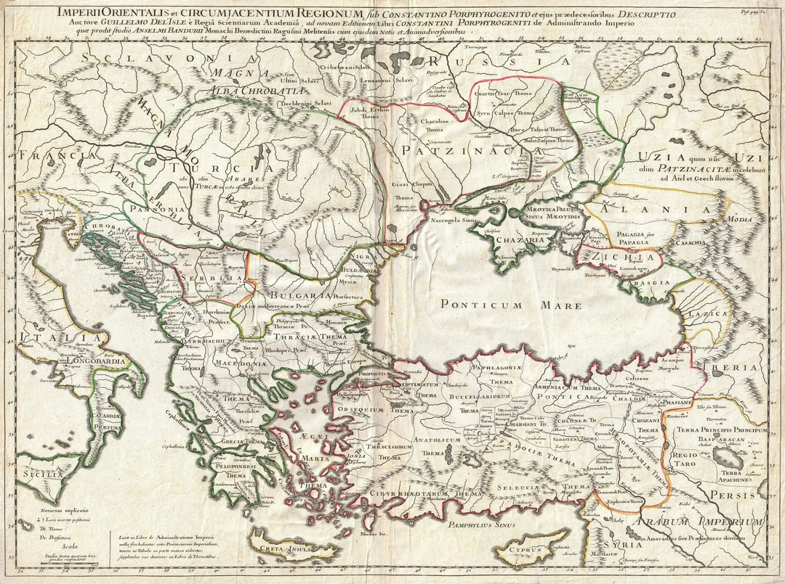

> [1715 map of the Eastern Roman Empire under Constantine VII Porphyrogenitus's reign in the 10th Century by Guillaume De L'Isle](https://www.reddit.com/r/Map_Porn/comments/81ren9/1715_map_of_the_eastern_roman_empire_under/)

### Περί τών Πατζινακιτών, καί προς πόσα συμβάλλονται μετά τοΰ βασιλέως 'Ρωμαίων είρηνεύοντες.

'Ψπολαμβάνω γάρ κατά πολύ συμφέρειν αεί τω βασιλεΐ 'Ρωμαίων ειρήνην έ&έλειν έχειν μετά τοΰ έ&νους τών Πατζινακιτών καί
φιλικάς προς αύτούς ποιεΐσ&αι συνθήκας τε καί σπονδάς καί άποστέλλειν κα&* έκαστον χρόνον έντεΰ&εν προς αύτούς
άποκρισιάριον μετά ξενίων άρμο6νΡ ζόντων ] καί πρός τό έ&νος επιτηδείων καί άναλαμβάνεσ&αι έκεΐθεν 20 ομήρους, ήτοι
δψιδας καί άποκρισιάριον, οΐτινες έν τη &εοφυλάκτω ταύτη πόλει μετά τοΰ καθ-υπουργοΰντος εις ταΰτα συνελεύσονται, καί
βασιλικών εύεργεσιών καί φιλοτιμιών τών επαξίων πάντων τοΰ βασι λεύοντος άπολαύσουσιν.

### Περί τών πατζινακιτών καί τών 'Ρώς.

'Ότι καί οί 'Ρώς διά σπουδής έχουσιν ειρήνην έχειν μετά τών Πατζινακιτών.
