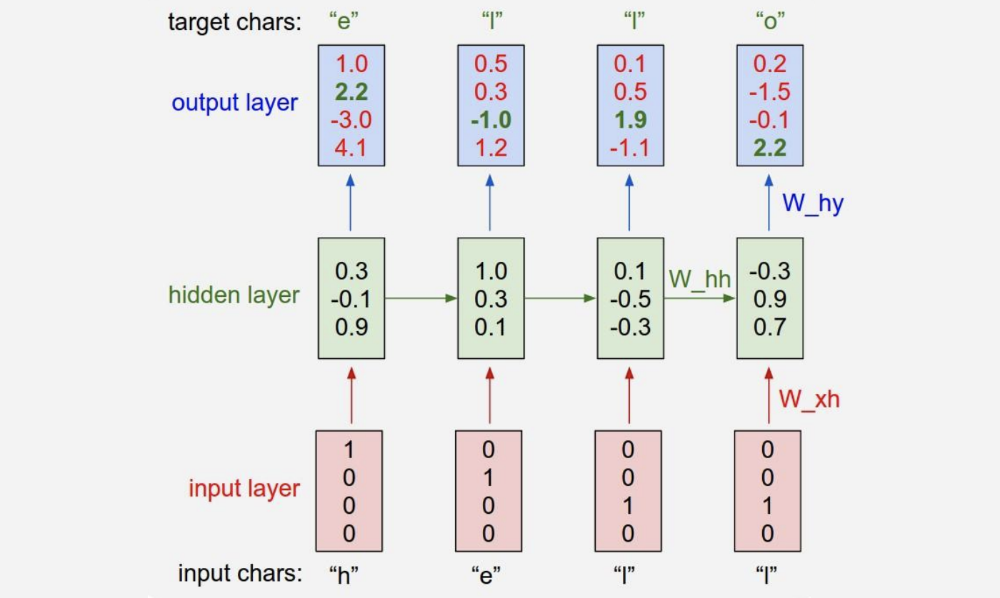

:::note

This article has the following recommended prerequisites:

1. Chapter 4 - Artificial Neural Networks (p. 81) of [_Machine Learning_ by Mitchell, Tom M. (1997), Paperback]
2. _Deep Learning_ (Adaptive Computation and Machine Learning series), Ian Goodfellow

:::

Introduction
------------

We all heard of this buz word "LLM" (Large Language Model). But let's put that aside for just a second and look at a
much simpler one called "character-level language model" where, for example, we input a prefix of a word such as "hell"
and the model outputs a complete word "hello". That is, this language model predicts the next character of a character
sequence. This is like a Math function where we have:

$$
    f(\text{“hell"}) = \text{“hello"}
$$

where we call inputs like "hell" a __sequence__.

How do we obtain a function like this? One approach is to have 4 black boxes, each of which takes a single character as
input and calculates an output:

But one might have noticed that if the 3rd function (box) produces $f('l') = 'l'$, then why would the 4th function
(box), given the same input, gives a different output of 'o'? This suggest that we should take the __history__ into
account. Instead of having $f$ depend on 1 parameter, we now have it take 2 parameters.

1. a character;
2. a variable that summarizes the previous calculations:

Now it makes much more sense with:

$$
    f(\text{‘l'}, h_2) = \text{‘l'}
$$

$$
    f(\text{‘l'}, h_3) = \text{‘o'}
$$

But what if we want to predict a longer or shorter word? For example, how about predicting "cat" by "ca"? That's simple,
we will have 2 black boxes to do the work.

What if the function $f$ is not smart enough to produce the correct output everytime? We will simply collect a lot of
examples such as "cat" and "hello", and feed them into the boxes to train them until they can output correct vocabulary
like "cat" and "hello".

This is the idea behind [RNN](https://en.wikipedia.org/wiki/Recurrent_neural_network). It's recurrent because the boxed
function gets invoked repeatedly for each element of the sequence. In the case of our character-level language model,
element is a character such as "e" and sequence is a string like "hell"

Each function $f$ is a network unit containing 2 perceptrons. One perceptron computes the "history" like $h_1$, $h_2$,
$h_3$. Its formula is very similar to that of perceptron:

$$
    h^{(t)} = g_1\left( W_{hh}h^{(t - 1)} + W_{xh}x^{(t)} + b_h \right)
$$

where $t$ is the index of the "black boxes" shown above. In our example of "hell", $t \in \{ 1, 2, 3, 4 \}$.

The other perceptron computes the output like 'e', 'l', 'l', 'o'. We call those value $y$ which is given by

$$
    o^{(t)} = g_2\left( W_{yh}h^{(t)} + b_o \right)
$$

:::tip[What are $g_1$ and $g_2$?]

They are __activation functions__ which are used to change the linear function in a perceptron to a non-linear function.
Please refer to _Machine Learning_ by Mitchell, Tom M. (1997), Paperback (page 96) for why we bump it to non-linear

A typical activation function for $g_1$ is $tanh$:

$$
    tanh(x) = \frac{e^x - e^{-x}}{e^x + e^{-x}}
$$

In practice, $g_2$ is constance, i.e. $g_2 = 1$

:::

One great thing about the RNNs is that they offer a lot of flexibility on how we wire up the neural network
architecture. Normally when we are working with neural networks, we are given a fixed sized input vector (red boxes
below), then we process it with some hidden layers (green), and we produce a fixed sized output vector (blue). The
left-most model in figure below is called __Vanilla Neural Networks__, which receives a single input and produce one
output. The rest of the models on the right are all __Recurrent Neural Networks__ that allow us to operate over
sequences of input, output, or both at the same time:

- An example of __one-to-many__ model is image captioning where we are given a fixed sized image and produce a sequence
  of words that describe the content of that image through RNN 
- An example of __many-to-one__ task is sentiment classification in NLP where we are given a sequence of words of a
- sentence and then classify what sentiment (e.g. positive or negative) that sentence is. 
- An example of __many-to-many__ task is machine translation in NLP, where we can have an RNN that takes a sequence of
  words of a sentence in English, and then this RNN is asked to produce a sequence of words of a sentence in German.
- There is also a __variation of many-to-many__ task as shown in the last model in Figure below, where the model
  generates an output at every timestep. An example of this many-to-many task is video classification on a frame level
  where the model classifies every single frame of video with some number of classes. We should note that we don't want
  this prediction to only be a function of the current timestep (current frame of the video), but also all the timesteps
  (frames) that have come before this video.

Forward Propagation Equations for RNN
-------------------------------------

We now develop the forward propagation equations for the RNN. We assume the hyperbolic tangent activation function,
i.e. $tanh(x) = \frac{e^x - e^{-x}}{e^x + e^{-x}}$ and that the output is discrete, as if the RNN is used to predict
words or characters. A natural way to represent discrete variables is to regard the output $\boldsymbol{o}$ as giving
the unnormalized log probabilities of each possible value of the discrete variable. We can then apply the softmax
(discussed shortly) operation as a post-processing step to obtain a vector $\boldsymbol{\hat{y}^{(t)}}$ of normalized
probabilities over the output.

Forward propagation begins with a specification of the initial state $\boldsymbol{h}^{(0)}$. The dimension of the hidden
state $\boldsymbol{h}$, in contract to our [previous overview](#introduction), is independent of the dimension of the
input or output sequences. In fact, $\boldsymbol{h}$ is a 3D array, whose 1st-dimensional size is exactly the number of
RNN parameters.

Then, for each time step from $t = 1$ to $t = \tau$, we apply the following update equations:

$$
    \color{green} \boxed{
        \begin{gather*}
            \boldsymbol{h}^{(t)} = \tanh\left( \boldsymbol{W_{hh}}h^{(t - 1)} + \boldsymbol{W_{xh}}x^{(t)} + \boldsymbol{b_h} \right) \\ \\
            \boldsymbol{o}^{(t)} = \boldsymbol{W_{yh}}\boldsymbol{h}^{(t)} + \boldsymbol{b_o} \\ \\
            \boldsymbol{\hat{y}^{(t)}} = softmax(\boldsymbol{o}^{(t)})
        \end{gather*}
    }
$$

where

- $\boldsymbol{h}^{(t)}$ is the hidden state vector of size $(\tau + 1)$
- $\boldsymbol{o}^{(t)}$ is the output produced by the model at step $t$ where $t \in \{1, 2, \cdots, \tau\}$
- $\boldsymbol{\hat{y}^{(t)}}$ is the normalized probability of $\boldsymbol{o}^{(t)}$ at $\tau = t$
- $\boldsymbol{b_h}$ is the hidden bias vector of size $\tau$
- $\boldsymbol{b_o}$ is the output bias vector of size $\tau$
- the size of $\boldsymbol{W_{xh}}$ is $(\tau - 1) \times \tau$
- the size of $\boldsymbol{W_{hh}}$ is $(\tau - 1) \times (\tau - 1)$
- the size of $\boldsymbol{W_{xh}}$ is $\tau \times (\tau - 1)$

Note that this recurrent network maps an input sequence to an output sequence of the same length.

Loss Function of RNN
--------------------

According to the discussion of _Machine Learning by Mitchell_, Tom M. (1997), the key for training RNN or any neural
network is through "specifying a measure for the training error". We call this measure a __loss function__.

In RNN, the total loss for a given sequence of input $\boldsymbol{x}$ paired with a sequence of expected
$\boldsymbol{y}$ is the sum of the losses over all the time steps, i.e.

$$
    \mathcal{L}\left( \{ \boldsymbol{x}^{(1)}, ..., \boldsymbol{x}^{(\tau)} \}, \{ \boldsymbol{y}^{(1)}, ..., \boldsymbol{y}^{(\tau)} \} \right) = \sum_t^{\tau} \mathcal{L}^{(t)}
$$

Knowing the exact form of $\mathcal{L}^{(t)}$ requires our intuitive understanding of [cross-entropy](#cross-entropy)

### Cross-Entropy

In information theory, the [cross-entropy](https://en.wikipedia.org/wiki/Cross-entropy) between two probability
distributions $p$ and $q$ over the same underlying set of events measures the average number of bits needed to identify
an event drawn from the set if a coding scheme used for the set is optimized for an estimated probability distribution
$q$, rather than the true distribution $p$

Confused? Let's put it in the context of Machine Learning. Machine Learning sees the world based on probability. The
"probability distribution" identifies the various tasks to learn. For example, a daily language such as English or
Chinese, can be seen as a probability distribution. The probability of "name" followed by "is" is far greater than "are"
as in "My name is Jack". We call such language distribution $p$. The task of RNN (or Machine Learning in general) is to
learn an approximated distribution of $p$; we call this approximation $q$

"The average number of bits needed" is can be seen as the distance between $p$ and $q$ given an event. In analogy of
language, this can be the *quantitative* measure of the deviation between a real language phrase "My name is Jack" and
"My name are Jack".

At this point, it is easy to imagine that, in the Machine Learning world, the cross entropy indicates the distance
between what the model believes the output distribution should be and what the original distribution really is.

Now we have an intuitive understanding of cross entropy, let's formally define it. The cross-entropy of the discrete
probability distribution $q$ relative to a distribution $p$ over a given set is defined as

$$
    H(p, q) = -\sum_x p(x)\log q(x)
$$

Since we assume the softmax probability distribution earlier, the probability distribution of $q(x)$ is:

$$
    \mathcal{L} = -\sum_t p(t)\log\sigma(\boldsymbol{o}^{(t)}) = -\sum_t\log\sigma(\boldsymbol{o}^{(t)}) = -\sum_t^{\tau}\log\boldsymbol{\hat{y}}^{(t)}
$$

where $\boldsymbol{o}$ is the predicted sequence by RNN and $o_i$ is the _i_-th element of the predicted sequence

Therefore, the total loss for a given sequence of input $\boldsymbol{x}$ paired with a sequence of expected
$\boldsymbol{y}$ is the sum of the losses over all the time steps, i.e.

$$
    \color{green} \boxed{
        \mathcal{L}\left( \{ \boldsymbol{x}^{(1)}, ..., \boldsymbol{x}^{(\tau)} \}, \{ \boldsymbol{y}^{(1)}, ..., \boldsymbol{y}^{(\tau)} \} \right) = \sum_t^{\tau} \mathcal{L}^{(t)} = -\sum_t^{\tau}\log\boldsymbol{\hat{y}}^{(t)}
    }
$$

:::tip[What is the Mathematical form of $p(i)$ in RNN? Why would it become 1?]

By definition, $p(i)$ is the _true_ distribution whose exact functional form is unknown. In the language of
Approximation Theory, $p(i)$ is the function that RNN is trying to learn or approximate mathematically.

Although the $p(i)$ makes the exact form of $\mathcal{L}$ unknown, computationally $p(i)$ is perfectly defined in each
training example. Taking our "hello" example:

The 4 probability distributions of $q(x)$ is "reflected" in the output layer of this example. They are "reflecting" the
probability distribution of $q(x)$ because they are only $o$ values and have not been transformed to the $\sigma$
distribution yet. But in this case, we are 100% sure that the true probability distribution $p(i)$ for the 4 outputs are

$$
\begin{pmatrix}0\\1\\0\\0\end{pmatrix}, \begin{pmatrix}0\\0\\1\\0\end{pmatrix}, \begin{pmatrix}0\\0\\1\\0\end{pmatrix}, \begin{pmatrix}0\\0\\0\\1\end{pmatrix}
$$

respectively. That is all we need for calculating the $\mathcal{L}$

:::

The [softmax function](https://en.wikipedia.org/wiki/Softmax_function) takes as input a vector $z$ of $K$ real numbers,
and normalizes it into a probability distribution consisting of $K$ probabilities proportional to the exponentials of
the input numbers. That is, prior to applying softmax, some vector components could be negative, or greater than one;
and might not sum to 1; but after applying softmax, each component will be in the interval $(0, 1)$ and the components
will add up to 1, so that they can be interpreted as probabilities. Furthermore, the larger input components will
correspond to larger probabilities.

For a vector $z$ of $K$ real numbers, the the standard (unit) softmax function $\sigma: \mathbb{R}^K \mapsto (0, 1)^K$,
where $K \ge 1$ is defined by

$$
    \sigma(\boldsymbol{z})_i = \frac{e^{z_i}}{\sum_{j = 1}^Ke^{z_j}}
$$

where $i = 1, 2, ..., K$ and $\boldsymbol{x} = (x_1, x_2, ..., x_K) \in \mathbb{R}^K$

In the context of RNN,

$$
    \sigma(\boldsymbol{o})_i = -\frac{e^{o_i}}{\sum_{j = 1}^ne^{o_j}}
$$

where

- $n$ is the length of a sequence feed into the RNN
- $o_i$ is the output by perceptron unit `i`
- $i = 1, 2, ..., n$,
- $\boldsymbol{o} = (o_1, o_2, ..., o_n) \in \mathbb{R}^n$

The softmax function takes an N-dimensional vector of arbitrary real values and produces another N-dimensional vector
with real values in the range (0, 1) that add up to 1.0. It maps $\mathbb{R}^N \rightarrow \mathbb{R}^N$

$$
    \sigma(\boldsymbol{o}): \begin{pmatrix}o_1\\o_2\\\dots\\o_n\end{pmatrix} \rightarrow \begin{pmatrix}\sigma_1\\\sigma_2\\\dots\\\sigma_n\end{pmatrix}
$$

This property of softmax function that it outputs a probability distribution makes it suitable for probabilistic
interpretation in classification tasks. Neural networks, however, are commonly trained under a log loss (or
cross-entropy) regime

We are going to compute the derivative of the softmax function because we will be using it for training our RNN model
shortly. But before diving in, it is important to keep in mind that Softmax is fundamentally a vector function. It takes
a vector as input and produces a vector as output; in other words, it has multiple inputs and multiple outputs.
Therefore, we cannot just ask for "the derivative of softmax"; We should instead specify:

1. Which component (output element) of softmax we're seeking to find the derivative of.
2. Since softmax has multiple inputs, with respect to which input element the partial derivative is computed.

What we're looking for is the partial derivatives of

$$
\frac{\partial \sigma_i}{\partial o_k} = \frac{\partial }{\partial o_k} \frac{e^{o_i}}{\sum_{j = 1}^ne^{o_j}}
$$

where $\frac{\partial \sigma_i}{\partial o_k}$ is the partial derivative of the i-th output with respect with the k-th
input.

We'll be using the quotient rule of derivatives. For $h(x) = \frac{f(x)}{g(x)}$ where both $f$ and $g$ are
differentiable and $g(x) \ne 0$, The [quotient rule](https://en.wikipedia.org/wiki/Quotient_rule) states that the
derivative of $h(x)$ is

$$
    h'(x) = \frac{f'(x)g(x) - f(x)g'(x)}{g^2(x)}
$$

In our case, we have

$$
    f'(o_k) = \frac{\partial}{\partial o_k} e^{o_i} = \begin{cases}
    e^{o_k}, & \text{if}\ i = k \\
    0,       & \text{otherwise}
    \end{cases}
$$

$$
    g'(o_k) = \frac{\partial}{\partial o_k} \sum_{j = 1}^ne^{o_j} = \left( \frac{\partial e^{o_1}}{\partial o_k} + \frac{\partial e^{o_2}}{\partial o_k} + \dots + \frac{\partial e^{o_k}}{\partial o_k} + \dots + \frac{\partial e^{o_n}}{\partial o_k} \right) = \frac{\partial e^{o_k}}{\partial o_k} = e^{o_k}
$$

The rest of it becomes trivial then. When $i = k$,

$$
    \frac{\partial \sigma_i}{\partial o_k} = \frac{e^{o_k} \sum_{j = 1}^ne^{o_j} - e^{o_k} e^{o_i}}{\left( \sum_{j = 1}^ne^{o_j} \right)^2}
                                           = \frac{e^{o_i} \sum_{j = 1}^ne^{o_j} - e^{o_i} e^{o_i}}{\left( \sum_{j = 1}^ne^{o_j} \right)^2}
                                           = \frac{e^{o_i}}{\sum_{j = 1}^ne^{o_j}} \frac{\sum_{j = 1}^ne^{o_j} - e^{o_i}}{\sum_{j = 1}^ne^{o_j}} \\
                                           = \sigma_i\left( \frac{\sum_{j = 1}^ne^{o_j}}{\sum_{j = 1}^ne^{o_j}} - \frac{e^{o_i}}{\sum_{j = 1}^ne^{o_j}} \right)
                                           = \sigma_i \left( 1 - \sigma_i \right)
$$

When $i \ne k$:

$$
    \frac{\partial \sigma_i}{\partial o_k} = \frac{-e^{o_k} e^{o_i}}{\left( \sum_{j = 1}^ne^{o_j} \right)^2} = -\sigma_i\sigma_k
$$

This concludes the derivative of the softmax function:

$$
    \frac{\partial \sigma_i}{\partial o_k} = \begin{cases}
                                                 \sigma_i \left( 1 - \sigma_i \right), & \text{if}\ i = k \\
                                                 -\sigma_i\sigma_k,                    & \text{otherwise}
                                             \end{cases}
$$

Deriving Gradient Descent Weight Update Rule
--------------------------------------------

Training a RNN model of is the same thing as searching for the optimal values for the following parameters of the
[Forward Progagation Equations](#forward-propagation-equations-for-rnn):

1. $W_{xh}$
2. $W_{hh}$
3. $W_{yh}$
4. $b_h$
5. $b_o$

By the Gradient Descent discussed in [_Machine Learning_ by Mitchell, Tom M. (1997), Paperback], we should derive the
weight update rule by taking partial derivatives with respect to all of the variables above. Let's start with $W_{yh}$

[_Machine Learning_ by Mitchell, Tom M. (1997), Paperback] has also mentioned gradients and partial derivatives as being
important for an optimization algorithm to update, say, the model weights of a neural network to reach an optimal set of
weights. The use of partial derivatives permits each weight to be updated independently of the others, by calculating
the gradient of the error curve with respect to each weight in turn.

Many of the functions that we usually work with in machine learning are multivariate, vector-valued functions, which
means that they map multiple real inputs $n$ to multiple real outputs $m$:

$$
    f: \mathbb{R}^n \rightarrow \mathbb{R}^m
$$

In training a neural network, the backpropagation algorithm is responsible for sharing back the error calculated at the
output layer among the neurons comprising the different hidden layers of the neural network, until it reaches the input.

If our RNN contains only 1 perceptron unit, the error is propagated back by, using the
[Chain Rule](https://en.wikipedia.org/wiki/Chain_rule) of $\frac{dz}{dx} = \frac{dz}{dy}\frac{dy}{dx}$:

$$
    \frac{\partial \mathcal{L}}{\partial W} = \frac{\partial \mathcal{L}}{\partial o}\frac{\partial o}{\partial W}
$$

Note that in the RNN mode, $\mathcal{L}$ is not a direct function of $W$. Thus its first order derivative cannot be
computed unless we connect the $\mathcal{L}$ to $o$ first and then to $W$, because both the first order derivatives of
$\frac{\partial \mathcal{L}}{\partial o}$ and $\frac{\partial o}{\partial W}$ are defined by the model presented earlier
above

It is more often the case that we'd have many connected perceptrons populating the network, each attributed a different
weight. Since this is the case for RNN, we can generalise multiple inputs and multiple outputs using the
[__Generalized Chain Rule__](https://machinelearningmastery.com/the-chain-rule-of-calculus-for-univariate-and-multivariate-functions/):

:::tip[Generalized Chain Rule]

Consider the case where $x \in \mathbb{R}^m$ and $u \in \mathbb{R}^n$; an inner function, $f$, maps $m$ inputs to $n$
outputs, while an outer function, $g$, receives $n$ inputs to produce an output, $h \in \mathbb{R}^k$. For
$i = 1, \dots, m$  the generalized chain rule states:

$$
\frac{\partial h}{\partial x_i} = \frac{\partial h}{\partial u_1} \frac{\partial u_1}{\partial x_i} + \frac{\partial h}{\partial u_2} \frac{\partial u_2}{\partial x_i} + \dots + \frac{\partial h}{\partial u_n} \frac{\partial u_n}{\partial x_i} = \sum_{j = 1}^n \frac{\partial h}{\partial u_j} \frac{\partial u_j}{\partial x_i}
$$

:::

Therefore, the error propagation of Gradient Descent in RNN is

$$
    \color{green} \boxed{
        \begin{align}
            \frac{\partial \mathcal{L}}{\partial W_{yh}} = \sum_{t = 1}^\tau \sum_{i = 1}^n \frac{\partial \mathcal{L}}{\partial o_i^{(t)}} \frac{\partial o_i^{(t)}}{\partial W_{yh}} \\
            \frac{\partial \mathcal{L}}{\partial W_{hh}} = \sum_{t = 1}^\tau \sum_{i = 1}^n \frac{\partial \mathcal{L}}{\partial h_i^{(t)}} \frac{\partial h_i^{(t)}}{\partial W_{hh}} \\
            \frac{\partial \mathcal{L}}{\partial W_{xh}} = \sum_{t = 1}^\tau \sum_{i = 1}^n \frac{\partial \mathcal{L}}{\partial h_i^{(t)}} \frac{\partial h_i^{(t)}}{\partial W_{xh}}
        \end{align}
    }
$$

where $n$ is the length of a RNN sequence and $t$ the index of timestep

:::note[On $\sum_{t = 1}^\tau$]

We assume the error is the sum of all errors of each timestep, which is why we include the $\sum_{t = 1}^\tau$ term

:::

Let's look at $\frac{\partial \mathcal{L}}{W_{yh}}$ first

$$
    \frac{\partial \mathcal{L}}{W_{yh}} = \sum_{t = 1}^\tau \sum_{i = 1}^n \frac{\partial \mathcal{L}}{\partial o_i^{(t)}} \frac{\partial o_i^{(t)}}{\partial W_{yh}}
$$

Since $o_i = \left( W_{yh}h_i + b_o \right)$

$$
    \frac{\partial o_i}{W_{yh}} = \frac{\partial }{W_{yh}}\left( W_{yh}h_i + b_o \right) = h_i
$$

For the $\frac{\partial \mathcal{L}}{\partial o_i}$ we shall recall from the earlier discussion on softmax derivative
that we CANNOT simply have

$$
    \frac{\partial \mathcal{L}}{\partial o_i} = -\frac{\partial}{\partial o_i}\sum_i^np(i)\log\sigma_i
$$

because we need to

1. specify which component (output element) we're seeking to find the derivative of
2. with respect to which input element the partial derivative is computed

Therefore:

$$
    \frac{\partial \mathcal{L}}{\partial o_i} = -\frac{\partial}{\partial o_i}\sum_j^np(j)\log\sigma_j = -\sum_j^n\frac{\partial}{\partial o_i}p(j)\log\sigma_j = -\sum_j^np(j)\frac{\partial \log\sigma_j}{\partial o_i}
$$

where $n$ is the number of timesteps (or the length of a sequence such as "hell")

Applying the chain rule again:

$$
    -\sum_j^np(j)\frac{\partial \log\sigma_j}{\partial o_i} = -\sum_j^np(j)\frac{1}{\sigma_j}\frac{\partial\sigma_j}{\partial o_i}
$$

Recall we have already derived that

$$
    \frac{\partial \sigma_i}{\partial o_j} = \begin{cases}
                                                 \sigma_i \left( 1 - \sigma_i \right), & \text{if}\ i = j \\
                                                 -\sigma_i\sigma_j,                    & \text{otherwise}
                                             \end{cases}
$$

$$
    -\sum_j^np(j)\frac{1}{\sigma_j}\frac{\partial\sigma_j}{\partial o_i} = -\sum_{i = j}^np(j)\frac{1}{\sigma_j}\frac{\partial\sigma_j}{\partial o_i} -\sum_{i \ne j}^np(j)\frac{1}{\sigma_j}\frac{\partial\sigma_j}{\partial o_i} = -p(i)(1 - \sigma_i) + \sum_{i \ne j}^np(j)\sigma_i
$$

Observing that

$$
    \sum_{j}^np(j) = 1
$$

$$
    -p(i)(1 - \sigma_i) + \sum_{i \ne j}^np(j)\sigma_i = -p(i) + p(i)\sigma_i + \sum_{i \ne j}^np(j)\sigma_i = \sigma_i - p(i)
$$

$$
    \color{green} \boxed{\frac{\partial \mathcal{L}}{\partial o_i} = \sigma_i - p(i)}
$$

$$
    \color{green} \boxed{ \frac{\partial \mathcal{L}}{\partial W_{yh}} = \sum_{t = 1}^\tau \sum_i^n\left[ \sigma_i - p(i) \right] h_i = \sum_{t = 1}^\tau \left( \boldsymbol{\sigma} - \boldsymbol{p} \right) \boldsymbol{h}^{(t)} }
$$

$$
    \frac{\partial \mathcal{L}}{\partial b_o} = \sum_{t = 1}^\tau \sum_i^n\frac{\partial \mathcal{L}}{\partial o_i^{(t)}}\frac{\partial o_i^{(t)}}{\partial b_o^{(t)}} = \sum_{t = 1}^\tau \sum_i^n\left[ \sigma_i - p(i) \right] \times 1
$$

$$
    \color{green} \boxed{ \frac{\partial \mathcal{L}}{\partial b_o} = \sum_{t = 1}^\tau \sum_i^n\left[ \sigma_i - p(i) \right] = \sum_{t = 1}^\tau \boldsymbol{\sigma} - \boldsymbol{p} }
$$

We have at this point derived backpropagating rule for $W_{yh}$ and $b_o$:

1. $W_{xh}$
2. $W_{hh}$
3. ✅ $W_{yh}$
4. $b_h$
5. ✅ $b_o$

Now let's look at $\frac{\partial \mathcal{L}}{\partial W_{hh}}$:

Recall from _Deep Learning_, section 6.5.2, p. 207 that the vector notation of
$\frac{\partial z}{\partial x_i} = \sum_j \frac{\partial z}{\partial y_j}\frac{\partial y_j}{\partial x_i}$ is

$$
    \nabla_{\boldsymbol{x}}z = \left( \frac{\partial \boldsymbol{y}}{\partial \boldsymbol{x}} \right)^\intercal \nabla_{\boldsymbol{y}}z
$$

This gives us a start with:

$$
    \begin{align}
        \frac{\partial \mathcal{L}}{\partial W_{hh}} &= \sum_{t = 1}^\tau \sum_{i = 1}^n \frac{\partial \mathcal{L}}{\partial h_i^{(t)}} \frac{\partial h_i^{(t)}}{\partial W_{hh}} \\
        & = \sum_{t = 1}^\tau \left( \frac{\partial \mathcal{L}}{\partial \boldsymbol{h}^{(t)}} \right)^\intercal \nabla_{\boldsymbol{W_{hh}}}\boldsymbol{h}^{(t)} \\
        & = \sum_{t = 1}^\tau \left( \frac{\partial \mathcal{L}}{\partial \boldsymbol{h}^{(t)}} \right)^\intercal \left( \frac{\partial \boldsymbol{h}^{(t)}}{\partial \boldsymbol{W_{hh}}} \right)^\intercal \nabla_{\boldsymbol{h}^{(t)}}\boldsymbol{h}^{(t)} \\
        & = \sum_{t = 1}^\tau \left( \frac{\partial \mathcal{L}}{\partial \boldsymbol{h}^{(t)}} \right)^\intercal \left( \frac{\partial \boldsymbol{h}^{(t)}}{\partial \boldsymbol{W_{hh}}} \right)^\intercal \\
        & = \sum_{t = 1}^\tau \left( \frac{\partial \boldsymbol{h}^{(t)}}{\partial \boldsymbol{W_{hh}}} \right)^\intercal \frac{\partial \mathcal{L}}{\partial \boldsymbol{h}^{(t)}} \\
        & = \sum_{t = 1}^\tau \left( \frac{\partial \boldsymbol{h}^{(t)}}{\partial \boldsymbol{h}^{(t - 1)}} \right)^\intercal \left( \frac{\partial \boldsymbol{h}^{(t - 1)}}{\partial \boldsymbol{W_{hh}}} \right)^\intercal \frac{\partial \mathcal{L}}{\partial \boldsymbol{h}^{(t)}} \\
        & = \sum_{t = 1}^\tau \left( \frac{\partial \boldsymbol{h}^{(t)}}{\partial \boldsymbol{h}^{(t - 1)}} \right)^\intercal \left( \frac{\partial \boldsymbol{h}^{(t - 1)}}{\partial \boldsymbol{h}^{(t)}}\frac{\partial \boldsymbol{h}^{(t)}}{\partial \boldsymbol{h}^{(t)}}\frac{\partial \boldsymbol{h}^{(t)}}{\partial \boldsymbol{W_{hh}}} \right)^\intercal \frac{\partial \mathcal{L}}{\partial \boldsymbol{h}^{(t)}} \\
        & = \sum_{t = 1}^\tau \left( \frac{\partial \boldsymbol{h}^{(t)}}{\partial \boldsymbol{h}^{(t - 1)}} \right)^\intercal \left( \frac{\partial \boldsymbol{h}^{(t - 1)}}{\partial \boldsymbol{h}^{(t)}}\frac{\partial \boldsymbol{h}^{(t)}}{\partial \boldsymbol{W_{hh}}}\frac{\partial \boldsymbol{h}^{(t)}}{\partial \boldsymbol{h}^{(t)}} \right)^\intercal \frac{\partial \mathcal{L}}{\partial \boldsymbol{h}^{(t)}} \\
        & = \sum_{t = 1}^\tau \left( \frac{\partial \boldsymbol{h}^{(t)}}{\partial \boldsymbol{h}^{(t - 1)}} \right)^\intercal \left( \frac{\partial \boldsymbol{h}^{(t - 1)}}{\partial \boldsymbol{h}^{(t)}} \right)^\intercal  \left( \frac{\partial \boldsymbol{h}^{(t)}}{\partial \boldsymbol{W_{hh}}} \right)^\intercal \left( \frac{\partial \boldsymbol{h}^{(t)}}{\partial \boldsymbol{h}^{(t)}} \right)^\intercal \frac{\partial \mathcal{L}}{\partial \boldsymbol{h}^{(t)}} \\
        & = \sum_{t = 1}^\tau \left( \frac{\partial \boldsymbol{h}^{(t)}}{\partial \boldsymbol{W_{hh}}} \right)^\intercal \left( \frac{\partial \boldsymbol{h}^{(t)}}{\partial \boldsymbol{h}^{(t)}} \right)^\intercal \frac{\partial \mathcal{L}}{\partial \boldsymbol{h}^{(t)}} \\
        & = \sum_{t = 1}^\tau diag\left[ 1 - \left(\boldsymbol{h}^{(t)}\right)^2 \right] \boldsymbol{h}^{(t - 1)} \nabla_{\boldsymbol{h}^{(t)}}\mathcal{L} \\
        & = \sum_{t = 1}^\tau diag\left[ 1 - \left(\boldsymbol{h}^{(t)}\right)^2 \right] \left( \nabla_{\boldsymbol{h}^{(t)}}\mathcal{L} \right) {\boldsymbol{h}^{(t - 1)}}^\intercal
    \end{align}
$$

$$
    \color{green} \boxed{ \frac{\partial \mathcal{L}}{\partial W_{hh}} = \sum_{t = 1}^\tau diag\left[ 1 - \left(\boldsymbol{h}^{(t)}\right)^2 \right] \left( \nabla_{\boldsymbol{h}^{(t)}}\mathcal{L} \right) {\boldsymbol{h}^{(t - 1)}}^\intercal }
$$

The equation above leaves us with a term $\nabla_{\boldsymbol{h}^{(t)}}\mathcal{L}$, which we calculate next. Note that
the back propagation on $\boldsymbol{h}^{(t)}$ has source from both $\boldsymbol{o}^{(t)}$ and
$\boldsymbol{h}^{(t + 1)}$. It's gradient, therefore, is given by

$$
    \begin{align}
        \nabla_{\boldsymbol{h}^{(t)}}\mathcal{L} &= \left( \frac{\partial \boldsymbol{o}^{(t)}}{\partial \boldsymbol{h}^{(t)}} \right)^\intercal \nabla_{\boldsymbol{o}^{(t)}}\mathcal{L} + \left( \frac{\partial \boldsymbol{h}^{(t + 1)}}{\partial \boldsymbol{h}^{(t)}} \right)^\intercal \nabla_{\boldsymbol{h}^{(t + 1)}}\mathcal{L} \\
        &= \left( \boldsymbol{W_{yh}} \right)^\intercal \nabla_{\boldsymbol{o}^{(t)}}\mathcal{L} + \left( diag\left[ 1 - (\boldsymbol{h}^{(t + 1)})^2 \right] \boldsymbol{W_{hh}} \right)^\intercal \nabla_{\boldsymbol{h}^{(t + 1)}}\mathcal{L} \\
        &= \left( \boldsymbol{W_{yh}} \right)^\intercal \nabla_{\boldsymbol{o}^{(t)}}\mathcal{L}+ \boldsymbol{W_{hh}}^\intercal \nabla_{\boldsymbol{h}^{(t + 1)}}\mathcal{L} \left( diag\left[ 1 - (\boldsymbol{h}^{(t + 1)})^2 \right] \right)
    \end{align}
$$

$$
    \color{green} \boxed{ \nabla_{\boldsymbol{h}^{(t)}}\mathcal{L} = \left( \boldsymbol{W_{yh}} \right)^\intercal \nabla_{\boldsymbol{o}^{(t)}}\mathcal{L} + \boldsymbol{W_{hh}}^\intercal \nabla_{\boldsymbol{h}^{(t + 1)}}\mathcal{L} \left( diag\left[ 1 - (\boldsymbol{h}^{(t + 1)})^2 \right] \right) }
$$

Note that the 2nd term
$\boldsymbol{W_{xh}}^\intercal \nabla_{\boldsymbol{h}^{(t + 1)}}\mathcal{L} \left( diag\left[ 1 - (\boldsymbol{h}^{(t + 1)})^2 \right] \right)$
is zero at first iteration propagating back because for the last-layer (unrolled) of RNN , there's no gradient update
flow from the next hidden state.

So far we have derived backpropagating rule for $W_{hh}$

1. $W_{xh}$
2. ✅ $W_{hh}$
3. ✅ $W_{yh}$
4. $b_h$
5. ✅ $b_o$

Let's tackle the remaining $\frac{\partial \mathcal{L}}{\partial W_{xh}}$ and $b_h$:

$$
    \begin{align}
        \frac{\partial \mathcal{L}}{\partial W_{xh}} &= \sum_{t = 1}^\tau \sum_{i = 1}^n \frac{\partial \mathcal{L}}{\partial h_i^{(t)}} \frac{\partial h_i^{(t)}}{\partial W_{xh}} \\
        &= \sum_{t = 1}^\tau \left( \frac{\partial \boldsymbol{h}^{(t)}}{\partial \boldsymbol{W_{xh}}} \right)^\intercal \nabla_{\boldsymbol{h}^{(t)}}\mathcal{L} \\
        &= \sum_{t = 1}^\tau \left( diag\left[ 1 - (\boldsymbol{h}^{(t)})^2 \right] \boldsymbol{x}^{(t)} \right)^\intercal \nabla_{\boldsymbol{h}^{(t)}}\mathcal{L} \\
        &= \sum_{t = 1}^\tau \left( diag\left[ 1 - (\boldsymbol{h}^{(t)})^2 \right] \right)^\intercal \nabla_{\boldsymbol{h}^{(t)}}\mathcal{L} \left( \boldsymbol{x}^{(t)} \right)
    \end{align}
$$

$$
    \color{green} \boxed{ \frac{\partial \mathcal{L}}{\partial W_{xh}} = \sum_{t = 1}^\tau \left( diag\left[ 1 - (\boldsymbol{h}^{(t)})^2 \right] \right)^\intercal \nabla_{\boldsymbol{h}^{(t)}}\mathcal{L} \left( \boldsymbol{x}^{(t)} \right) }
$$

$$
    \begin{align}
        \frac{\partial \mathcal{L}}{\partial b_h} &= \sum_{t = 1}^\tau \sum_{i = 1}^n \frac{\partial \mathcal{L}}{\partial h_i^{(t)}} \frac{\partial h_i^{(t)}}{\partial b_h^{(t)}} \\
        &= \sum_{t = 1}^\tau \left( \frac{\partial h_i^{(t)}}{\partial b_h^{(t)}} \right)^\intercal \nabla_{\boldsymbol{h}^{(t)}}\mathcal{L} \\
        &= \sum_{t = 1}^\tau \left( diag\left[ 1 - (\boldsymbol{h}^{(t)})^2 \right] \right)^\intercal \nabla_{\boldsymbol{h}^{(t)}}\mathcal{L}
    \end{align}
$$

$$
    \color{green} \boxed{ \frac{\partial \mathcal{L}}{\partial b_h} = \sum_{t = 1}^\tau \left( diag\left[ 1 - (\boldsymbol{h}^{(t)})^2 \right] \right)^\intercal \nabla_{\boldsymbol{h}^{(t)}}\mathcal{L} }
$$

This concludes our propagation rules for training RNN:

$$
    \color{green} \boxed{
        \begin{align*}
            & \frac{\partial \mathcal{L}}{\partial W_{xh}} = \sum_{t = 1}^\tau \left( diag\left[ 1 - (\boldsymbol{h}^{(t)})^2 \right] \right)^\intercal \nabla_{\boldsymbol{h}^{(t)}}\mathcal{L} \left( \boldsymbol{x}^{(t)} \right) \\ \\
            & \frac{\partial \mathcal{L}}{\partial W_{hh}} = \sum_{t = 1}^\tau diag\left[ 1 - \left(\boldsymbol{h}^{(t)}\right)^2 \right] \left( \nabla_{\boldsymbol{h}^{(t)}}\mathcal{L} \right) {\boldsymbol{h}^{(t - 1)}}^\intercal \\ \\
            & \frac{\partial \mathcal{L}}{\partial W_{yh}} = \sum_{t = 1}^\tau \left( \boldsymbol{\sigma} - \boldsymbol{p} \right) \boldsymbol{h}^{(t)} \\ \\
            & \frac{\partial \mathcal{L}}{\partial b_h} = \sum_{t = 1}^\tau \left( diag\left[ 1 - (\boldsymbol{h}^{(t)})^2 \right] \right)^\intercal \nabla_{\boldsymbol{h}^{(t)}}\mathcal{L} \\ \\
            & \frac{\partial \mathcal{L}}{\partial b_o} = \sum_{t = 1}^\tau \boldsymbol{\sigma} - \boldsymbol{p}
        \end{align*}
    }
$$

According to page 91 of [_Machine Learning_ by Mitchell, Tom M. (1997), Paperback], the amount of updates in direction
$i$ is given by

$$

\Delta{w_i} = -\eta\frac{\partial E}{\partial w_i}

$$

The update rules for training RNN with a learning rate of $\eta$, therefore, are:

$$
\color{green} \boxed{
    \begin{align*}
        & \Delta W_{xh} = -\eta\sum_{t = 1}^\tau \left( diag\left[ 1 - (\boldsymbol{h}^{(t)})^2 \right] \right)^\intercal \nabla_{\boldsymbol{h}^{(t)}}\mathcal{L} \left( \boldsymbol{x}^{(t)} \right) \\ \\
        & \Delta W_{hh} = -\eta\sum_{t = 1}^\tau diag\left[ 1 - \left(\boldsymbol{h}^{(t)}\right)^2 \right] \left( \nabla_{\boldsymbol{h}^{(t)}}\mathcal{L} \right) {\boldsymbol{h}^{(t - 1)}}^\intercal \\ \\
        & \Delta W_{yh} = -\eta\sum_{t = 1}^\tau \left( \boldsymbol{\sigma} - \boldsymbol{p} \right) \boldsymbol{h}^{(t)} \\ \\
        & \Delta b_h = -\eta\sum_{t = 1}^\tau \left( diag\left[ 1 - (\boldsymbol{h}^{(t)})^2 \right] \right)^\intercal \nabla_{\boldsymbol{h}^{(t)}}\mathcal{L} \\ \\
        & \Delta b_o = -\eta\sum_{t = 1}^\tau \boldsymbol{\sigma} - \boldsymbol{p}
    \end{align*}
    }
$$

where

$$
\color{green} \boxed{ \nabla_{\boldsymbol{h}^{(t)}}\mathcal{L} = \left( \boldsymbol{W_{yh}} \right)^\intercal \nabla_{\boldsymbol{o}^{(t)}}\mathcal{L} + \boldsymbol{W_{hh}}^\intercal \nabla_{\boldsymbol{h}^{(t + 1)}}\mathcal{L} \left( diag\left[ 1 - (\boldsymbol{h}^{(t + 1)})^2 \right] \right) }
$$

:::note

A Python implementation of the RNN discussed in this article can be found at [here](https://github.com/QubitPi/RNN)

:::

[_Machine Learning_ by Mitchell, Tom M. (1997), Paperback]: https://trello.com/c/bccmQ6jv
