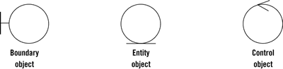

Robustness diagrams are written after use cases and before class diagrams. They help to identify the roles of use case
steps. We can use them to ensure our use cases are sufficiently robust to represent usage requirements for the system
we're building.

They involve:

1. Actors
2. Use Cases
3. __Entities__
4. __Boundaries__
5. __Controls__

Whereas the Model-View-Controller pattern is used for user interfaces, the Entity-Control-Boundary Pattern (ECB) is used
for systems. The following aspects of ECB can be likened to an abstract version of MVC, if that's helpful:



- __Entities__ (_model_): Objects representing system data, often from the domain model.
- __Boundaries__ (_view/service collaborator_): Objects that interface with system actors (e.g. a __user__ or
  __external__ service). Windows, screens and menus are examples of boundaries that interface with users.
- __Controls__ (_controller_): Objects that mediate between boundaries and entities. These serve as the glue between
  boundary elements and entity elements, implementing the logic required to manage the various elements and their
  interactions. It is important to understand that you may decide to implement controllers within your design as
  something other than objects - many controllers are simple enough to be implemented as a method of an entity or
  boundary class for example.

__Four rules apply to their communication__:

1. Actors can only talk to boundary objects.
2. Boundary objects can only talk to controllers and actors.
3. Entity objects can only talk to controllers.
4. Controllers can talk to boundary objects and entity objects, and to other controllers, but not to actors

__Communication allowed__

```text
         Entity    Boundary   Control
Entity     X                     X
Boundary                         X
Control    X          X          X
```
