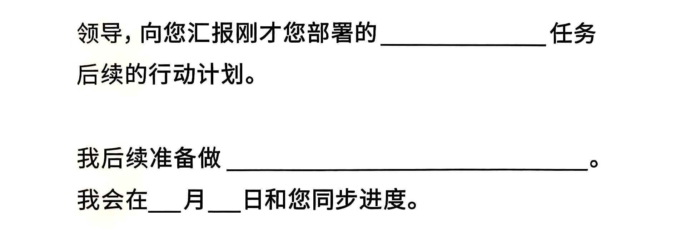

:::note[内容来源]

- [_干得漂亮_](https://book.douban.com/subject/36798889/)，脱不花，新星出版社
- [_Fight Right - How Successful Couples Turn Conflict into Connection_](https://www.amazon.com/Fight-Right-Successful-Conflict-Connection/dp/0593579658), John Gottman & Julie Gottman, Harmony
- [_幽默感_](https://book.douban.com/subject/34993005//)，李新，中信出版集团
- [_Die Metaphysik der Sitten_](https://ia801503.us.archive.org/26/items/in.ernet.dli.2015.358315/2015.358315.Immanuel-Kant.pdf), Immanuel Kant

:::

职场沟通
--------

### 接任务 - 接活儿是一种工作能力

#### 领导给的指令过于简单，怎么接？

你可能经常听到：“这事儿你跟进一下”。对此，我们要将接下来的对话落到行动计划上，领导才愿意来听取并回答你后续的疑问，如果
对方觉得你的行动计划更对方想得不一样，他就会耐心地和你多说两句，比如：

“我理解，您是让我去跟进 XX 任务。接下来，我准备分成这几步来干，您看合适吗？您再给我指点指点？”

这里本质是从对方身上获取更多信息的，用到了一类通用方法，可以分为 3 步：

1. 复述对方的话（复述领导给你不知的任务）
2. 用自己的话表达自己的理解（说说行动计划）
3. 通过对方的回复让双方理解同频（对齐任务标准）

如果承接的任务比较复杂，那么做完上面的步骤以后，我们可以再给领导发条信息，跟对方备个案，
这主要是为了避免领导随便改主意的情况，可以参考以下格式思路：

:::tip[领导经常临时起意派活儿怎么办？]

对于一些特殊情况，比如领导每到下班就来一句“这事你跟进以一下”，搞得自己经常被迫加班，其实，这可能事领导的一个“坏习惯”，
怕自己明天忘了，先和你说一下，不一定是让你现在就开干。所以，为了避免无效加班，我们可以说：“好的，领导，这事我听懂了，
我准备这么落实……明天中午之前给您回复，您看可以吗？”

这么一来，就很有效地把任务放到了自己的节奏里。

当然如果领导说来不及，今晚必须出方案，那我们肯定得配合，但无论是哪种情况，都能避免默默加班却发现这事儿不那么着急，
最后让我们非常难受的情况

:::

#### 领导布置的任务不会做，怎么办

我们可以这样回复：“好的，领导。我理解，您是希望给我一个机会把这个事情给挑起来。但是说实话，这件事我确实没有做过。
您能不能帮我致电一下，以往这类工作是哪个同事负责的，我先去向他请教一下。”

1. 问“谁能帮自己”

幽默感
------

### 什么是幽默？

仅仅是为了让人发笑而让人发笑，不是真正的幽默。幽默并不是肤浅的搞笑，它体现了一个人的内涵和修养，
幽默的语言具有沁人心脾的神奇魅力。幽默有三个元素：

1. 有趣的视角

   幽默是一种世界观，站在一个独特的视角去观察这个世界，造成的新奇感、意外感、和幽默感。比如自己为脱发烦恼，
   可以用自己头发的视角来看待自己：__“昨天跟我约会的那根头发，今天已经被冲进下水道了”__

2. 洞见真相

3. 痛苦和失败

## 
Communication Between Couple

All major features of typical couples' conflict demonstrate

- It's about almost nothing
- It moves very quickly into difficult conflict
- There's no listening
- It contains every single one of the "Four Horsemen of the Apocalypse"

## 
Philosophie der Liebe

### 
Die Metaphysik der Sitten

#### 
Metaphysische Anfangsgründe der Tugendlehre

##### 
Von der Menschenliebe

Liebe ist eine Sache der Empfindung, nicht des Wollens, und ich kann nicht lieben, weil ich will, noch weniger aber,
weil ich soll (zur Liebe genötigt werden); mithin ist eine Pflicht zu lieben ein Unding. Wohlwollen (amor benevolentiac)
aber kann, als ein Tun, einem Pflichtgesetz unterworfen sein. Man nennt aber oftmals ein uneigennütziges Wohlwollen
gegen Menschen auch (obzwar sehr uneigentlich) Liebe; ja, wo es nicht um des anderen Glückseligkeit, sondern die
gänzliche und freie Ergebung aller seiner Zwecke in die Zwecke eines anderen (selbst eines übermenschlichen) Wesens zu
tun ist, spricht man von Liebe, die zugleich für uns Pflicht sei. Aber alle Pflicht ist Nötigung, ein Zwang, wenn er
auch ein Selbstzwang nach einem Gesetz sein sollte. Was man aber aus Zwang tut, das geschieht nicht aus Liebe.

