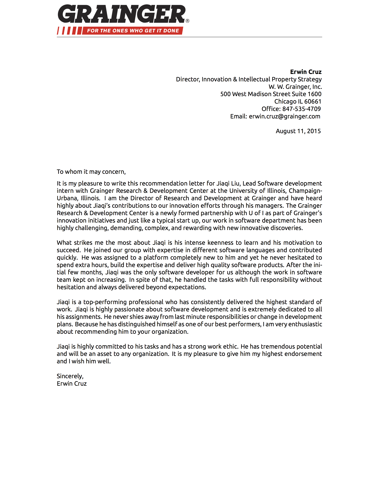

About Me
========

My name is Jiaqi Liu. I graduate from U of I, had internship at Fortune 500 Grainger Inc., worked at Yahoo for 4 years.

Leadership, for me, is a Science, a discipline that involves a much broader superset beyond technology. It includes not
just project management and public speaking, but also Psychology, Philosophy, and not to forget the technology itself.

[leadership.qubitpi.org](https://leadership.qubitpi.org/) serves as my continuing effort that expand the boundary of my
limit on being a leader

::github{repo="QubitPi/leadership-blogs"}

Appendix - Recommendation Letter from Grainger Inc.
---------------------------------------------------

